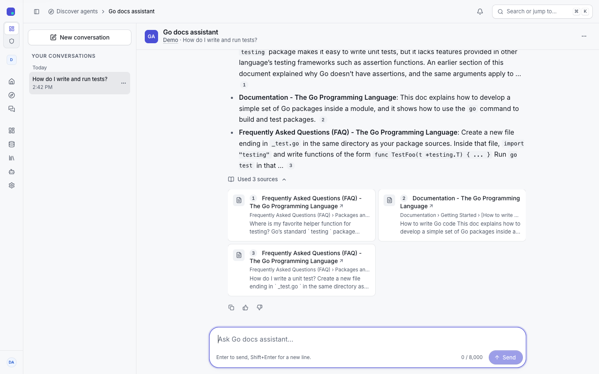
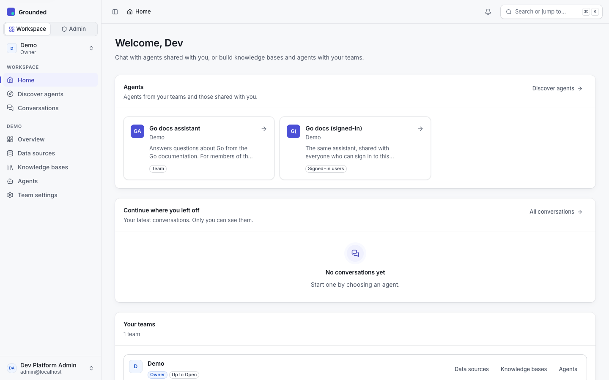
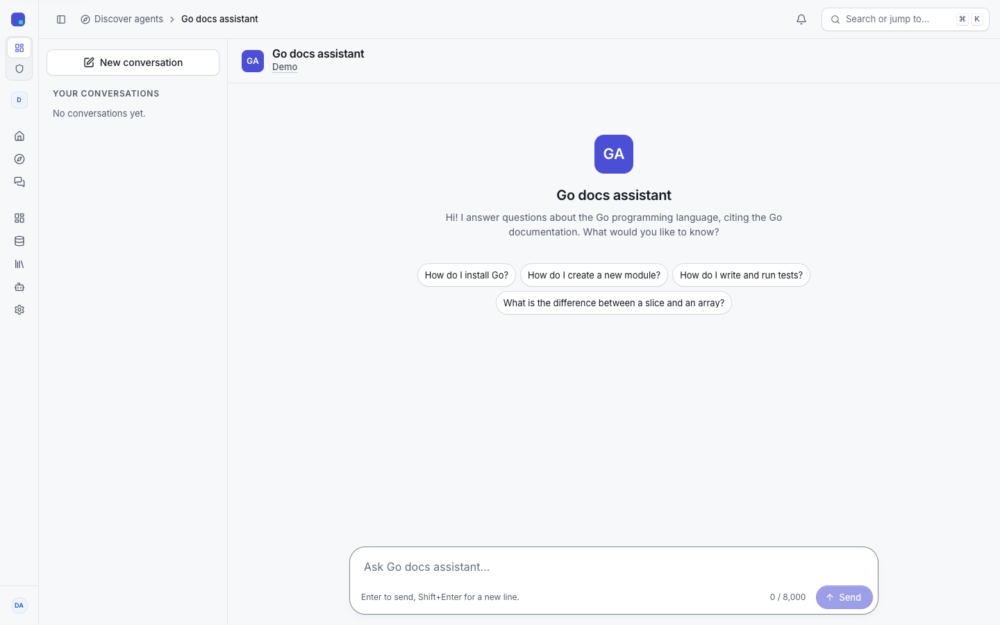
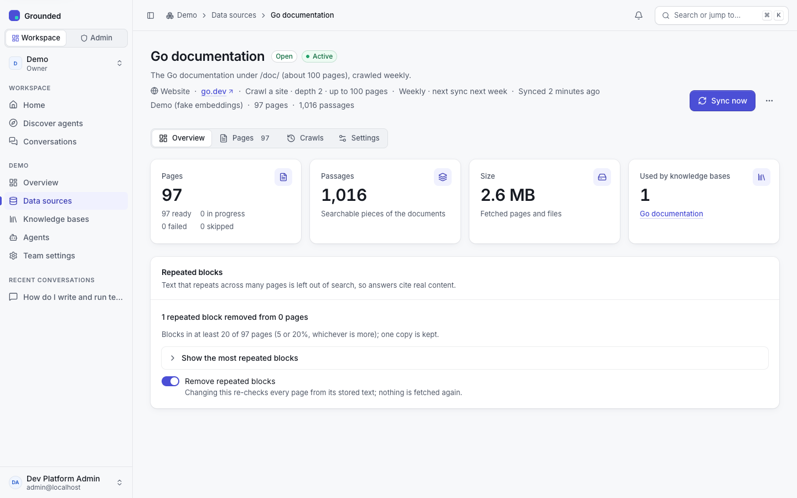
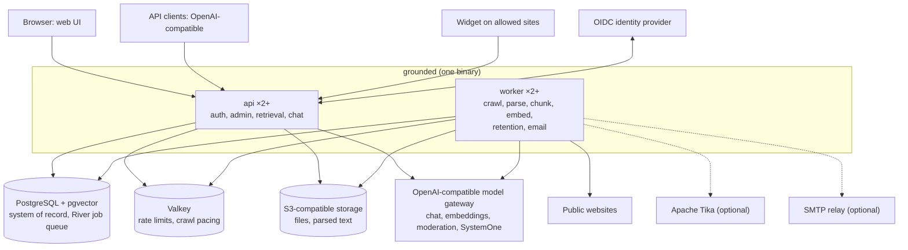

# Grounded

[](https://github.com/ncecere/grounded/actions/workflows/ci.yml)
[](LICENSE)

Grounded is an open-source, multi-tenant RAG (retrieval-augmented generation) and agents platform for organisations. One install serves many teams. Each team turns uploaded files and crawled websites into knowledge bases, then publishes agents that answer only from those sources. Every answer cites its passages, and citations can optionally be checked claim by claim. People use the agents in the web UI, in a widget embedded on a public site, from any OpenAI-compatible client, or from AI tools over MCP; agents can also call approved tools on remote MCP servers. Platform admins govern what happens: data classification levels decide which models may see which data and who may use an agent, public agents are moderated, and retention, legal holds, audited break-glass access and a full audit log cover the rest. Grounded is a single Go binary with an embedded React UI. It stores everything in PostgreSQL with pgvector and works with any OpenAI-compatible model gateway.



## Try it in five minutes

All you need is Docker. No model keys are required.

```sh
git clone https://github.com/ncecere/grounded.git
cd grounded
docker compose -f compose.demo.yaml up --build     # or: make demo
```

The first start builds the image, then `grounded demo` seeds a **Demo** team and crawls about 100 pages of the Go documentation (roughly two minutes). Open http://localhost:8080, sign in as **Dev Platform Admin**, and ask the **Go docs assistant** one of its starter questions.

The answers come from a **fake model** built into the binary. It quotes the best-matching passages under a "Demo model" label, and it isn't a language model. Retrieval, citations, conversations and the rest of the UI are real. To use **real models**, start again with any OpenAI-compatible gateway (LiteLLM, vLLM, SGLang, a hosted API):

```sh
docker compose -f compose.demo.yaml down -v
export DEMO_MODELS=openai-compatible DEMO_SERVE_FAKE_MODELS=false
export DEMO_CHAT_URL=https://gateway.example.org/v1 DEMO_CHAT_KEY=sk-... DEMO_CHAT_MODEL=<chat model>
export DEMO_EMBED_MODEL=<embedding model>
docker compose -f compose.demo.yaml up --build
```

The demo uses development sign-in and public example keys. Grounded accepts both only because the URL is a loopback address, so **keep it on your machine**. [`docs/demo.md`](docs/demo.md) describes everything the demo creates.

<table>
  <tr>
    <td></td>
    <td></td>
    <td></td>
  </tr>
  <tr>
    <td align="center">Home</td>
    <td align="center">An agent</td>
    <td align="center">A crawled website</td>
  </tr>
</table>

## Deploy

Grounded runs on Kubernetes. [`deploy/kubernetes/`](deploy/kubernetes/README.md) holds a generic Kustomize **base**: the API and worker Deployments, migrations in an init container, probes, PodDisruptionBudgets, restricted security contexts and default-deny NetworkPolicies. It also has optional **components** (Postgres as a single StatefulSet or CloudNativePG, Valkey, `pg_dump` backups, Ingress, Apache Tika, the OCR sidecar, monitoring, alerts and dashboards, tracing) and two example **overlays**, `example-small` and `example-ha`. Your install keeps its own overlay in its own repository and references the base at a release tag:

```yaml
resources:
  - https://github.com/ncecere/grounded//deploy/kubernetes/base?ref=v0.4.0
images:
  - name: ghcr.io/ncecere/grounded
    digest: sha256:<digest from the release notes>
```

You'll need Postgres 17 with pgvector 0.8 or later, Valkey or Redis 7 or later, S3-compatible storage, an OIDC provider and an OpenAI-compatible model gateway. The guide is [`docs/deployments/kubernetes.md`](docs/deployments/kubernetes.md). It covers secrets, configuration, components, the first platform admin, upgrades and troubleshooting. `grounded doctor` checks the configuration and every dependency, and names what fails.

**Images.** `ghcr.io/ncecere/grounded` is multi-arch (amd64 and arm64), distroless, and runs as a non-root user. Each image is built only in CI with an SBOM and provenance attestation, scanned with Trivy, and signed keylessly with cosign. There is no `latest` tag, so deploy by digest. Before you deploy, check that the image was signed by this repository's workflows:

```sh
cosign verify ghcr.io/ncecere/grounded@sha256:<digest> \
  --certificate-identity-regexp '^https://github.com/ncecere/grounded/\.github/workflows/' \
  --certificate-oidc-issuer https://token.actions.githubusercontent.com
```

Each install sets its own name, logo, support links and crawl allowlist through configuration ([`.env.example`](.env.example)). Nothing institution-specific lives in this repository ([ADR-0018](docs/adr/0018-open-source-institution-neutral.md), [ADR-0023](docs/adr/0023-no-institution-data-in-the-repository.md)).

## Features

**Teams and access**
- Teams are the tenants. Each has members with roles (owner, admin, editor, member), email invites, per-team limits and usage, and its own audit log.
- Sign-in uses OIDC. API keys can be personal or team service keys, scoped and restricted to agents, and are stored only as peppered hashes.
- Platform admins can't see team content by default.

**Data sources and knowledge bases**
- Upload PDF, DOCX, PPTX, HTML, Markdown and text files, parsed by built-in parsers with Apache Tika as an optional fallback.
- **OCR** reads scanned PDF pages and image uploads (PNG, JPEG, TIFF) with a Tesseract sidecar, Tika or a vision model, switchable per source.
- A native **web crawler** can scrape a page or a list of pages, crawl a site, or map one. It respects sitemaps and robots.txt, paces requests per site, re-syncs on a schedule and removes pages that disappear. Crawling is limited to an admin allowlist, which teams can ask to extend. Private addresses are always blocked.
- Text that repeats across a site (navigation, footers) is left out of search.
- Platform-shared sources can be attached by any team.
- Knowledge bases use hybrid vector and keyword retrieval with tunable fusion and metadata filters.
- Embedding profiles fix a knowledge base's model, dimensions and chunking. Moving a knowledge base to a new profile happens in the background, switches in one step, and can be switched back.

**Agents**
- Drafts and immutable published versions, with side-by-side diffs between them.
- Chat streams over SSE, with retrieval before every answer or as a tool the model calls.
- **Strict grounding** (on by default): the agent answers only from its sources and gives the team's refusal message when they have nothing relevant.
- Numbered **citations** link to the passages and pages that were used. An optional SystemOne model checks each cited claim against its source (verified, unsupported or contradicted), re-ranks passages, drops prompt injections, and spots questions outside the agent's scope.
- **Tools from MCP servers:** a platform admin registers a remote MCP server and approves its tools; editors enable them on an agent, and each result is cited as a numbered source and checked like a passage. Calls are audited, metered and bounded.
- Answers show what the agent is doing before the first words (searching, checking the passages, writing), a follow-up is rewritten only when it depends on the conversation, and a reasoning model's effort can be set per agent.
- **Evaluations:** sets of questions per knowledge base or agent, scored for retrieval and for full answers, with trends between runs.
- Conversations are private to their user, who can export or delete them. Users can give feedback on answers.
- Three audiences: the team, everyone who signs in (listed in a directory), or the public.

**Publishing**
- An **OpenAI-compatible API**: each agent is a model (`agent:{team}/{agent}`) on `POST /v1/chat/completions`, with citations in the response.
- An **MCP server** (`POST /mcp`, off until a platform admin turns it on): AI tools such as coding agents search knowledge bases and ask agents with an API key that has the MCP scope, under the same limits as the API, or (experimental) by signing in with OAuth and approving the tool. See [`docs/mcp.md`](docs/mcp.md).
- An **embeddable widget** (iframe) with publishable keys, allowed origins and optional CAPTCHA, plus public agent pages and admin-assigned short names.
- Public agents have per-IP and per-session rate limits, daily query and token caps, a platform-wide switch and a kill switch.
- **Moderation** is required for public agents and fails closed. Four provider kinds are supported: `/moderations` endpoints, guardrail models, chat models used as classifiers, and SystemOne models.

**Governance**
- **Data classification**: configurable levels decide which models may process data and which audiences an agent may have. They're checked when anything changes and again on every query.
- **Retention**: every period is configurable and nothing is deleted until one is set (except anonymous conversations, after 24 hours). A dry-run report shows what a run would delete. **Legal holds** keep what they cover.
- **Break-glass**: time-boxed, read-only access to one team's conversations or documents, with a written reason. An install can require a second admin's approval. Every read is audited, and the team's owners are notified.
- **Costs and budgets:** dated prices per model and unit, spend per team and category, and monthly budgets that track only or enforce.
- **SSO groups:** identity-provider groups grant team roles at sign-in, with a dry run.
- **Audit log** of every change, saying how each person acted (signed in, API key or connected app), and an access log. Team analytics never contain message content.
- Notifications in the app and by email.

**Operations**
- One binary: `grounded serve`, `api`, `worker`, `migrate`, `doctor`, `rotate-keys`, `demo`, `version`.
- Zero-downtime upgrades with expand/contract migrations, checked by an upgrade test in CI.
- Maintenance mode pauses ingestion while chat keeps working.
- Rotation of `ENCRYPTION_KEY` and `API_KEY_PEPPER` without downtime.
- Grounded refuses to start in production with the example keys, development sign-in or plain HTTP.
- Prometheus metrics, five Grafana dashboards, 24 alerts with runbooks, and SLO burn-rate rules.
- **Stored health:** every connection, model and MCP server is re-tested on a schedule at no cost, with failures on the admin Overview.
- **OpenTelemetry tracing** (optional): one answer is one trace across the request, retrieval, model calls, SystemOne checks, MCP tool calls and jobs, without question or answer text.
- The UI meets WCAG 2.1 AA, checked with axe in unit tests and in a Playwright end-to-end suite.

## Architecture



PostgreSQL is the system of record. It holds the vectors (pgvector, one table per embedding profile) and the job queue (River). Valkey holds only state that can be rebuilt. The API and the worker are the same binary in different modes, and a small install can run both as `grounded serve`. [`docs/DESIGN.md`](docs/DESIGN.md) §15 describes the architecture, and [`docs/security/data-flow.md`](docs/security/data-flow.md) covers the trust boundaries.

## Documentation

| For | Start with |
|---|---|
| Everyone | [`docs/README.md`](docs/README.md): every document, grouped by audience |
| Trying it | [`docs/demo.md`](docs/demo.md) |
| Operators | [`docs/deployments/kubernetes.md`](docs/deployments/kubernetes.md), [`docs/operations/`](docs/README.md#operators), [deployment profiles](docs/deployments/README.md) |
| Security reviewers | [`docs/security/`](docs/security/README.md), [`SECURITY.md`](SECURITY.md) |
| API users | [`api/openapi.yaml`](api/openapi.yaml) (every route; a test enforces it) |
| Contributors | [`CONTRIBUTING.md`](CONTRIBUTING.md), [`docs/DESIGN.md`](docs/DESIGN.md), [ADRs](docs/adr/README.md) |
| Release notes | [`CHANGELOG.md`](CHANGELOG.md), [`docs/releases/`](docs/releases/) (latest: [`v0.4.0`](docs/releases/v0.4.0.md)) |

## Project status

Grounded is **pre-1.0**. The current release is **v0.4.0** (2026-10-02). The whole design through Phase 5 shipped in v0.1.0 ([`docs/DESIGN.md`](docs/DESIGN.md) §19), and every release since runs on a reference install before it is tagged, but Grounded hasn't yet had long production use. What to expect:

- **Meant to stay stable through 0.x:** the OpenAI-compatible chat endpoint, the widget embed, the environment variables in `.env.example`, and the Kubernetes resource names that overlays patch. If one of these has to change, the release notes will say how to adapt.
- **May change between minor releases:** the native REST API (`/v1/...`, described in [`api/openapi.yaml`](api/openapi.yaml)), metric names, the UI, and component defaults. Changes are listed in the [changelog](CHANGELOG.md).
- **Upgrades** are forward-only and without downtime (expand/contract migrations). Don't skip a release that the release notes mark as required. Downgrading means restoring a backup.
- **Supported versions:** the latest 0.4.x patch release gets fixes, including security fixes. See [`SECURITY.md`](SECURITY.md).

[`docs/releases/v0.4.0.md`](docs/releases/v0.4.0.md) lists the known limitations, and [`docs/roadmap.md`](docs/roadmap.md) lists what may come next.

## Roadmap

**Released**

- [x] **v0.1.0** (2026-09-28): teams, sources and the web crawler, knowledge bases, agents with strict grounding and citations, the OpenAI-compatible API, the widget and public agents, moderation, classification, retention, legal holds, break-glass, the audit log, Kubernetes deployment, metrics, alerts and the demo.
- [x] **v0.2.0** (2026-09-29): evaluations, SSO groups, costs and budgets, OCR, ⌘K search across objects, a verdict per citation marker with uncited sentences flagged.
- [x] **v0.2.1** (2026-09-29): navigation and clarity (the admin sidebar in groups, fewer pages, the agent editor in tabs) and per-claim verification.
- [x] **v0.2.2** (2026-09-30): small fixes (SystemOne connection tests, withdrawing a domain request, local development).
- [x] **v0.3.0** (2026-09-30): Grounded as an MCP server, OAuth sign-in for MCP clients (experimental), MCP tools in agents, stored health, OpenTelemetry tracing, faster answers with progress steps, and reasoning effort.
- [x] **v0.3.1** (2026-09-30): the Grounded logo (the "Cited" mark), and long answers that arrive whole shown from their start.
- [x] **v0.4.0** (2026-10-02): cross-encoder reranking, the gap report (unanswered questions grouped into topics), the source viewer and per-claim source cards, saved answers, answers streamed in checked paragraphs, reasoning effort Off, and feedback on public pages.

**Next:** to be planned ([`docs/roadmap.md`](docs/roadmap.md)); small wins (follow-up suggestions, expectation warnings, OCR follow-ups, SystemOne capacity) and the housekeeping in § K (the name, a screenshot refresh, the MCP threat model).

**Later**

- [ ] Microsoft Teams and Slack bots (D1)
- [ ] Microsoft 365 connector: SharePoint and OneDrive (B1), with document ACLs (B6)
- [ ] SCIM provisioning (E4) and audit export to a SIEM (E5)
- [ ] Community and Enterprise editions ([ADR-0025](docs/adr/0025-community-and-enterprise-editions.md), a draft)

## Development

You'll need Go 1.26+, Node 22+ and Docker.

```sh
make deps-up   # Postgres (pgvector) and Valkey on loopback ports; they restart with Docker
make dev-up    # optional, instead: deps-up plus the fake model gateway on :8090, also restarted by Docker
make web       # build the UI, which is embedded in the binary
make run       # build bin/grounded and run `grounded serve` with .env (created from .env.example)
make test      # all Go tests, including integration tests
```

Open http://localhost:8080 and choose a development persona. [`CONTRIBUTING.md`](CONTRIBUTING.md) covers the fake model gateway, hot reload, tests, code style and how design decisions are made. Run `make help` to list every target.

## Contributing

Contributions are welcome. [`CONTRIBUTING.md`](CONTRIBUTING.md) explains how to propose and submit changes. For anything larger than a small fix, please open an issue first. Everyone taking part follows the [Code of Conduct](CODE_OF_CONDUCT.md).

## Security

Please report vulnerabilities privately through GitHub's [private vulnerability reporting](https://github.com/ncecere/grounded/security/advisories/new), as [`SECURITY.md`](SECURITY.md) describes. Don't open a public issue.

## License

MIT. See [LICENSE](LICENSE).
