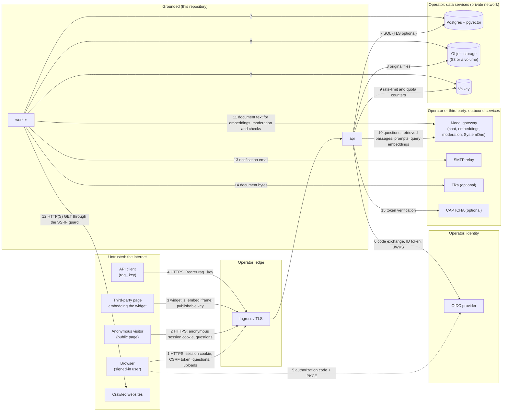

# Data flow

Grounded is one binary run as two kinds of process: **api** (HTTP: the web UI, the `/v1` API, the public API and the widget) and **worker** (River jobs: ingestion, crawls, embeddings, retention, break-glass expiry, profile migrations). `serve` runs both in one process for small installs. Everything durable is in Postgres and object storage; Valkey holds only counters that are safe to lose (ADR-0015).

## Boundaries and what crosses them

| # | Boundary | Direction | Data | Protection |
|---|---|---|---|---|
| 1 | Browser → api | in | Session cookie (`HttpOnly`, `Secure` on HTTPS, `SameSite=Lax`), CSRF token on writes, questions, uploads, admin settings (including gateway API keys typed by admins) | TLS at the ingress; server-side sessions in Postgres; CSRF token and `Origin` check on every write; CSP, `X-Frame-Options: DENY`, `nosniff` |
| 2 | Anonymous visitor → api | in | Questions to public agents; an anonymous session cookie (stored hashed, with the /24 or /48 of the IP) | Only `/v1/public/*`, which refuses credentials; per-IP and per-agent rate limits, daily caps (fail closed), optional CAPTCHA, moderation on input and output |
| 3 | Third-party page → api | in | `widget.js` (Subresource Integrity hash published), the embed page in an iframe, a publishable key (`pk_`) naming one agent | The key's allowed origins, enforced by the session start and the embed page's CSP `frame-ancestors`; the key reaches one published public agent and nothing else |
| 4 | API client → api | in | `Authorization: Bearer rag_…`, questions, documents | Key stored as HMAC-SHA256 with `API_KEY_PEPPER`; bound to one team, scopes, optional KB and agent restrictions, expiry; per-key rate limit; never platform administration |
| 5–6 | api ↔ OIDC provider | out | Authorization code, PKCE verifier, state and nonce; the ID token's claims (all stored on the user) | TLS; issuer and audience checked by `go-oidc`; optional allowed email domains; `(issuer, sub)` identifies the user |
| 7 | api, worker → Postgres | out | Everything durable: users, teams, sources, parsed text, passages and vectors, conversations and messages, audit log, usage, settings; gateway, SMTP and moderation secrets encrypted with `ENCRYPTION_KEY` (AES-256-GCM) | Private network (Kubernetes NetworkPolicy egress); TLS if the operator's `DATABASE_URL` asks for it; the audit log is append-only in the database (trigger) |
| 8 | api, worker → object storage | out | Uploaded files and fetched pages (originals) | Private network; S3 credentials from a Secret; paths derived from IDs, symlink escapes refused on volumes |
| 9 | api, worker → Valkey | out | Counters: request rate limits, sign-in attempts, anonymous and quota counters. No content or credentials | Private network; password; losing Valkey loses only counters (public traffic then fails closed) |
| 10 | api → model gateway | out | A user's question and recent turns, the agent's instructions, retrieved passages (team content up to the model's approved classification), query embeddings, moderation and SystemOne checks | TLS to the configured base URL; per-model maximum classification enforced before any call (DESIGN §4); connection keys encrypted at rest; the gateway is trusted with the content sent to it |
| 11 | worker → model gateway | out | Document passages for embedding (and SystemOne or moderation checks where configured) | As 10 |
| 12 | worker → crawled websites | out | GET requests with Grounded's user agent; responses are parsed as untrusted | SSRF guard: public unicast addresses only, checked on every redirect hop and pinned at dial time; the crawl allowlist; robots.txt; size, page and time limits |
| 13 | worker → SMTP | out | Notification email (titles and short bodies; never document text or transcripts) | TLS as configured; credentials encrypted at rest |
| 14 | worker → Tika | out | Document bytes for parsing (optional component) | In-cluster only; built-in parsers are used otherwise (PDF through PDFium compiled to WebAssembly, run in-process by wazero) |
| 15 | api → CAPTCHA provider | out | The visitor's token and IP | Optional (Turnstile) |

## Data at rest

| Store | Holds | Notes |
|---|---|---|
| Postgres | All durable data, including content (parsed text, passages, vectors), transcripts, the audit log and the access log | Retention rules and legal holds decide deletion ([`operations/retention.md`](../operations/retention.md)); nothing is deleted by default except anonymous conversations after their level's hours |
| Object storage | Original files | Deleted with their document, or kept under a legal hold (the deleted-files rule) |
| Valkey | Counters | Safe to lose |
| Logs (stdout) | One line per request: method, route pattern (not the raw path), status, duration, request ID, client IP. Request and response bodies aren't logged; error lines carry the error, which can name an object or an upstream reply | Shipped wherever the operator sends container logs; client IPs are personal data in many jurisdictions |
| Metrics (`/metrics`) | Request counts and latencies by route pattern and status, job and retention counts | No user or team labels; see [`threat-model.md`](threat-model.md) for exposure |

## Who can see content

| Who | Team content (sources, documents, passages) | Transcripts |
|---|---|---|
| Team members | Their team's, by role (DESIGN §3.5); through agents, what the agent's KBs hold | Their own only |
| API keys | Their team's, by scope; restricted keys to their KBs and agents | A personal key: its user's, with its team's agents, with the query scope |
| Other teams | None (the authorization matrix checks every route) | None |
| Platform admins | None, except under break-glass: one team, one scope, time-boxed, every read audited, owners notified | Only under break-glass with the conversations scope |
| Platform auditors | None; metadata, usage, audit and access log only | None |
| Anonymous visitors | What a public agent answers (its KBs, within the classification's audience ceiling) | Their own anonymous session's |
| The model gateway | Whatever is sent to it (10, 11) | The turns sent to it |
