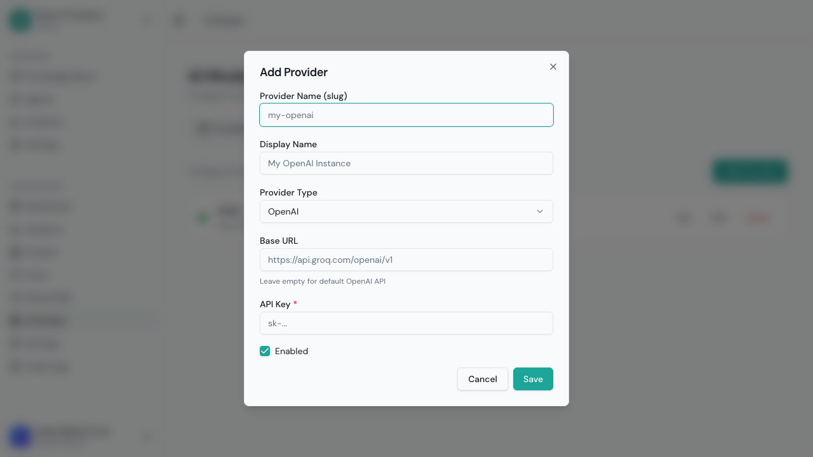
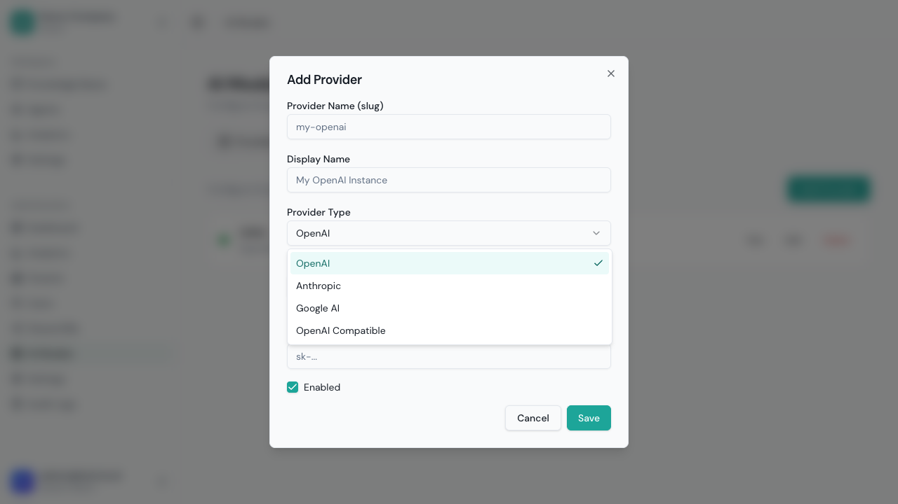
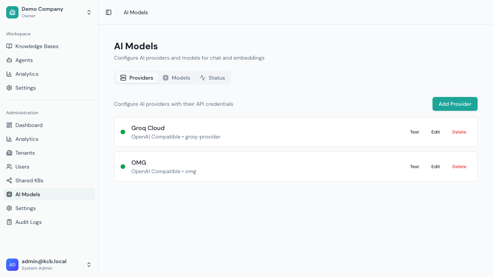
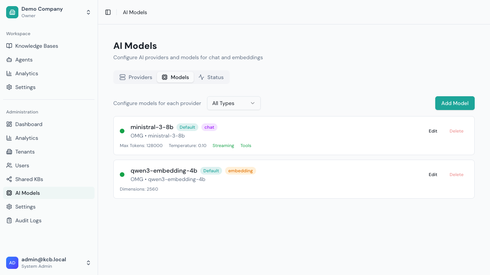
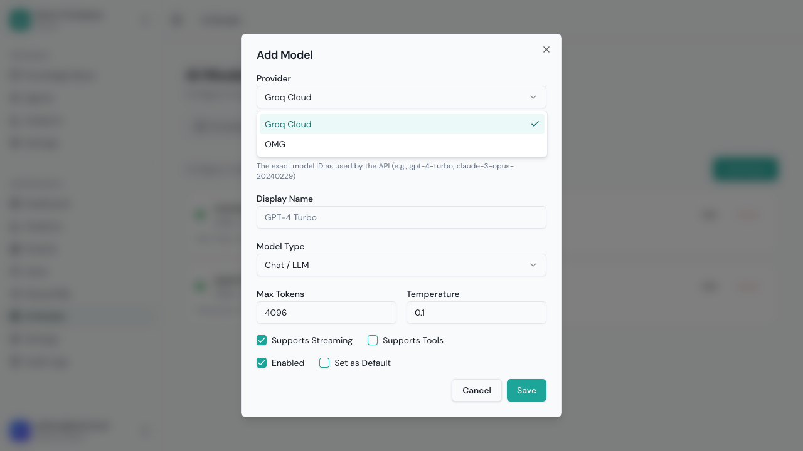
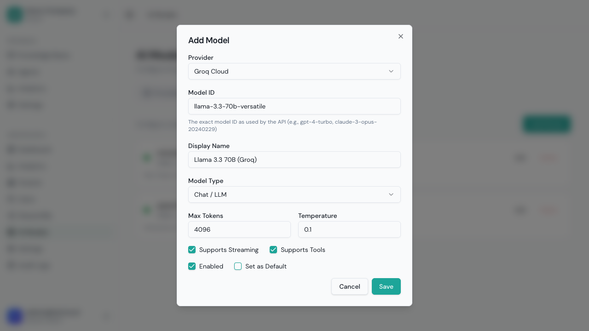
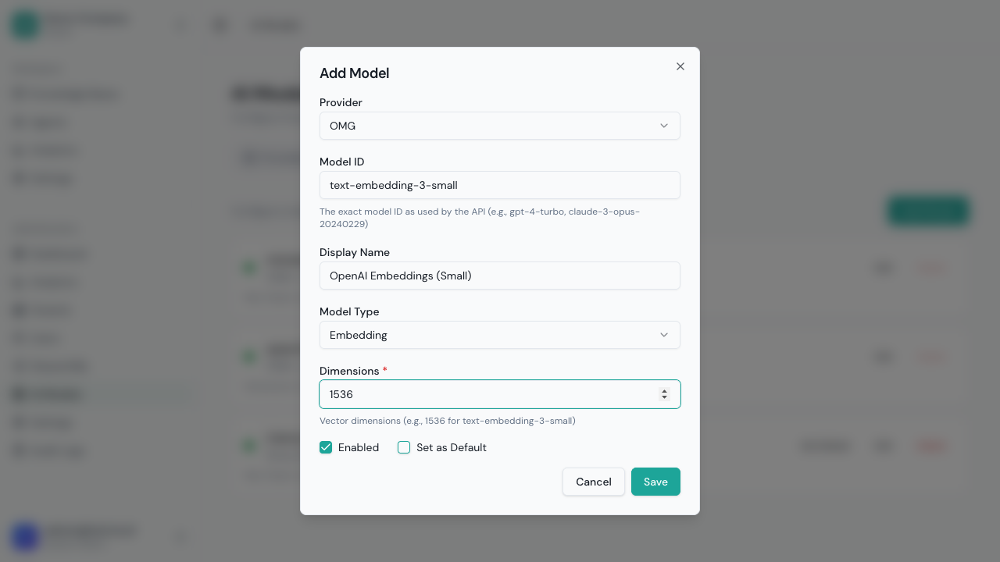
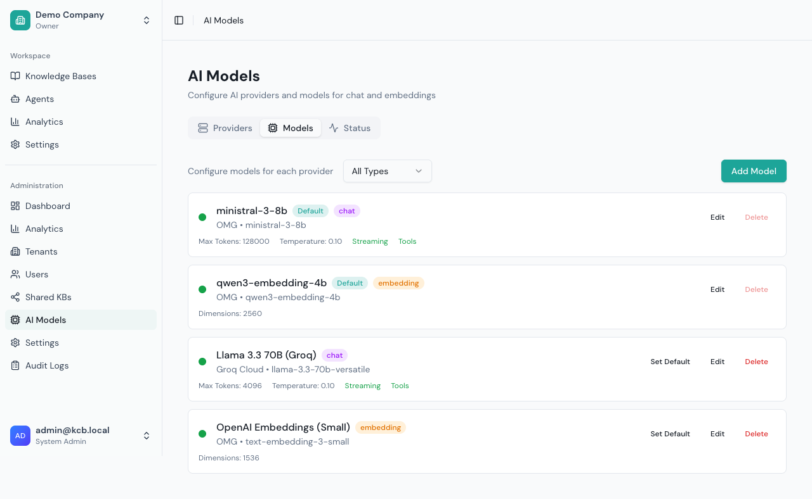
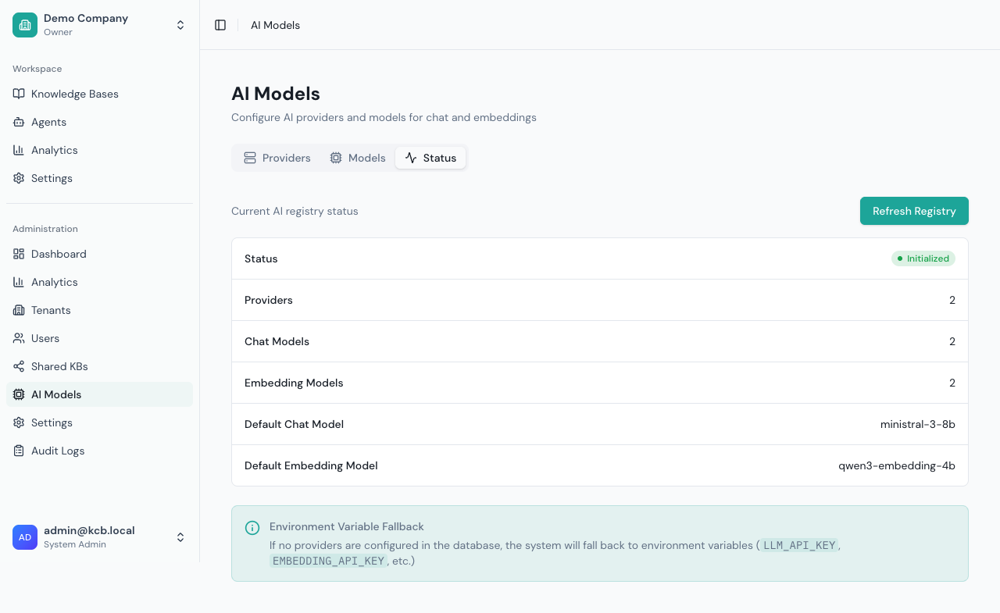

# AI Model Configuration

This guide covers configuring LLM providers and models in Grounded.

## Overview

Grounded uses AI models for two purposes:

1. **Chat Generation**: Producing responses based on retrieved context
2. **Embeddings**: Converting text to vectors for similarity search

You need at least one provider configured with both capabilities to use Grounded.

## Supported Providers

### OpenAI

**Capabilities:** Chat, Embeddings, Tool Use

**Popular Models:**
| Model ID | Type | Context | Notes |
|----------|------|---------|-------|
| `gpt-4o` | Chat | 128K | Latest, recommended |
| `gpt-4o-mini` | Chat | 128K | Faster, cheaper |
| `gpt-4-turbo` | Chat | 128K | Previous generation |
| `gpt-3.5-turbo` | Chat | 16K | Budget option |
| `text-embedding-3-small` | Embeddings | - | 1536 dimensions |
| `text-embedding-3-large` | Embeddings | - | 3072 dimensions |

**Setup:**
1. Get API key from [OpenAI Platform](https://platform.openai.com/api-keys)
2. Add provider in Grounded
3. Add desired models

### Anthropic

**Capabilities:** Chat, Tool Use

**Popular Models:**
| Model ID | Type | Context | Notes |
|----------|------|---------|-------|
| `claude-sonnet-4-20250514` | Chat | 200K | Latest, recommended |
| `claude-3-5-sonnet-20241022` | Chat | 200K | Previous Sonnet |
| `claude-3-5-haiku-20241022` | Chat | 200K | Fast, efficient |
| `claude-3-opus-20240229` | Chat | 200K | Most capable |

**Note:** Anthropic doesn't provide embeddings. Use OpenAI or another provider for embeddings.

**Setup:**
1. Get API key from [Anthropic Console](https://console.anthropic.com/)
2. Add provider in Grounded
3. Add desired models

### Google AI

**Capabilities:** Chat, Embeddings

**Popular Models:**
| Model ID | Type | Context | Notes |
|----------|------|---------|-------|
| `gemini-1.5-pro` | Chat | 1M | Very large context |
| `gemini-1.5-flash` | Chat | 1M | Fast, efficient |
| `text-embedding-004` | Embeddings | - | 768 dimensions |

**Setup:**
1. Get API key from [Google AI Studio](https://makersuite.google.com/app/apikey)
2. Add provider in Grounded
3. Add desired models

### OpenAI-Compatible

For self-hosted or alternative providers that use OpenAI's API format.

**Examples:**
- Ollama
- LM Studio
- Azure OpenAI
- Together AI
- Groq
- Fireworks AI

**Setup:**
1. Get API key (if required)
2. Get base URL for the API
3. Add as OpenAI-Compatible provider
4. Add models available on that provider

## Adding a Provider

**Navigate to:** Sidebar > **AI Models** (in the Admin section)


The Providers tab shows all configured AI providers with their type, status, and model count.

### Step 1: Open Add Provider Dialog

Click **Add Provider** to open the configuration dialog.



### Step 2: Select Provider Type

Click the provider type dropdown to see available options:



| Type | Description |
|------|-------------|
| **OpenAI** | OpenAI's official API |
| **Anthropic** | Anthropic's Claude models |
| **Google AI** | Google's Gemini models |
| **OpenAI Compatible** | Any provider with OpenAI-compatible API |

### Step 3: Fill Provider Details

**For OpenAI/Anthropic/Google:**
- **Name**: Internal identifier (lowercase, hyphens allowed)
- **Display Name**: Friendly name shown in UI
- **API Key**: Your provider API key

**For OpenAI-Compatible:**
All the above, plus:
- **Base URL**: The API endpoint (e.g., `https://api.groq.com/openai/v1`)


Click **Save** to create the provider.

### Step 4: Test Connection

After adding a provider:
1. Find the provider in the list
2. Click **Test** button
3. Verify it shows a success message



## Adding Models

Navigate to the **Models** tab to add and manage models.



### Adding a Chat Model

1. Click **Add Model**
2. Select the provider from the dropdown



3. Fill in the model details:



| Field | Description |
|-------|-------------|
| **Model ID** | The provider's model identifier (e.g., `llama-3.3-70b-versatile`) |
| **Display Name** | Friendly name shown to users |
| **Model Type** | Select "Chat / LLM" |
| **Max Tokens** | Maximum response length |
| **Temperature** | Creativity level (0.0-2.0) |
| **Supports Streaming** | Enable for real-time responses |
| **Supports Tools** | Enable for function calling |
| **Enabled** | Whether the model is available |
| **Set as Default** | Use as default chat model |

4. Click **Save**

### Adding an Embedding Model

1. Click **Add Model**
2. Select the provider
3. Select "Embedding" as the model type



For embedding models, configure:
- **Model ID**: e.g., `text-embedding-3-small`
- **Display Name**: e.g., "OpenAI Embeddings (Small)"
- **Dimensions**: Vector dimensions (e.g., 1536)

4. Click **Save**

### Models List

After adding models, they appear in the Models tab:



Use the type filter dropdown to show only Chat or Embedding models.

## Model Status

The **Status** tab shows the current state of the model registry:



Click **Refresh Registry** to reload the model configuration from the database.

```
Model ID: gpt-4o
Display Name: GPT-4o (Latest)
Model Type: Chat (or Embedding)
Max Tokens: 4096
Temperature: 0.7
Supports Streaming: ☑
Supports Tools: ☑
Is Default: ☑
Is Enabled: ☑
```

**Note:** Each model configuration is for ONE type (Chat or Embedding). If a provider model supports both, create two configurations.

3. Click **Save**

## Model Configuration Options

### Basic Settings

| Setting | Description |
|---------|-------------|
| **Model ID** | Provider's model identifier |
| **Display Name** | Friendly name shown to users |
| **Is Enabled** | Whether model is available for use |
| **Is Default** | Use as default when not specified |

### Model Type

| Type | Description |
|------|-------------|
| **Chat** | Generates conversational responses |
| **Embedding** | Generates vector embeddings for search |

**Note:** Each model configuration is for one type. Create separate configurations if needed.

### Performance Settings

| Setting | Default | Description |
|---------|---------|-------------|
| **Max Tokens** | 4096 | Maximum output tokens |
| **Temperature** | 0.1 | Response creativity (0-2) |
| **Supports Streaming** | true | Enable real-time streaming |
| **Supports Tools** | false | Enable function calling (chat models) |
| **Dimensions** | - | Vector dimensions (embedding models only) |

### Temperature Guide

| Value | Use Case |
|-------|----------|
| 0.0 | Deterministic, factual responses |
| 0.1 | Default - consistent, minimal variation (recommended for RAG) |
| 0.3 | Mostly consistent, slight variation |
| 0.7 | Balanced creativity |
| 1.0 | Creative, varied responses |
| 1.5+ | Highly creative, experimental |

## Managing Models

### Enable/Disable Models

1. Find the model
2. Toggle **Enabled** switch

Disabled models:
- Won't appear in selection dropdowns
- Existing agents using them will error
- Can be re-enabled later

### Set Default Model

1. Find the model
2. Click **Set as Default**

You can have separate defaults for:
- Chat models
- Embedding models

### Edit Model

1. Click the model
2. Update settings
3. Click **Save**

Changes take effect immediately for new requests.

### Delete Model

1. Click the model
2. Click **Delete**
3. Confirm

**Warning:** Agents using this model will need reconfiguration.

## Embedding Configuration

### Understanding Embeddings

Embeddings convert text into numerical vectors for similarity search. Key considerations:

| Factor | Impact |
|--------|--------|
| **Dimensions** | Higher = more accuracy, more storage |
| **Model** | Different models have different quality |
| **Consistency** | All content in a KB must use same model |

### Dimension Compatibility

Knowledge bases are created with a specific embedding dimension. You cannot mix dimensions:

| Model | Dimensions |
|-------|------------|
| text-embedding-3-small | 1536 |
| text-embedding-3-large | 3072 |
| text-embedding-004 | 768 |

If you change embedding models:
1. Create a new knowledge base with new dimension
2. Re-ingest all content
3. Old KB remains with old embeddings

### Recommended Setup

For most use cases:
- Use `text-embedding-3-small` (1536 dimensions)
- Good balance of quality and efficiency

For maximum quality:
- Use `text-embedding-3-large` (3072 dimensions)
- Higher storage and compute cost

## Provider Management

### Multiple Providers

You can configure multiple providers:
- Use different models for different purposes
- Have backup providers for redundancy
- Test new providers safely

### Provider Priority

When multiple chat models are default:
- First enabled default is used
- Reorder by drag-and-drop

### Updating API Keys

1. Find the provider
2. Click **Edit**
3. Update API key
4. Click **Save**

### Deleting Providers

1. Find the provider
2. Click **Delete**
3. Confirm

**Warning:** All models under the provider are also deleted.

## Cost Management

### Monitoring Usage

View token usage in Analytics:
- Prompt tokens (input)
- Completion tokens (output)
- Total cost (estimated)

### Cost Optimization

1. **Use appropriate models:**
   - GPT-4o-mini for simple queries
   - GPT-4o for complex reasoning

2. **Optimize context:**
   - Reduce topK in retrieval config
   - Use smaller chunk sizes

3. **Enable caching:**
   - Redis caches common queries
   - Reduces redundant API calls

## Troubleshooting

### "No models configured" Error

**Cause:** No enabled chat or embedding models

**Solution:**
1. Add a provider
2. Add at least one chat model
3. Add at least one embedding model
4. Ensure both are enabled and set as default

### "API key invalid" Error

**Cause:** Incorrect or expired API key

**Solution:**
1. Verify key in provider settings
2. Regenerate key if needed
3. Check for trailing spaces

### "Model not found" Error

**Cause:** Model ID doesn't exist at provider

**Solution:**
1. Verify model ID spelling
2. Check provider documentation
3. Model may have been deprecated

### "Rate limit exceeded" Error

**Cause:** Too many requests to provider

**Solution:**
1. Implement request queuing
2. Upgrade provider plan
3. Use multiple providers for load balancing

### "Context length exceeded" Error

**Cause:** Input too long for model

**Solution:**
1. Reduce topK in retrieval config
2. Use smaller chunk sizes
3. Use model with larger context window

## API Reference

**Authentication:** All admin endpoints require a JWT from a logged-in system admin user. Use the same `Authorization: Bearer <token>` header you receive from the login endpoint.

### List Providers

```bash
GET /api/v1/admin/models/providers
Authorization: Bearer <jwt-token>
```

### Add Provider

```bash
POST /api/v1/admin/models/providers
Authorization: Bearer <jwt-token>
Content-Type: application/json

{
  "name": "openai-prod",
  "displayName": "OpenAI Production",
  "type": "openai",
  "apiKey": "sk-xxx",
  "baseUrl": null,
  "isEnabled": true
}
```

**Note:** The `name` field must be lowercase alphanumeric with hyphens (e.g., `openai-prod`, `anthropic-main`).

### List Models

```bash
GET /api/v1/admin/models/models
Authorization: Bearer <jwt-token>
```

### Add Model

```bash
POST /api/v1/admin/models/models
Authorization: Bearer <jwt-token>
Content-Type: application/json

{
  "providerId": "provider-uuid",
  "modelId": "gpt-4o",
  "displayName": "GPT-4o",
  "modelType": "chat",
  "maxTokens": 4096,
  "temperature": 0.7,
  "supportsStreaming": true,
  "supportsTools": true,
  "isDefault": true,
  "isEnabled": true
}
```

For embedding models:

```bash
POST /api/v1/admin/models/models
Authorization: Bearer <jwt-token>
Content-Type: application/json

{
  "providerId": "provider-uuid",
  "modelId": "text-embedding-3-small",
  "displayName": "Embeddings (Small)",
  "modelType": "embedding",
  "dimensions": 1536,
  "isDefault": true,
  "isEnabled": true
}
```

---

Next: [Tenant Management](./tenant-management.md)
