# Shared Knowledge Bases

This guide covers creating and managing shared (global) knowledge bases that can be accessed by multiple tenants.

## Overview

Shared Knowledge Bases allow administrators to create centralized content repositories that can be made available to some or all tenants. This is useful for:

- **Company-wide policies** - HR documents, compliance guidelines, employee handbooks
- **Product documentation** - Technical docs shared across customer tenants
- **Common resources** - FAQs, best practices, training materials
- **Centralized knowledge** - Information that should be consistent across the organization

### Key Differences from Tenant KBs

| Feature | Tenant KB | Shared KB |
|---------|-----------|-----------|
| **Owner** | Specific tenant | System (no tenant) |
| **Management** | Tenant admins | System admins only |
| **Visibility** | Single tenant | Multiple tenants |
| **Editable by tenants** | Yes | No (read-only) |
| **Sources** | Tenant manages | Admin manages |

## Accessing Shared KBs

Navigate to **Shared KBs** in the Administration section of the sidebar.

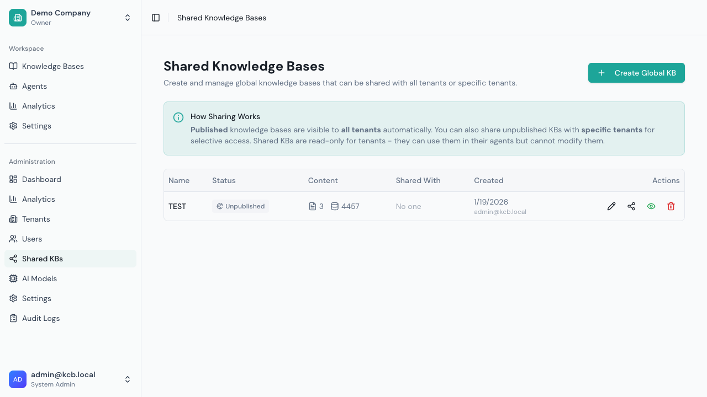

The list shows all global knowledge bases with:
- Name and description
- Number of sources and chunks
- Sharing status (published to all vs. specific tenants)
- Action buttons (Edit, Manage sharing, Publish/Unpublish, Delete)

## Creating a Shared KB

### Step 1: Open Create Dialog

Click **Create Global KB** to open the creation dialog.

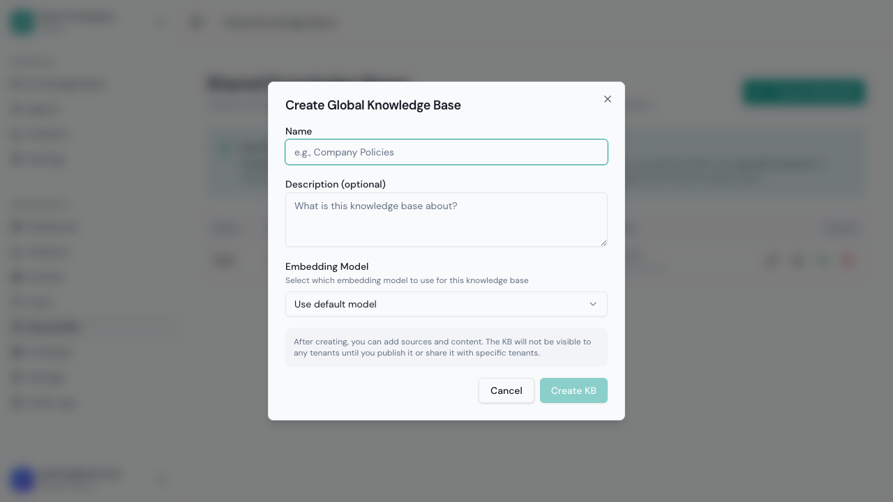

### Step 2: Fill in Details

| Field | Description |
|-------|-------------|
| **Name** | Descriptive name for the KB |
| **Description** | What content this KB contains |
| **Embedding Model** | Model for vector embeddings |

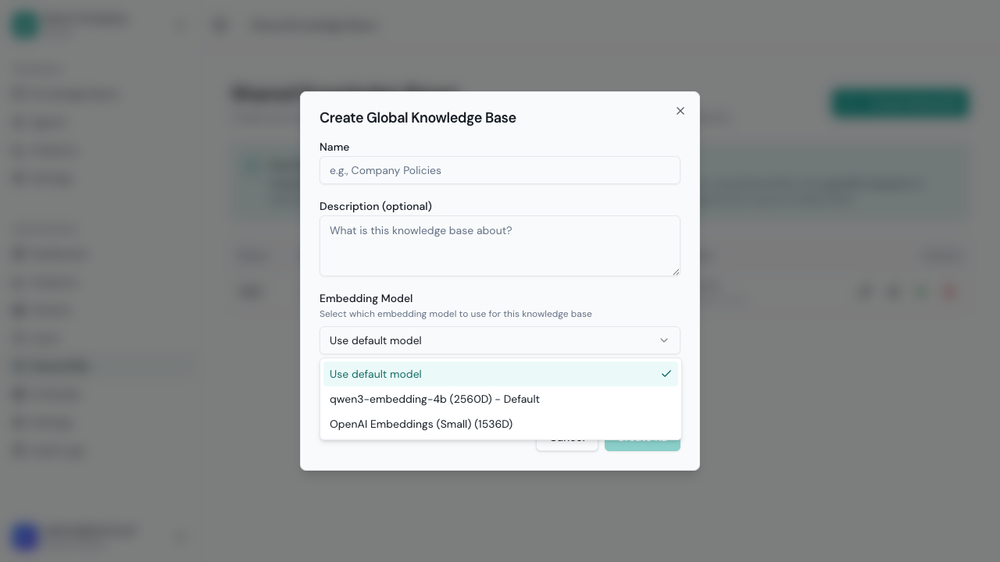

Choose an embedding model or use the system default. The embedding dimension determines vector storage requirements.

### Step 3: Create the KB

Fill in the details and click **Create KB**.

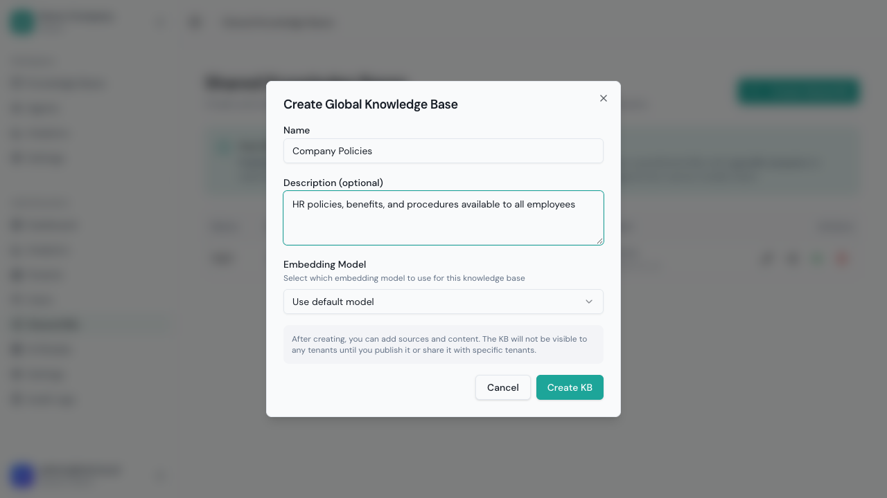

The KB is created but not yet visible to any tenants.

## Sharing Methods

There are two ways to make a shared KB available to tenants:

### Method 1: Publish to All Tenants

Publishing makes the KB visible to **every tenant** automatically.

1. Find the KB in the list
2. Click **Publish to all tenants**

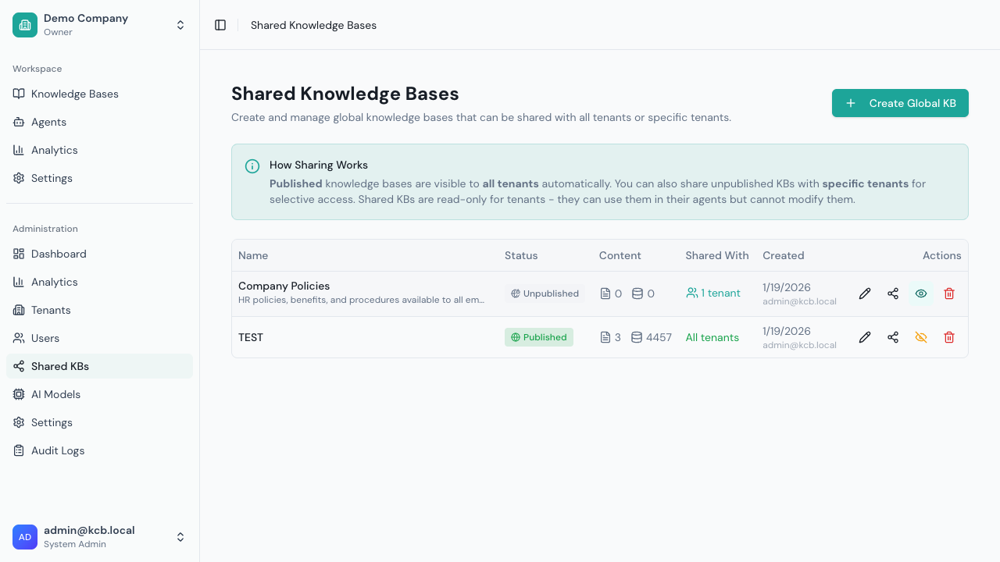

The button changes to **Unpublish** when the KB is published. All current and future tenants will see this KB.

**When to use:** Company-wide resources that everyone should access.

### Method 2: Share with Specific Tenants

For selective sharing, add individual tenants:

1. Click **Manage sharing**

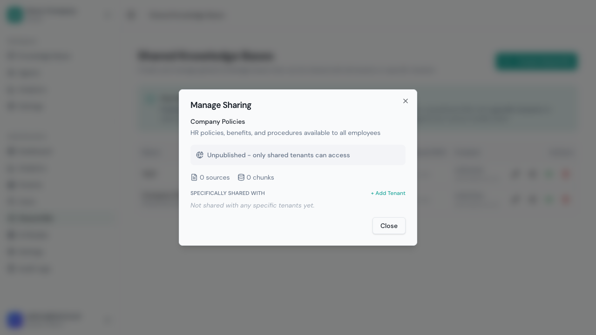

2. Click **+ Add Tenant**
3. Select a tenant from the dropdown

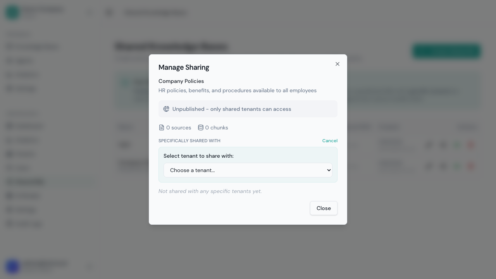

4. Repeat for additional tenants

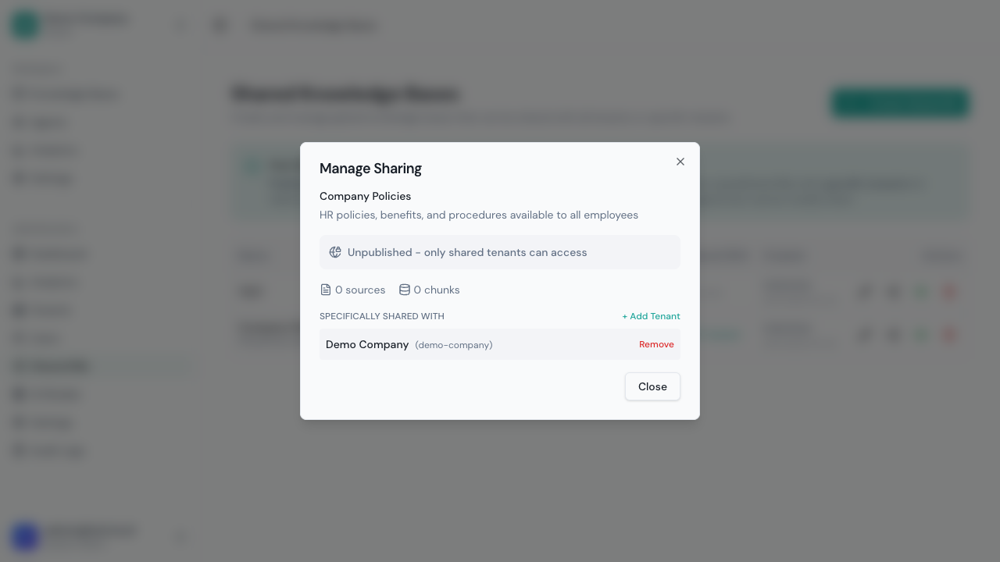

**When to use:** Content for specific customer segments, beta features, or restricted access.

### Combining Methods

You can use both methods:
- Publish to all for baseline access
- Add specific shares for unpublished KBs

When you unpublish a KB, only explicitly shared tenants retain access.

## Managing Sources

Click on a shared KB to manage its sources.

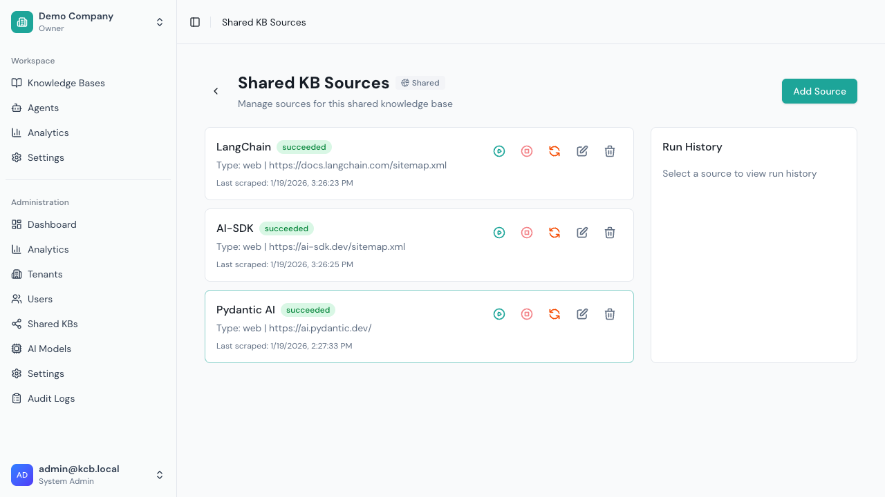

### Adding Sources

Click **Add Source** to add content to the KB.

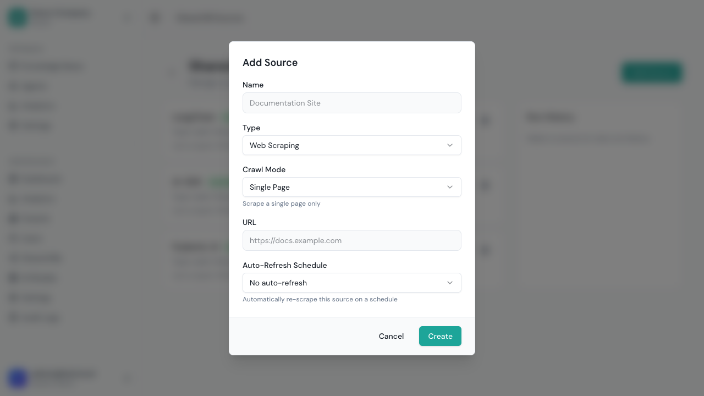

Source types available:
- **Web/Sitemap** - Crawl websites
- **Upload** - Upload documents (PDF, DOCX, TXT, etc.)

### Running Ingestion

After adding sources:
1. Click **Run Now** to start ingestion
2. Monitor progress in the source card
3. Use **Force Re-index** to refresh cached content

## Tenant Experience

### Viewing Shared KBs

Tenants see shared KBs in their Knowledge Bases list with visual indicators:

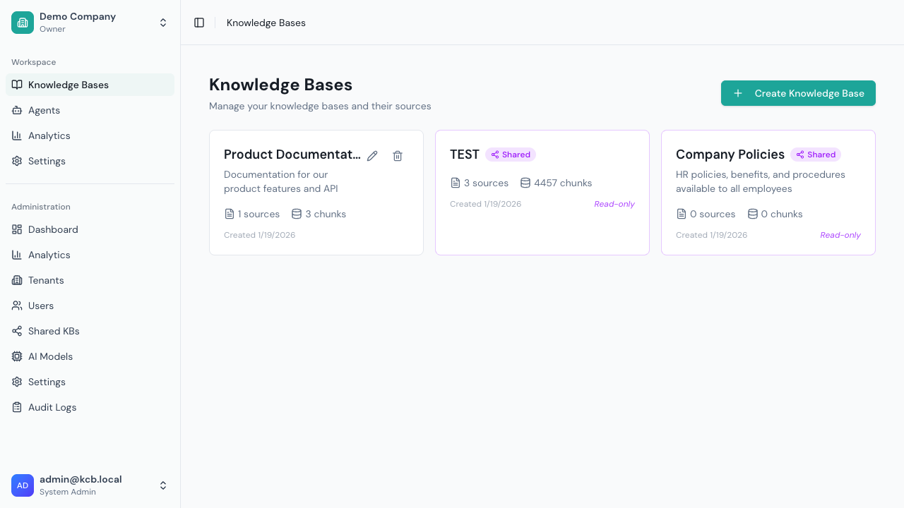

Shared KBs display:
- **"Shared" badge** - Purple indicator showing it's a shared KB
- **"Read-only" label** - Tenants cannot modify the content
- **Source/chunk counts** - Shows the amount of indexed content

### Shared KB Detail View

When tenants click on a shared KB, they see a read-only detail view:

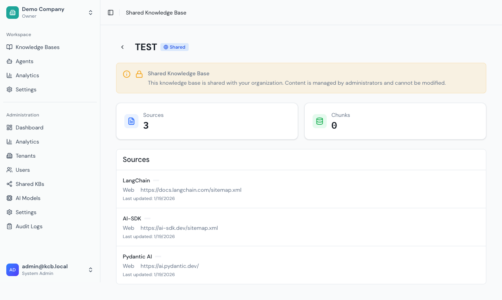

Tenants can:
- View the KB description
- See the list of sources
- View source metadata (type, URL, last updated)

Tenants **cannot**:
- Edit the KB name or description
- Add, edit, or delete sources
- Trigger re-indexing

### Using in Agents

Tenants can attach shared KBs to their agents just like their own KBs:

1. Create or edit an agent
2. In the Knowledge Bases section, shared KBs appear in the list
3. Select the shared KB to attach it

When the agent responds to queries, it searches both tenant-owned and shared KB content.

## Best Practices

### Content Organization

1. **Separate by topic** - Create focused KBs (e.g., "HR Policies", "Product Docs", "Compliance")
2. **Clear naming** - Use descriptive names that indicate the content
3. **Detailed descriptions** - Help tenants understand what's included

### Sharing Strategy

| Scenario | Recommendation |
|----------|----------------|
| All tenants need access | Publish to all |
| Only some customers | Share individually |
| Internal vs. external | Separate KBs with different sharing |
| Sensitive content | Individual shares with audit trail |

### Maintenance

1. **Regular updates** - Schedule periodic re-indexing for web sources
2. **Monitor usage** - Check Analytics for shared KB usage patterns
3. **Version control** - For documents, maintain source versions externally
4. **Communication** - Notify tenants of significant content updates

## API Reference

### List Shared KBs

```bash
GET /api/v1/admin/shared-kbs
Authorization: Bearer <admin-token>
```

### Create Shared KB

```bash
POST /api/v1/admin/shared-kbs
Authorization: Bearer <admin-token>
Content-Type: application/json

{
  "name": "Company Policies",
  "description": "HR policies and procedures",
  "embeddingModelId": "model-uuid"  // optional
}
```

### Publish to All Tenants

```bash
POST /api/v1/admin/shared-kbs/:kbId/publish
Authorization: Bearer <admin-token>
```

### Unpublish

```bash
POST /api/v1/admin/shared-kbs/:kbId/unpublish
Authorization: Bearer <admin-token>
```

### Share with Specific Tenant

```bash
POST /api/v1/admin/shared-kbs/:kbId/shares
Authorization: Bearer <admin-token>
Content-Type: application/json

{
  "tenantId": "tenant-uuid"
}
```

### Remove Tenant Share

```bash
DELETE /api/v1/admin/shared-kbs/:kbId/shares/:tenantId
Authorization: Bearer <admin-token>
```

### List Available Tenants for Sharing

```bash
GET /api/v1/admin/shared-kbs/:kbId/available-tenants
Authorization: Bearer <admin-token>
```

Returns tenants that don't already have access to this KB.

## Troubleshooting

### KB Not Visible to Tenant

**Causes:**
- KB is not published and tenant is not in share list
- Tenant was added after KB was unpublished

**Solution:**
1. Check sharing settings via "Manage sharing"
2. Either publish to all or add the specific tenant

### Tenant Can't Attach KB to Agent

**Causes:**
- KB was unpublished or share was removed
- Agent validation error

**Solution:**
1. Verify KB is still shared with the tenant
2. Check agent's KB attachment list
3. Re-share if necessary

### Changes Not Reflecting

**Causes:**
- Embedding model mismatch
- Ingestion not complete

**Solution:**
1. Check source run status
2. Ensure embedding model matches KB configuration
3. Run re-indexing if needed

---

Next: [Model Configuration](./model-configuration.md) | [Tenant Management](./tenant-management.md)
