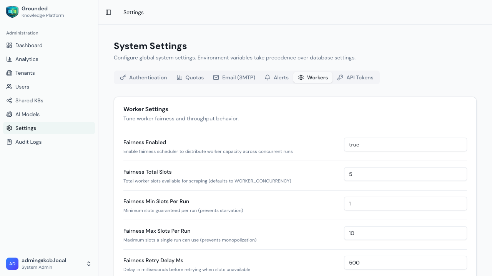
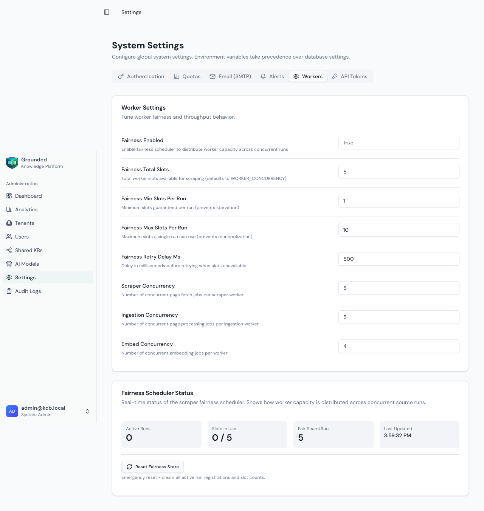
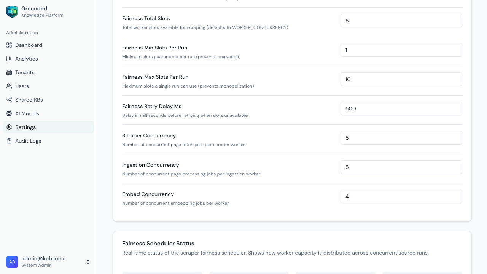

# Worker Settings

This guide covers the configuration of worker processes that handle document ingestion, web scraping, and embedding generation.

## Overview

Grounded uses background workers to process:
- **Scraper Worker** - Fetches web pages using Playwright
- **Ingestion Worker** - Processes documents, creates chunks, generates embeddings

Worker settings can be configured in two ways:
1. **Admin UI** (recommended) - Settings > Workers tab
2. **Environment Variables** - Fallback when UI settings aren't configured

**Priority**: Admin UI settings always take precedence over environment variables. Workers fetch settings from the API at startup and refresh every 60 seconds.

## Accessing Worker Settings

1. Log in as a System Administrator
2. Navigate to **Settings** in the sidebar
3. Click the **Workers** tab



Here's the full Workers settings page:



## Configuration Options

### Worker Concurrency

These settings control how many jobs each worker processes simultaneously.

| Setting | Description | Default |
|---------|-------------|---------|
| **Scraper Concurrency** | Concurrent page fetch jobs per scraper worker | `5` |
| **Ingestion Concurrency** | Concurrent processing jobs per ingestion worker | `5` |
| **Embed Concurrency** | Concurrent embedding jobs per worker | `4` |

**Note**: Changes to concurrency settings require a worker restart to take effect. Workers will log a warning when settings change, prompting you to restart.

### Fairness Scheduler

The fairness scheduler ensures that when multiple source runs are active simultaneously, no single run monopolizes worker capacity.

| Setting | Description | Default |
|---------|-------------|---------|
| **Fairness Enabled** | Enable/disable the fairness scheduler | `true` |
| **Total Slots** | Total worker slots available for scraping | `5` |
| **Min Slots Per Run** | Minimum slots guaranteed per run (prevents starvation) | `1` |
| **Max Slots Per Run** | Maximum slots any single run can use (prevents monopolization) | `10` |
| **Retry Delay (ms)** | Delay before retrying when slots unavailable | `500` |

**How it works:**
- When a scraper job starts, it requests a "slot" from the fairness scheduler
- Slots are distributed evenly across active source runs
- If a run has used its fair share, new jobs are delayed briefly
- This ensures all active runs make progress, even with limited workers

### Fairness Metrics

The Workers tab displays real-time metrics for the fairness scheduler:



| Metric | Description |
|--------|-------------|
| **Active Runs** | Number of source runs currently in the scraping stage |
| **Total Slots In Use** | Current slots being used across all runs |
| **Total Slots Available** | Maximum slots from configuration |
| **Fair Share Per Run** | Calculated slots per run (total / active) |
| **Run Slots** | Breakdown of slots per active source run |

### Reset Fairness State

If the fairness scheduler gets into an inconsistent state (e.g., after a crash), you can reset it:

1. Scroll to the "Fairness Metrics" section
2. Click **Reset Fairness State**
3. Confirm the action

This clears all slot tracking data in Redis. Active jobs will re-acquire slots automatically.

## Environment Variable Fallbacks

When the API is unavailable or settings haven't been configured in the UI, workers use these environment variables as fallbacks:

```env
# Worker concurrency
WORKER_CONCURRENCY=5
INDEX_WORKER_CONCURRENCY=5
EMBED_WORKER_CONCURRENCY=4

# Fairness scheduler
FAIRNESS_DISABLED=false
FAIRNESS_TOTAL_SLOTS=5
FAIRNESS_MIN_SLOTS_PER_RUN=1
FAIRNESS_MAX_SLOTS_PER_RUN=10
FAIRNESS_RETRY_DELAY_MS=500
FAIRNESS_DEBUG=false

# Settings refresh interval
SETTINGS_REFRESH_INTERVAL_MS=60000
```

## Internal API

Workers fetch settings from an internal API endpoint:

```
GET /api/v1/internal/workers/settings
```

### Securing the Internal API

In production, secure this endpoint by setting the `INTERNAL_API_KEY` environment variable:

```env
# Generate a secure key
INTERNAL_API_KEY=$(openssl rand -hex 32)
```

Workers include this key in the `X-Internal-API-Key` header when fetching settings.

**In development**: If `INTERNAL_API_KEY` is not set, the endpoint is open (no authentication required).

## Best Practices

### Capacity Planning

1. **Start conservative**: Begin with default concurrency values
2. **Monitor resource usage**: Watch CPU, memory, and network on worker nodes
3. **Scale gradually**: Increase concurrency as you add more worker replicas

### Fairness Tuning

For workloads with many concurrent source runs:
- Increase `Total Slots` to match your total worker capacity
- Keep `Min Slots Per Run` at `1` to prevent starvation
- Set `Max Slots Per Run` to allow bursting when only one run is active

For single-tenant deployments:
- Consider disabling fairness (`Fairness Enabled = false`)
- Or set `Max Slots Per Run` equal to `Total Slots`

### Kubernetes Deployments

When running in Kubernetes:
1. Set `INTERNAL_API_KEY` in your secrets
2. Configure worker replica counts in your deployment
3. Set `Total Slots` = `WORKER_CONCURRENCY` x `replicas`

Example for 3 scraper workers with concurrency 5:
```
Total Slots = 5 * 3 = 15
```

## Troubleshooting

### Workers Not Picking Up Setting Changes

**Symptom**: Changed settings in UI but workers use old values

**Solution**: 
1. Check worker logs for "Settings updated from API" messages
2. Verify workers can reach the API (`API_URL` environment variable)
3. If using `INTERNAL_API_KEY`, ensure it matches on API and workers
4. Restart workers to force immediate refresh

### Fairness Slots Not Releasing

**Symptom**: Metrics show slots in use but no jobs running

**Solution**:
1. Click **Reset Fairness State** in the Workers tab
2. Check Redis connectivity
3. Slots auto-expire after 5 minutes (TTL safety)

### Workers Failing to Start

**Symptom**: Workers crash on startup with settings errors

**Solution**:
1. Verify `API_URL` is correct and reachable
2. Check `INTERNAL_API_KEY` matches (if configured)
3. Workers fall back to environment variables if API is unavailable

---

Next: [Model Configuration](./model-configuration.md)
