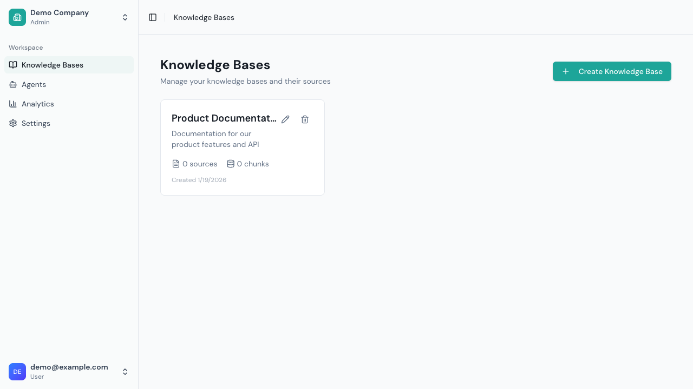
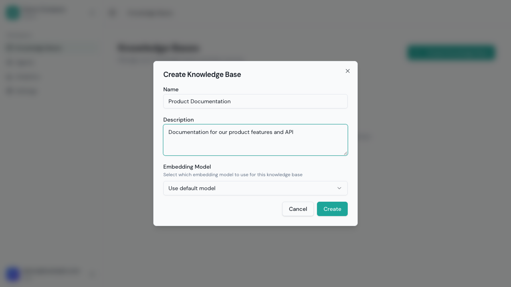
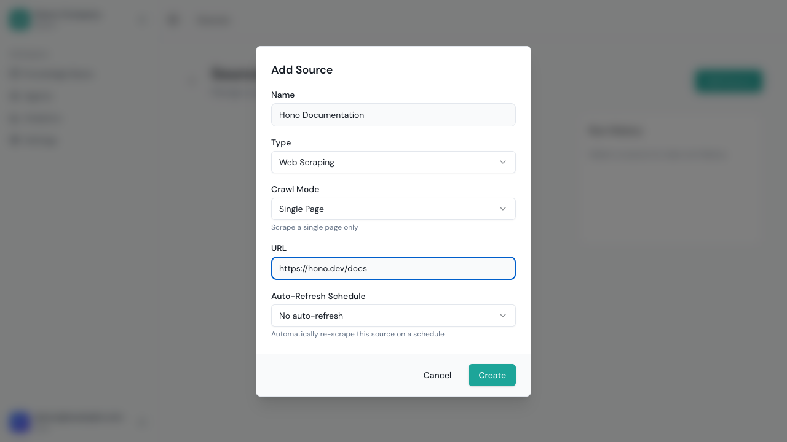
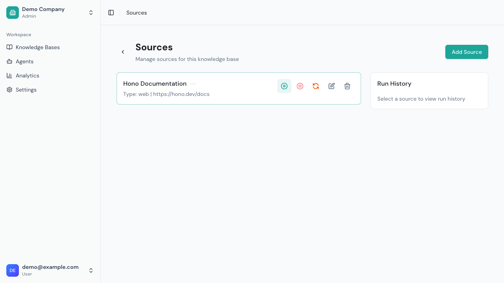

# Knowledge Bases

Knowledge bases are the foundation of Grounded. They store and organize your content for AI-powered retrieval.

## Overview

A knowledge base is a collection of:
- **Web Sources**: Content crawled from websites
- **Uploads**: Documents you upload directly
- **Chunks**: Processed text segments ready for search



If you haven't created any knowledge bases yet, you'll see an empty state with a prompt to create your first one:


When someone asks a question, the system:
1. Searches the knowledge base for relevant chunks
2. Provides those chunks as context to the AI
3. Generates a response with citations

## Creating a Knowledge Base

### From the UI

1. Navigate to **Knowledge Bases**
2. Click **Create Knowledge Base**
3. Enter details:
   - **Name**: Descriptive name (e.g., "Product Documentation")
   - **Description**: Optional context
   - **Embedding Model**: Usually leave as default
4. Click **Create**



### Embedding Model Selection

The embedding model determines how text is converted to vectors for search. Once set, it cannot be changed.

| Model | Dimensions | Best For |
|-------|------------|----------|
| text-embedding-3-small | 1536 | General use (recommended) |
| text-embedding-3-large | 3072 | Maximum accuracy |

**Tip**: Stick with the default unless you have specific requirements.

## Adding Web Sources

Web sources automatically fetch and index content from URLs.


### Creating a Web Source

1. Open your knowledge base
2. Go to **Sources** tab
3. Click **Add Web Source**
4. Configure:
   - **Name**: Identifier for this source
   - **URL**: Starting point URL
   - **Crawl Mode**: How to discover pages



### Crawl Modes

| Mode | Description | Use Case |
|------|-------------|----------|
| **Single Page** | Fetch only this URL | Individual pages, blog posts |
| **List** | Fetch specific URLs | Curated page lists |
| **Sitemap** | Follow sitemap.xml | Structured websites |
| **Domain** | Crawl entire domain | Full website indexing |

### Advanced Options

**URL Patterns**
```
Include: /docs/*, /blog/*
Exclude: /admin/*, /login/*
```

**Subdomain Handling**
- Include subdomains: Crawl docs.example.com from example.com
- Exclude subdomains: Stay on the exact domain

**Crawl Depth** (Domain mode)
- Depth 1: Links from starting page
- Depth 2: Links from those pages
- Depth 3+: Deeper crawling

**Scheduling**
- Manual: Crawl on demand
- Daily: Automatic daily updates
- Weekly: Weekly refresh

### Running a Crawl

1. Open the source
2. Click **Start Crawl**
3. Monitor progress in the **Runs** tab



Each run shows:
- Pages discovered
- Pages processed
- Success/failure counts
- Duration

### Crawl Results

After crawling:
- **Pages**: List of crawled URLs
- **Status**: Success, error, or skipped
- **Content**: Extracted text preview
- **Chunks**: Generated text segments

## Uploading Documents

Upload files directly to your knowledge base.

### Supported Formats

| Format | Extensions | Notes |
|--------|------------|-------|
| PDF | .pdf | Text extraction from all pages |
| Word | .docx, .doc | Full content extraction |
| Excel | .xlsx, .xls | All sheets, structured data |
| PowerPoint | .pptx, .ppt | Slide content extraction |
| Text | .txt, .md | Direct text processing |
| HTML | .html, .htm | Content extraction |
| CSV | .csv | Structured data |
| JSON | .json | Structured data |

### Uploading Files

1. Open your knowledge base
2. Go to **Uploads** tab
3. Click **Upload**
4. Select files (drag-and-drop supported)
5. Wait for processing

### Upload Processing

Each upload goes through:
1. **Extraction**: Convert to text
2. **Chunking**: Split into segments
3. **Embedding**: Generate vectors
4. **Indexing**: Store for search

Monitor status in the uploads list:
- **Processing**: Currently being processed
- **Complete**: Ready for search
- **Failed**: Error during processing

### Replacing Content

To update a document:
1. Delete the old upload
2. Upload the new version

Grounded doesn't automatically detect changes in uploaded files.

## Understanding Chunks

### What is a Chunk?

Chunks are segments of text optimized for AI retrieval. Each chunk:
- Contains coherent information
- Includes metadata (title, heading, URL)
- Has a vector embedding for search

### Chunk Properties

| Property | Description |
|----------|-------------|
| Content | The actual text |
| Title | Document or page title |
| Heading | Section heading |
| URL | Source URL (web) or file reference (upload) |
| Keywords | Extracted key terms |

### Viewing Chunks

1. Open knowledge base
2. Click on a source
3. View chunks in the **Content** tab

### Chunk Quality

Good chunks lead to better answers. Signs of quality:
- Complete sentences
- Clear context
- Relevant metadata
- No truncated information

## Managing Knowledge Bases

### Editing

1. Open the knowledge base
2. Click **Edit**
3. Update name or description
4. Save changes

### Deleting

1. Open the knowledge base
2. Click **Delete**
3. Confirm deletion

**Warning**: Deleting a KB removes all sources, uploads, and chunks.

### Viewing Statistics

The knowledge base overview shows:
- Total sources
- Total chunks
- Total uploads
- Processing status
- Last updated

## Shared Knowledge Bases

Your tenant may have access to shared knowledge bases from administrators.

### Identifying Shared KBs

Shared KBs show a "Shared" badge in the list.

### Using Shared KBs

You can:
- ✅ View content
- ✅ Attach to agents
- ❌ Add or modify sources
- ❌ Delete content

### Subscribing to Published KBs

If enabled by admins:
1. Go to **Knowledge Bases**
2. Click **Browse Shared**
3. Find available KBs
4. Click **Subscribe**

## Best Practices

### Organization

**Single-topic KBs**
- Create separate KBs for different topics
- Easier to manage and update
- Better retrieval accuracy

**Naming Conventions**
- Use clear, descriptive names
- Include version or date if relevant
- Example: "Product Docs v3.2"

### Content Quality

**Source Selection**
- Choose authoritative sources
- Avoid duplicate content
- Keep sources focused

**Regular Updates**
- Schedule recurring crawls for dynamic content
- Re-upload updated documents
- Remove outdated sources

### Performance

**Optimal KB Size**
- Start smaller, expand as needed
- Very large KBs may have slower retrieval
- Consider splitting by topic

**Processing Monitoring**
- Check processing status regularly
- Address failed sources promptly
- Ensure complete indexing before deployment

## Troubleshooting

### Crawl Issues

**"Connection refused"**
- URL may be incorrect
- Site may block crawlers
- Try adding User-Agent headers

**"No content found"**
- JavaScript-rendered content may not extract
- Check if page requires authentication
- Verify robots.txt allows crawling

**Slow crawling**
- Large sites take time
- Rate limiting protects target sites
- Consider using sitemap mode

### Upload Issues

**"Unsupported format"**
- Verify file extension
- Try saving in different format
- Check file isn't corrupted

**"Processing failed"**
- File may be encrypted
- Check for password protection
- Try re-exporting the file

### Search Issues

**Poor results**
- Content may not cover the topic
- Check chunk quality
- Ensure indexing completed

**Missing content**
- Verify source processed successfully
- Check for crawl errors
- Re-process if needed

## API Reference

### List Knowledge Bases

```bash
GET /api/v1/knowledge-bases
X-Tenant-ID: <tenant-id>
Authorization: Bearer <token>
```

### Create Knowledge Base

```bash
POST /api/v1/knowledge-bases
X-Tenant-ID: <tenant-id>
Authorization: Bearer <token>
Content-Type: application/json

{
  "name": "Product Docs",
  "description": "Official product documentation"
}
```

### Get Knowledge Base

```bash
GET /api/v1/knowledge-bases/{kbId}
X-Tenant-ID: <tenant-id>
Authorization: Bearer <token>
```

### Delete Knowledge Base

```bash
DELETE /api/v1/knowledge-bases/{kbId}
X-Tenant-ID: <tenant-id>
Authorization: Bearer <token>
```

---

Next: [Data Sources](./sources.md)
