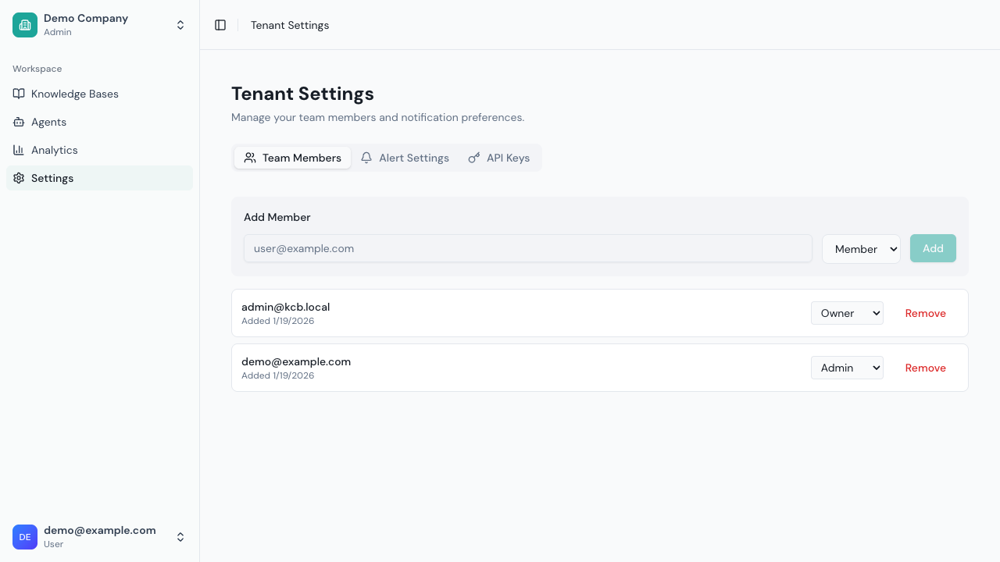
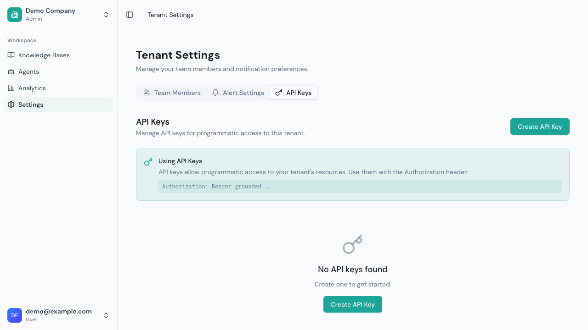

# Team Management

Manage your team members and their access to Grounded resources.

## Overview

Team management allows you to:
- Invite team members to your tenant
- Assign roles and permissions
- Control access to knowledge bases and agents
- Monitor team activity

## User Roles

### Available Roles

| Role | Description |
|------|-------------|
| **Owner** | Full access, can manage billing and delete tenant |
| **Admin** | Full access except billing and tenant deletion |
| **Member** | Can create and manage KBs, agents, and sources |
| **Viewer** | Read-only access to resources |

### Role Permissions

| Permission | Owner | Admin | Member | Viewer |
|------------|-------|-------|--------|--------|
| View resources | Yes | Yes | Yes | Yes |
| Create knowledge bases | Yes | Yes | Yes | No |
| Manage knowledge bases | Yes | Yes | Yes | No |
| Create agents | Yes | Yes | Yes | No |
| Manage agents | Yes | Yes | Yes | No |
| Invite users | Yes | Yes | No | No |
| Manage users | Yes | Yes | No | No |
| Change user roles | Yes | Yes | No | No |
| Manage tenant settings | Yes | Yes | No | No |
| Access billing | Yes | No | No | No |
| Delete tenant | Yes | No | No | No |

## Inviting Team Members

### Send an Invitation

1. Go to **Settings** > **Team Members**
2. Enter the email address
3. Select role from dropdown
4. Click **Add**



### Invitation Process

1. User receives email invitation
2. User clicks link to accept
3. If new to Grounded: Creates account
4. If existing user: Added to tenant
5. User appears in team list

### Pending Invitations

View pending invitations in **Settings** > **Team** > **Pending**

Options:
- **Resend**: Send invitation again
- **Revoke**: Cancel the invitation

### Invitation Expiration

Invitations expire after 7 days. Resend if expired.

## Managing Team Members

### View Team

Go to **Settings** > **Team Members** to see:
- All team members
- Their roles
- Role change dropdown
- Remove button


### Change User Role

1. Find user in team list
2. Click **Edit** (or role dropdown)
3. Select new role
4. Confirm change

**Note**: Cannot demote yourself from Owner.

### Remove Team Member

1. Find user in team list
2. Click **Remove**
3. Confirm removal

**Effects:**
- User loses access immediately
- Their created resources remain
- Can be re-invited later

### Transfer Ownership

To transfer Owner role:

1. Go to **Settings** > **Team**
2. Find the new owner
3. Click **Transfer Ownership**
4. Confirm with password
5. You become Admin

**Warning**: This cannot be undone by you.

## Access Control

### Knowledge Base Access

By default, all team members can access all knowledge bases.

For restricted access (Enterprise feature):
1. Open knowledge base settings
2. Go to **Access** tab
3. Toggle **Restricted Access**
4. Add allowed users/roles

### Agent Access

Similar to knowledge bases:
1. Open agent settings
2. Go to **Access** tab
3. Configure who can view/edit

### Chat Endpoint Scope

Chat endpoints are public and don't require authentication. However, they are tied to the agent that created them:
- Endpoints can be created by users with edit access to the agent
- Endpoints can be revoked by the creator or admins
- Each endpoint is specific to one agent

### API Keys

For programmatic access, create API keys in **Settings** > **API Keys**:



1. Click **Create API Key**
2. Give it a descriptive name
3. Copy the key immediately (it won't be shown again)
4. Use the key in the `Authorization: Bearer <key>` header

## Activity Monitoring

### Audit Log

View team activity in **Settings** > **Audit Log**:

| Event | Details |
|-------|---------|
| User invited | Who, by whom, when |
| User joined | Who, when |
| User removed | Who, by whom, when |
| Role changed | Who, old role, new role |
| Resource created | What, by whom |
| Resource deleted | What, by whom |

### Filtering

Filter audit logs by:
- Date range
- User
- Event type
- Resource

### Export

Export audit logs for compliance:
1. Set filters
2. Click **Export**
3. Choose format (CSV, JSON)

## Single Sign-On (SSO)

If your organization uses SSO:

### How It Works

1. Admin configures SSO provider
2. Users sign in with organization credentials
3. Automatic account creation
4. Role assignment based on groups

### SSO Providers

Supported protocols:
- SAML 2.0
- OpenID Connect (OIDC)

Common providers:
- Okta
- Azure AD
- Google Workspace
- Auth0

### Group Mapping

Map SSO groups to Grounded roles:

| SSO Group | Grounded Role |
|-----------|---------------|
| `grounded-admins` | Admin |
| `grounded-users` | Member |
| `grounded-readonly` | Viewer |

Configure in **Settings** > **Authentication** > **Group Mapping**

## Best Practices

### Role Assignment

1. **Least privilege**: Give minimum required access
2. **Multiple admins**: Don't rely on single admin
3. **Regular review**: Audit roles quarterly
4. **Document decisions**: Note why roles were assigned

### Security

1. **Remove promptly**: Remove access when people leave
2. **Use SSO**: Centralized access control
3. **Monitor activity**: Review audit logs regularly
4. **Strong passwords**: Enforce password requirements

### Onboarding

1. **Send welcome email**: With instructions
2. **Assign mentor**: For new team members
3. **Start with Viewer**: Upgrade after training
4. **Provide documentation**: Link to user guides

### Offboarding

1. **Remove access immediately**: Don't delay
2. **Transfer ownership**: Reassign owned resources
3. **Revoke chat endpoints**: Created by the user
4. **Document handover**: Note any knowledge transfer

## Troubleshooting

### "Invitation Not Received"

**Check:**
1. Spam/junk folder
2. Correct email address
3. Email allowlisting

**Solutions:**
1. Resend invitation
2. Check email logs (admin)
3. Add to allowlist

### "Cannot Accept Invitation"

**Causes:**
- Invitation expired
- Already a member
- Email mismatch

**Solutions:**
1. Request new invitation
2. Check existing membership
3. Use correct email

### "Permission Denied"

**Causes:**
- Insufficient role
- Resource restricted
- Endpoint revoked

**Solutions:**
1. Request role upgrade
2. Request resource access
3. Create new endpoint

### "Cannot Remove User"

**Causes:**
- User is Owner
- Removing yourself
- Insufficient permissions

**Solutions:**
1. Transfer ownership first
2. Ask another admin
3. Check your role

## API Reference

### List Team Members

```bash
GET /api/v1/team
X-Tenant-ID: <tenant-id>
Authorization: Bearer <token>
```

### Invite User

```bash
POST /api/v1/team/invite
X-Tenant-ID: <tenant-id>
Authorization: Bearer <token>
Content-Type: application/json

{
  "email": "user@example.com",
  "role": "member"
}
```

### Update User Role

```bash
PUT /api/v1/team/{userId}/role
X-Tenant-ID: <tenant-id>
Authorization: Bearer <token>
Content-Type: application/json

{
  "role": "admin"
}
```

### Remove User

```bash
DELETE /api/v1/team/{userId}
X-Tenant-ID: <tenant-id>
Authorization: Bearer <token>
```

### Get Audit Log

```bash
GET /api/v1/audit-log?startDate=2024-01-01&endDate=2024-12-31
X-Tenant-ID: <tenant-id>
Authorization: Bearer <token>
```

---

Next: [Widget Integration](../integration/widget.md)
