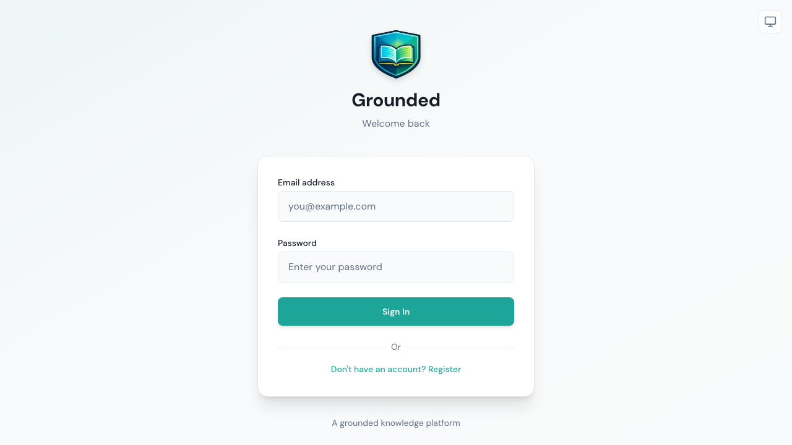
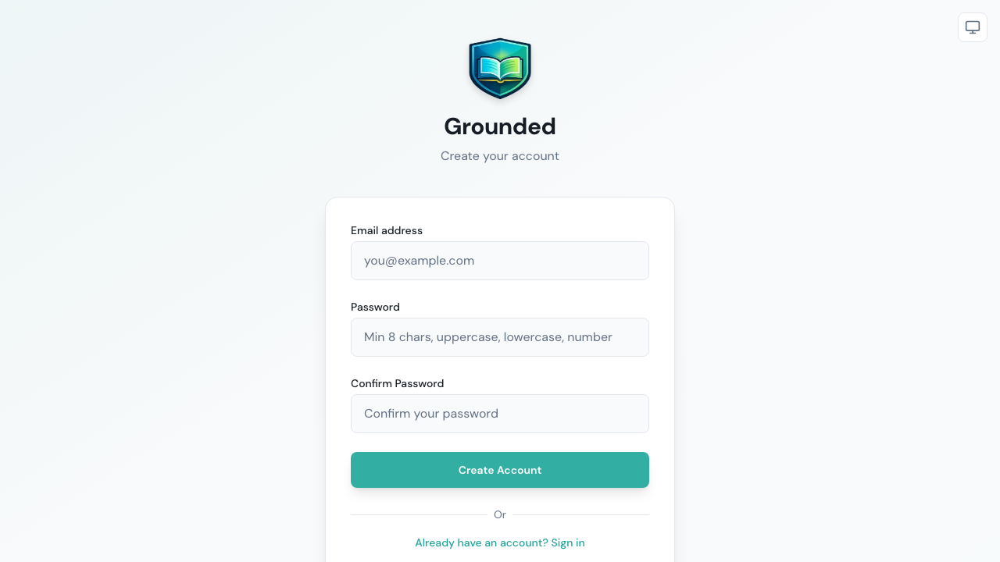
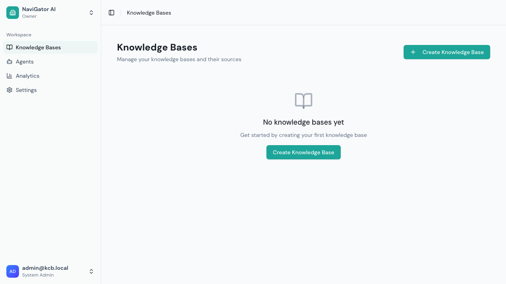
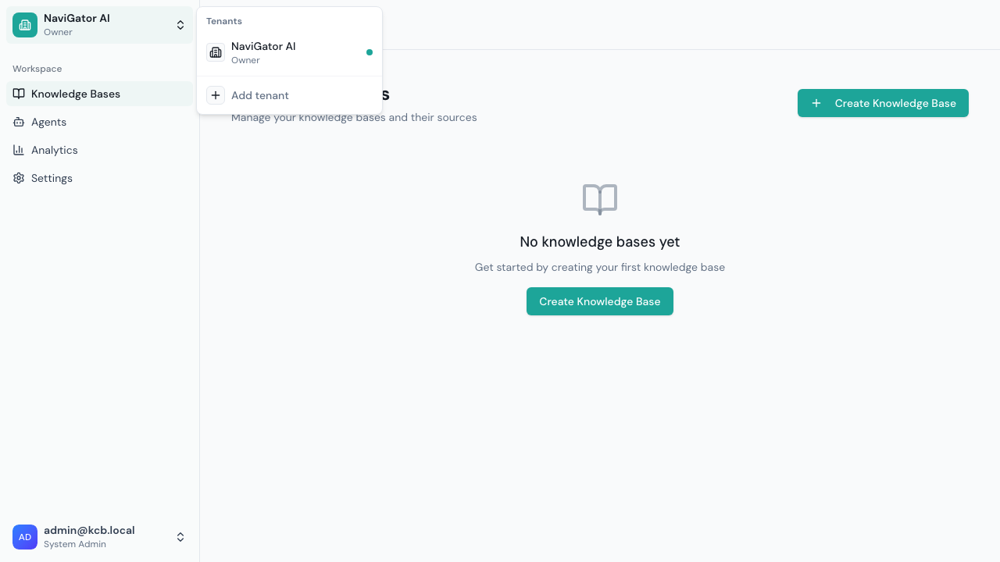
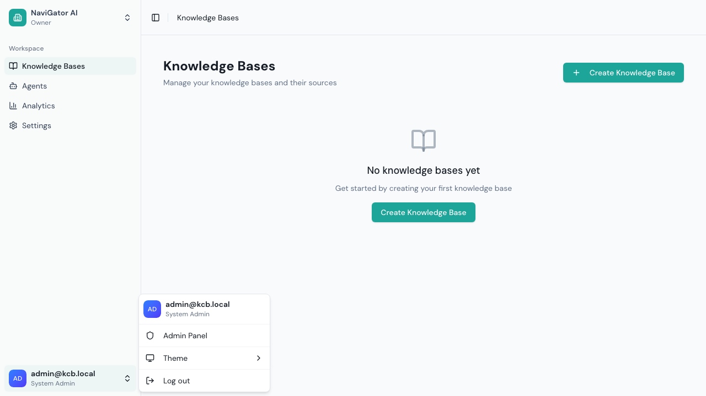

# Logging In & Navigation

## Signing In

Navigate to your Grounded instance URL. You'll see the login screen:

1. Enter your **email address** and **password**
2. Click **Sign In**
3. If your organization uses SSO (Single Sign-On), you may see an additional SSO option

> **First-time setup:** The initial admin account is created automatically during installation. Contact your system administrator for your login credentials.

## Registering a New Account

If self-registration is enabled (configurable by your system admin):

1. On the login page, click **Don't have an account? Register**

2. Enter your **email address**
3. Create a **password** (minimum 8 characters, must include uppercase, lowercase, and a digit)
4. **Confirm your password**
5. Click **Create Account**

After registering, you'll be signed in automatically. You'll need a tenant owner or admin to add you to a tenant before you can access any workspace features.

> **Note:** If you don't see the "Register" link, self-registration may be disabled. Ask your system administrator to create an account for you.

## Main Navigation

After logging in, you'll see the workspace with a sidebar on the left:

The sidebar contains two sections:

### Workspace Navigation
These are your day-to-day tools:
- **Knowledge Bases** — Manage your knowledge content
- **Agents** — Configure AI assistants
- **Analytics** — View chat usage and performance
- **Settings** — Manage team members and API keys

### Admin Navigation (System Admins Only)
If you're a system administrator, you'll see additional admin options accessible from the user menu.

## Switching Tenants

If you belong to multiple organizations (tenants), use the **tenant switcher** at the top of the sidebar:

1. Click the current tenant name at the top of the sidebar
2. Select the tenant you want to switch to
3. Click **Add tenant** to create a new organization

All data in Grounded is scoped to the current tenant — knowledge bases, agents, and settings are separate per tenant.

## User Menu

Click your name at the bottom of the sidebar to access the user menu:

Options:
- **Admin Panel** — Switch to the system administration view (system admins only)
- **Theme** — Toggle between light and dark mode
- **Log out** — Sign out of your account

## Returning to Workspace from Admin

When you're in the Admin Panel, click **← Back to Workspace** at the top of the sidebar to return to your normal workspace view.
