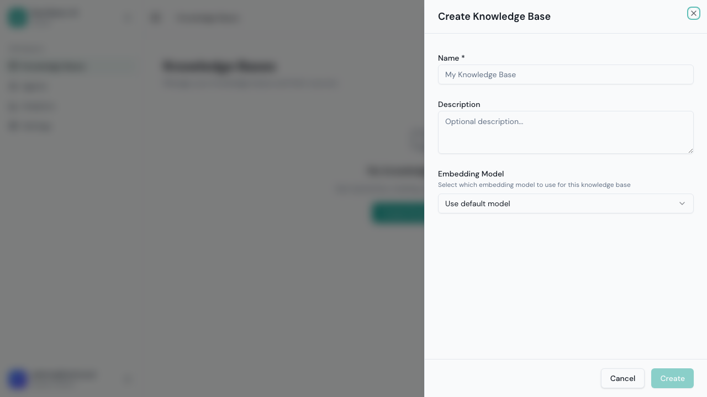
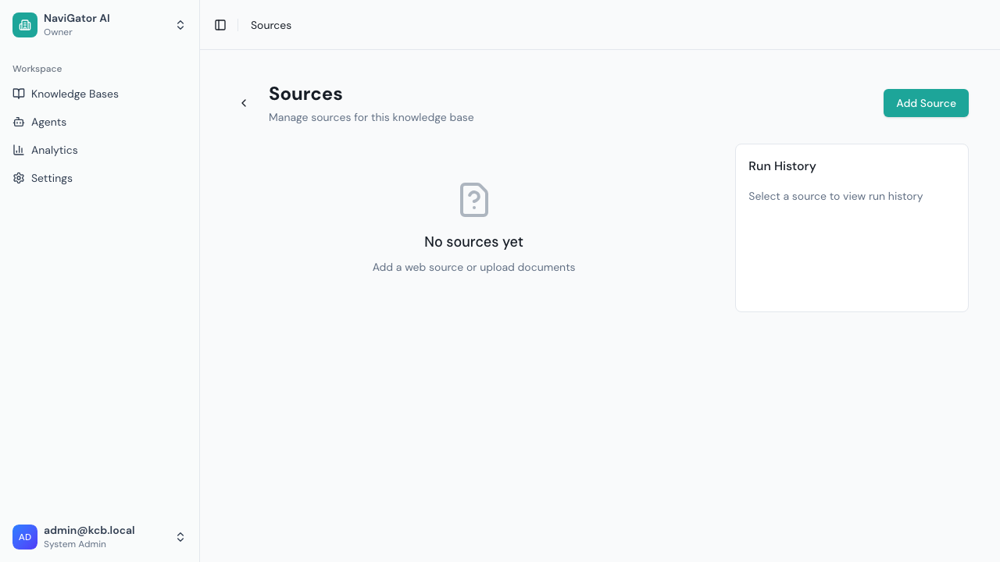
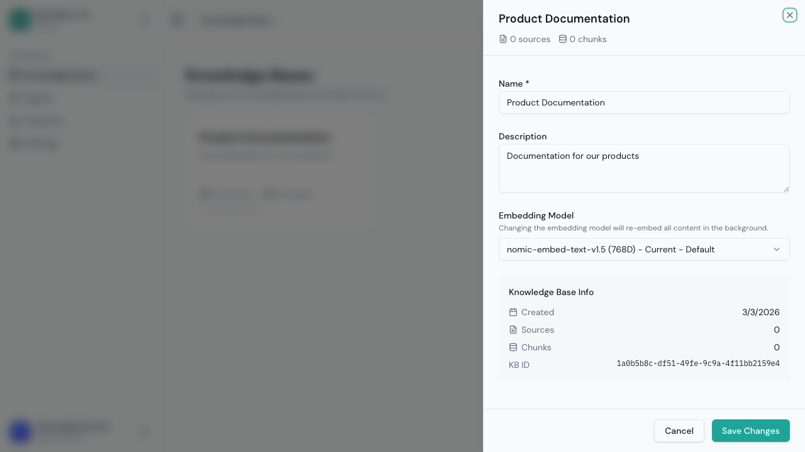

# Knowledge Bases

Knowledge bases are containers for your content. They hold the documents, web pages, and other information that your AI agents use to answer questions. Think of them as organized libraries that agents can search through.

## Viewing Knowledge Bases

Click **Knowledge Bases** in the sidebar to see all KBs in your tenant:

Each knowledge base card shows:
- **Name** and description
- **Source count** — Number of content sources (web scrapers or file uploads) attached
- **Chunk count** — Number of searchable text chunks indexed (content gets split into small pieces)
- **Embedding model** — The AI model used to create vector embeddings for search
- Action buttons: **Open**, **Configure**, and a **⋮** menu

---

## Creating a Knowledge Base

1. Click **Create Knowledge Base**

2. Fill in:

| Field | Required | Description |
|-------|:--------:|-------------|
| **Name** | ✅ | A descriptive name (e.g., "Product Documentation", "Support FAQ") |
| **Description** | No | What content this KB contains — helps your team understand its purpose |
| **Embedding Model** | ✅ | Which model converts text into searchable vectors. Defaults to the system default. |

3. Click **Create**

### Choosing an Embedding Model

The embedding model determines how content is vectorized for search. Key points:

- **Use the default** unless you have a specific reason to change it
- **All sources in a KB share the same model** — you can't mix embedding models
- **Changing the model later requires re-indexing all content**, which can take significant time for large KBs
- Common choices: `text-embedding-3-small` (fast, cost-effective) or `text-embedding-3-large` (higher quality)

---

## Managing Knowledge Bases

### Opening a KB (Sources View)

Click **Open** to see the sources within a KB:

From here you can:
- **Add Source** — Add a web scraper or upload files (see [Sources & Ingestion](./03-sources-and-ingestion.md))
- **View source status** — See which sources have been ingested and their health
- **Run ingestion** — Trigger processing for sources
- **Go back** — Return to the KB list

### Configuring a KB

Click **Configure** to edit a KB's settings:

You can change:
- **Name** — Update the display name
- **Description** — Update or add a description
- **Embedding Model** — Change the model (⚠️ triggers a full re-index)

Click **Save Changes** to apply.

### Deleting a KB

From the **⋮** menu on a KB card, select **Delete**:
- This is a **soft delete** — the KB is marked as deleted but not immediately removed
- Content is retained for 30 days before permanent deletion
- Any agents using this KB will lose access to its content
- Contact your admin if you need to restore a deleted KB

---

## Understanding KB Metrics

| Metric | What It Means | Healthy Range |
|--------|--------------|---------------|
| **Sources** | Number of web scrapers + file uploads | 1-10 per KB typical |
| **Chunks** | Total searchable text pieces | Varies by content volume |
| **Embedding Model** | Model used for vectorization | Should match across related KBs |

**Chunks** are the fundamental search unit. When a user asks a question:
1. The question is converted to a vector using the same embedding model
2. The most similar chunks are retrieved from the KB
3. These chunks are provided to the LLM as context for generating an answer

More chunks = more content indexed, but also more to search through.

---

## Organizing Knowledge Bases

### Recommended Structure

| Strategy | Example | When to Use |
|----------|---------|-------------|
| **By topic** | "Product Docs", "FAQ", "Policies" | Most common — clear separation |
| **By audience** | "Customer-Facing", "Internal" | Different agents for different users |
| **By source** | "Website Content", "Uploaded Docs" | When mixing web and file content |

### Best Practices
- **One KB per topic** — Keep content focused. An agent searching "Product Docs" shouldn't also search through HR policies.
- **Multiple KBs per agent** — Agents can search across several KBs at once. Create a "Support Agent" that searches both "Product Docs" and "FAQ".
- **Don't over-segment** — If content is closely related, keep it in one KB. Too many small KBs adds complexity without benefit.
- **Name clearly** — Use names that make it obvious what content is inside. Your team will thank you.

---

## Shared Knowledge Bases

Your system admin can create **Shared (Global) Knowledge Bases** that appear in your KB list with a special badge:

- These contain company-wide content (policies, shared docs, etc.)
- You can **subscribe** to make them available in your tenant
- Once subscribed, attach them to agents just like any other KB
- You **cannot** edit shared KB content — only the system admin can

See [Shared Knowledge Bases](./14-shared-knowledge-bases.md) for admin-side management.

---

## Tips

- **Start with one KB** — Create your first KB, add a source, run ingestion, and test with an agent before creating more
- **Check chunk counts after ingestion** — If the count seems low, check source run status for errors
- **Keep related content together** — All your product docs in one KB, all your FAQ in another
- **Use descriptions** — They help your team understand what each KB contains without opening it
- **Monitor source health** — If a web source fails during re-scrape, the KB content becomes stale
- **Plan your embedding model** — Switching later is expensive, so choose carefully at creation time
