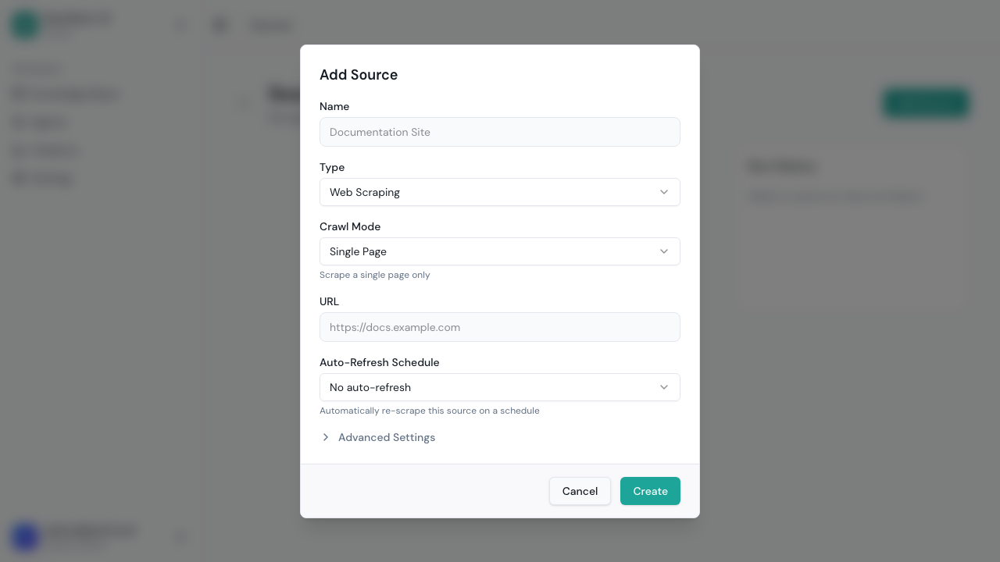
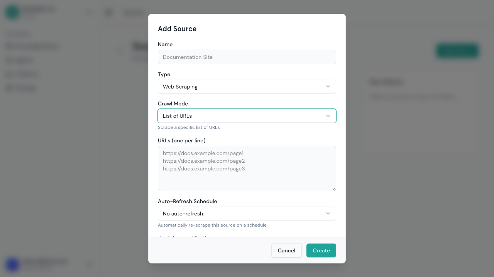
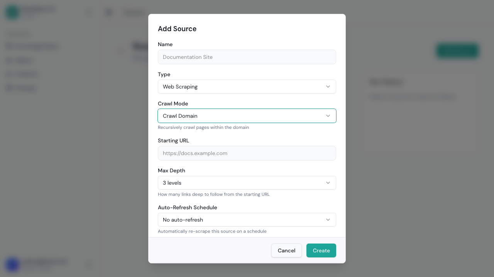
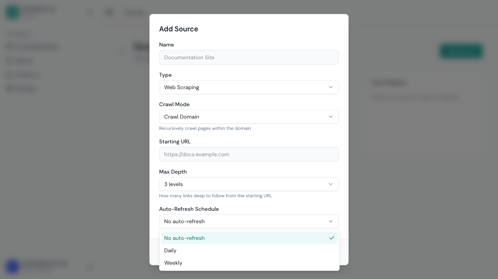
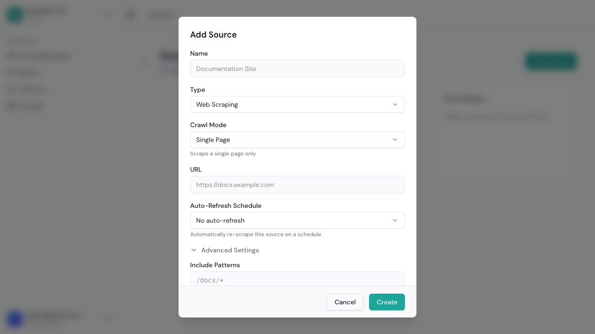
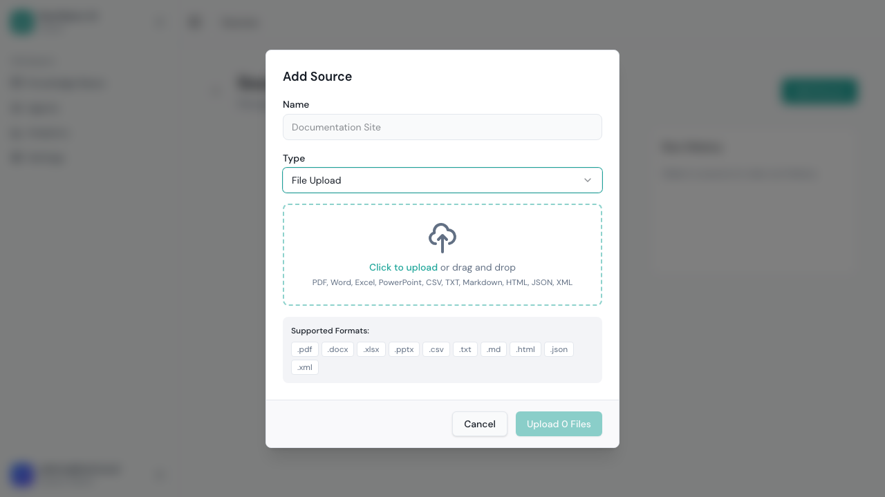
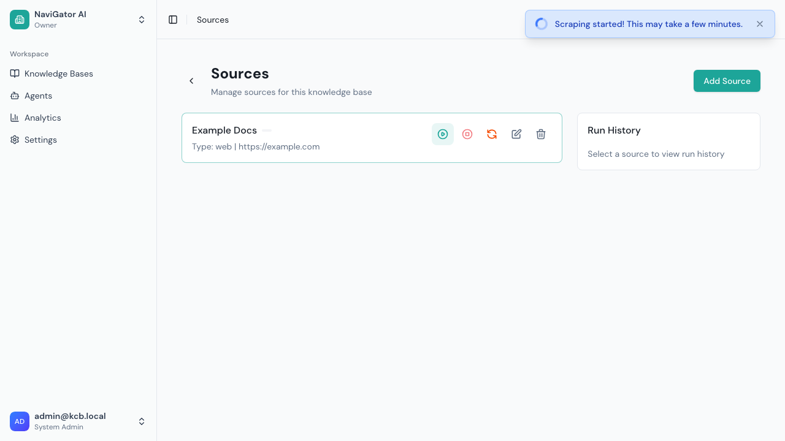
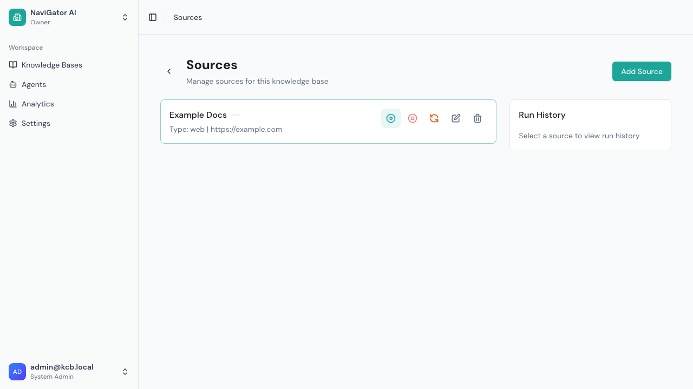

# Sources & Ingestion

Sources define where your content comes from. Each source is attached to a knowledge base and can be either a **web source** (scraped from a website) or a **file upload**.

## Source Types at a Glance

| Type | Best For | How It Works |
|------|----------|-------------|
| **Web — Single Page** | One specific page | Scrapes exactly one URL |
| **Web — List of URLs** | Hand-picked pages | Scrapes a specific set of URLs you provide |
| **Web — Sitemap** | Structured sites | Reads the site's sitemap.xml to discover all pages |
| **Web — Crawl Domain** | Entire websites | Starts at a seed URL and follows links to discover pages |
| **File Upload** | PDFs, Word docs, text files | Uploads and extracts text from document files |

---

## Web Source: Single Page

Use this when you need to index one specific page.

1. Click **Add Source** in your knowledge base
2. Set **Type** to `Web Scraping`
3. Set **Scrape Mode** to `Single Page`
4. Enter the exact **URL** to scrape
5. Select a **Fetch Mode** (see [Fetch Modes](#fetch-modes) below)
6. Click **Create**



**When to use:** FAQ pages, landing pages, specific articles, individual documentation pages.

---

## Web Source: List of URLs

Use this when you have a known set of pages to index.

1. Set **Scrape Mode** to `List of URLs`
2. Enter your URLs — one per line in the text area



**When to use:** You've curated a specific set of pages. Blog posts, selected help articles, product pages from different sections of a site.

**Tip:** This mode is great when you don't want to crawl an entire site but need more than one page.

---

## Web Source: Sitemap

Use this to automatically discover pages from a website's sitemap.

1. Set **Scrape Mode** to `Sitemap`
2. Enter the **sitemap URL** (e.g., `https://docs.example.com/sitemap.xml`)
3. The system reads the sitemap and processes all URLs listed in it

**When to use:** Well-structured websites that maintain a sitemap. Most documentation sites, blogs, and CMS-based sites have one.

**Tip:** Check if a site has a sitemap by visiting `https://example.com/sitemap.xml` or checking `robots.txt`.

---

## Web Source: Crawl Domain

Use this to automatically discover and scrape an entire website by following links.

1. Set **Scrape Mode** to `Crawl Domain`
2. Enter the **starting URL** (e.g., `https://docs.example.com`)
3. Configure **Crawl Depth** — how many links deep to follow (1-10, default: 3)



**When to use:** You want to index an entire site or section without manually listing pages. The crawler starts at your URL and follows every link it finds.

**Important settings for domain crawling:**
- **Crawl Depth** — Depth 1 = only the starting page's links. Depth 3 = follows links 3 levels deep. Higher depth = more pages but longer crawl time.
- **Include Subdomains** — Enable to also crawl `blog.example.com` when starting from `example.com`
- **Include/Exclude Patterns** — Control which URLs are followed (see [Advanced Settings](#advanced-settings))

---

## Fetch Modes

Every web source needs a **fetch mode** that determines how pages are downloaded:



| Fetch Mode | Speed | Description | Best For |
|------------|-------|-------------|----------|
| **Auto** | ⚡⚡ | Tries HTTP first, falls back to headless browser if needed | Most sites (recommended default) |
| **HTML** | ⚡⚡⚡ | Simple HTTP GET request | Static sites, documentation, blogs |
| **Headless** | ⚡ | Full Chromium browser rendering | JavaScript-heavy sites (SPAs, React apps) |
| **Firecrawl** | ⚡⚡ | External Firecrawl API service | Complex sites, when headless isn't available |

**Choosing a fetch mode:**
- Start with **Auto** — it handles most cases
- Use **HTML** if you know the site is static (faster, less resource intensive)
- Use **Headless** for single-page apps (React, Vue, Angular) where content loads via JavaScript
- Use **Firecrawl** if configured by your admin — it's a hosted scraping service

---

## Advanced Settings

Click **Advanced Settings** when creating or editing a web source:



| Setting | Description | Example |
|---------|-------------|---------|
| **Crawl Depth** | How many link levels deep to follow (domain mode only) | `3` = three levels of links |
| **Include Patterns** | Only process URLs matching these patterns | `/docs/*`, `/help/*` |
| **Exclude Patterns** | Skip URLs matching these patterns | `/blog/*`, `/login`, `*.pdf` |
| **Include Subdomains** | Follow links to subdomains | `blog.example.com` when crawling `example.com` |
| **Respect robots.txt** | Honor the site's crawling rules | Recommended: keep enabled |
| **Schedule** | Auto re-scrape on a timer | `Daily` or `Weekly` |
| **Enrichment** | Use AI to add tags, entities, keywords to chunks | Enable for enhanced search |

**Pattern examples:**
```
Include: /docs/*          → Only pages under /docs/
Exclude: /docs/archive/*  → Skip archived docs
Exclude: *.pdf            → Skip PDF downloads
Include: /api/v2/*        → Only v2 API docs
```

---

## File Upload

Use file uploads to add documents directly to your knowledge base.

1. Click **Add Source** in your knowledge base
2. Set **Type** to `File Upload`



3. Drag and drop files or click to browse
4. Click **Upload**

### Supported File Types

| File Type | Extensions | What's Extracted |
|-----------|-----------|-----------------|
| **PDF** | `.pdf` | Text content from all pages |
| **Word** | `.docx` | Full document text with headings |
| **Plain Text** | `.txt`, `.md`, `.csv` | Raw text content |
| **HTML** | `.html`, `.htm` | Parsed content (like a web page) |

### How File Upload Processing Works

1. **Upload** — File is uploaded and stored (max 15 MB per file)
2. **Text Extraction** — Content is extracted based on file type:
   - PDFs: text extracted from each page (OCR not currently supported)
   - Word docs: full text with structure preserved
   - Text/Markdown: used as-is
3. **Chunking** — Extracted text is split into overlapping chunks (800 tokens each, 120-token overlap)
4. **Embedding** — Each chunk is converted to a vector embedding
5. **Indexing** — Vectors stored for similarity search

**Tips:**
- Ensure PDFs contain actual text (not scanned images)
- Larger documents produce more chunks and take longer to process
- Each uploaded file becomes its own "page" in the source run
- You can upload multiple files to the same upload source

---

## Running Ingestion

After creating a source, you need to trigger an ingestion run to start processing:

1. Find the source in the KB sources list
2. Click the **Run Now** button (▶)
3. The system processes the source through the ingestion pipeline

### Ingestion Pipeline Stages

Each run progresses through these stages:

| Stage | What Happens | Time |
|-------|-------------|------|
| **Discovering** | Finds all URLs to process (web) or prepares files (upload) | Seconds |
| **Scraping** | Downloads page content from URLs | Seconds to minutes |
| **Processing** | Extracts main content, removes navigation/ads | Seconds |
| **Indexing** | Splits content into searchable chunks | Seconds |
| **Embedding** | Creates vector representations for each chunk | Seconds to minutes |
| **Completed** | All content indexed and searchable | — |

### Monitoring Progress

After creating a source, you'll see the source detail page with run controls:


Click **Run Now** to start ingestion. While a run is in progress:



- The **current stage** is shown (discovering, scraping, etc.)
- A **progress bar** shows completion percentage
- **Stats** show pages succeeded, failed, and skipped
- You can click **Stop Run** to cancel

After completion:


Scroll down to see the **run history** with timestamps and results:



### Run Statuses

| Status | Meaning |
|--------|---------|
| **Pending** | Run is queued and waiting to start |
| **Running** | Currently processing content |
| **Succeeded** | All pages processed successfully ✅ |
| **Partial** | Some pages failed but others succeeded ⚠️ |
| **Failed** | Critical error, no content was indexed ❌ |
| **Canceled** | Run was manually stopped by a user |

### Re-running Sources

You can re-run a source at any time:
- The system compares **content hashes** to skip unchanged pages
- Only new or modified content is re-processed
- This makes subsequent runs much faster than the first
- Use **Force Re-index** to ignore cache and re-process everything

---

## Tips

- **Start with Single Page** — Test with one URL before crawling an entire domain
- **Check the first run** — Watch it to ensure pages are found and processed correctly
- **Use patterns for large sites** — Include/exclude patterns keep your KB focused
- **Keep robots.txt enabled** — Be respectful of website crawling preferences
- **Schedule updates** — Use daily/weekly schedules for content that changes often
- **Monitor partial runs** — Check which pages failed and why
- **Upload clean documents** — PDFs with selectable text work best (not scanned images)
