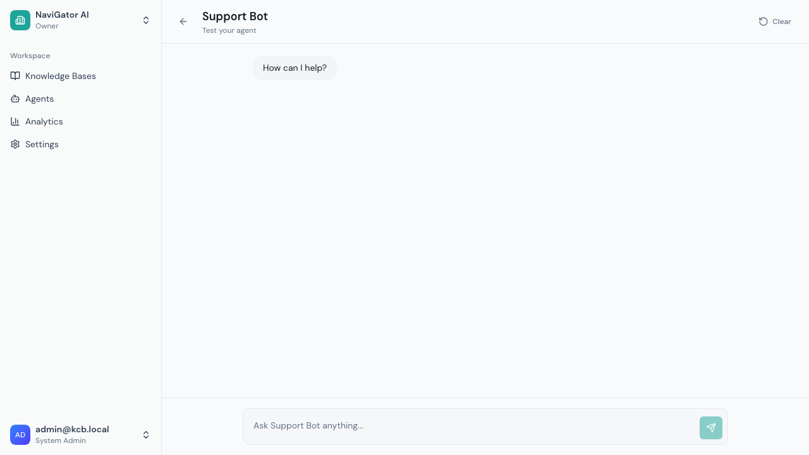
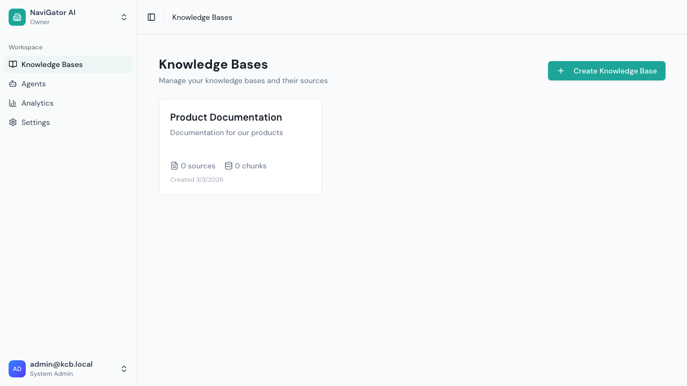

# Chat

Chat is where you interact with your AI agents. You can chat in the admin UI for testing, or end users can chat via the embedded widget or hosted chat pages.

## Admin Chat Interface

To chat with an agent from the admin UI:

1. Go to **Agents** in the sidebar
2. Click **Chat** on the agent card
3. Or click **Configure** → **Chat & API** tab → **Open Test Chat**



The chat interface shows:
- **Agent name** at the top
- **Message area** — Conversation history with user and assistant messages
- **Input box** — Type your question at the bottom (with placeholder showing the agent name)
- **Clear button** — Start a new conversation



## Sending Messages

1. Type your question in the input box
2. Press **Enter** or click the send button
3. The agent will:
   - Search your knowledge bases for relevant content
   - Generate a response based on what it found
   - Stream the response in real-time

## Understanding Responses

### Citations
When the agent cites a source, you'll see numbered references like `[1]`, `[2]` in the response. Below the response, source cards show:
- **Source title** — The page or document title
- **URL** — Link to the original source
- **Snippet** — A brief excerpt from the source content

### "I Don't Know" Responses
If the agent can't find relevant information in the knowledge bases, it will say so rather than making something up. This is by design — Grounded emphasizes accuracy over completeness.

### Reasoning Steps (Advanced RAG)
When chatting with an agent that uses Advanced RAG, you'll see the AI's thinking process:

| Step | What's Happening |
|------|-----------------|
| **Rewriting** | The AI rewrites your question for clarity |
| **Planning** | The AI breaks your question into sub-queries |
| **Searching** | Parallel searches across knowledge bases |
| **Merging** | Combining and ranking results |
| **Generating** | Producing the final answer |

Each step shows a brief summary of what was done.

## Conversation History

- Conversations are maintained during your session
- Follow-up questions understand the context of previous messages
- Click **Clear** to start a fresh conversation
- Conversation history is stored temporarily (1 hour) and limited to 20 turns

## Chat via API

For programmatic access to chat:

1. Go to agent **Configure** → **Chat & API** tab
2. Click **Create API Endpoint**
3. Give the endpoint a name and copy the token
4. Use the token to send chat requests:

```bash
curl -X POST https://your-instance.com/api/v1/c/chat \
  -H "Content-Type: application/json" \
  -H "Authorization: Bearer YOUR_TOKEN" \
  -d '{
    "message": "How do I reset my password?",
    "conversationId": "optional-uuid-for-follow-ups"
  }'
```

The response streams back as Server-Sent Events (SSE).

## Chat via Hosted Page

For a shareable chat experience without embedding a widget:

1. Go to agent **Configure** → **Chat & API** tab
2. Click **Create Hosted Chat Page**
3. Copy the generated URL
4. Share the URL — anyone with the link can chat with the agent

The hosted chat page is a full-screen chat interface with your agent's branding.

## Tips

- **Be specific** — "What are the return policy deadlines?" works better than "Tell me about returns"
- **Ask follow-ups** — The agent remembers the conversation context
- **Check citations** — Click source links to verify information
- **Test different phrasings** — If you don't get a good answer, try rewording your question
- **Report issues** — If the agent gives incorrect answers, review the knowledge base content and system prompt
