# Test Suites

Test suites let you automatically evaluate your agent's response quality. Define test cases with expected behavior, run them against your agent, and track quality over time.

## Accessing Test Suites

From the **Agents** page, click **Test Suites** on an agent card to manage its test suites.

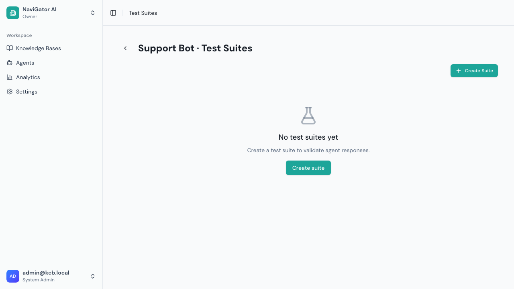

The list shows each suite's name, schedule, and last run status. From here you can:
- **View** — Open the suite detail page with health, runs, and prompt analysis
- **Run** — Trigger a manual run immediately
- **Edit** — Open the suite editor dialog

## Creating a Test Suite

Click **Create Suite** to open the suite editor dialog with four tabs.

### General Tab

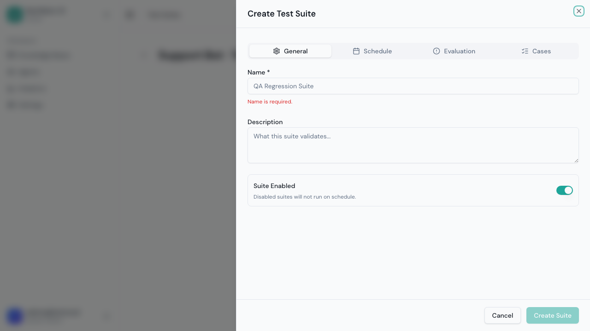

- **Name** — Descriptive name (e.g., "Product FAQ Quality Tests")
- **Description** — What this suite validates
- **Enabled** — Toggle the suite on/off (disabled suites won't run on schedule)

### Schedule Tab

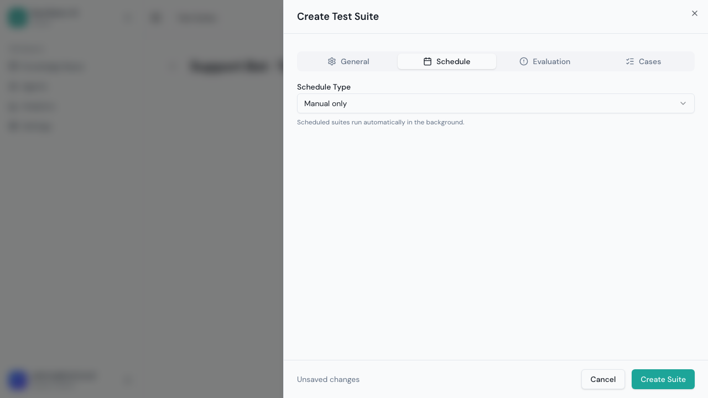

Choose when to auto-run:
- **Manual** — Only when you trigger it
- **Hourly** — Every hour
- **Daily** — Once per day (pick a time)
- **Weekly** — Once per week (pick a day and time)

### Evaluation Tab

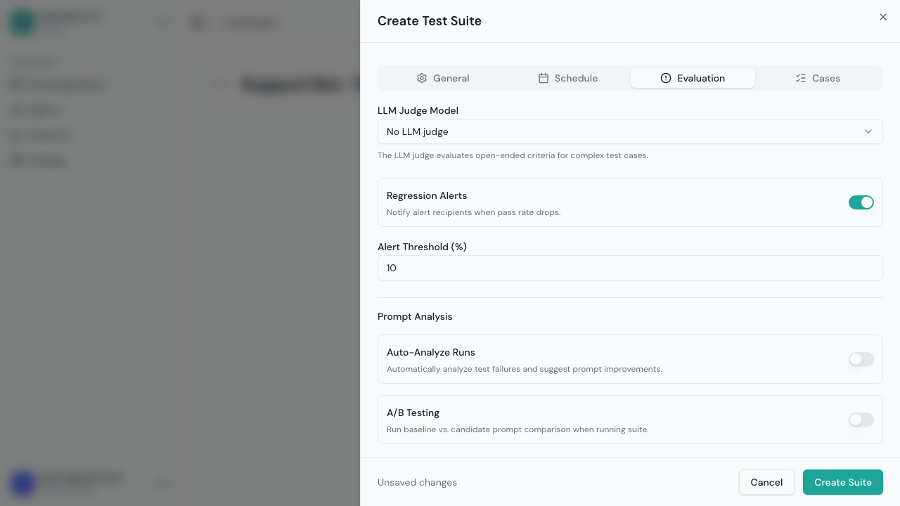

Configure evaluation and alerting:
- **LLM Judge Model** — Which AI model to use for LLM-based evaluations (required for LLM Judge checks)
- **Alert on Regression** — Email when pass rate drops significantly
- **Alert Threshold** — Percentage drop that triggers an alert (default: 10%)
- **Prompt Analysis** — Enable AI-powered failure analysis (see [Prompt Analysis](#prompt-analysis))
- **A/B Testing** — Enable prompt comparison experiments (see [A/B Testing](#ab-testing-prompts))

### Cases Tab

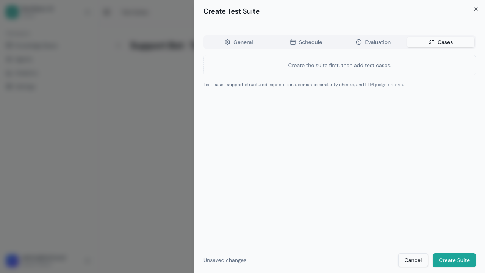

You can add test cases during creation or after. If you have existing tests, click **Import JSONL** to upload them in bulk.

Click **Create Suite** when ready.

## Suite Detail Page

After creating a suite, click **View** to open the detail page:

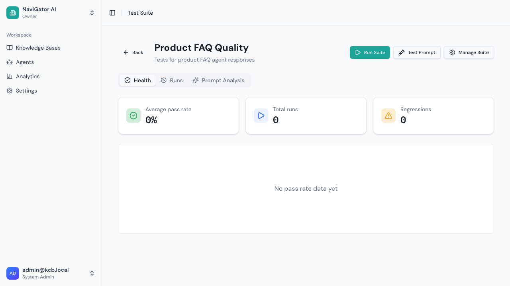

The detail page has three tabs and action buttons:

| Action | Purpose |
|--------|---------|
| **Run Suite** | Start a manual test run |
| **Test Prompt** | Run an A/B experiment with a candidate prompt |
| **Manage Suite** | Edit suite settings and test cases |

### Health Tab

Shows overall suite health:
- Current pass rate trend
- Recent run history with pass/fail counts
- Agent and schedule information

### Runs Tab

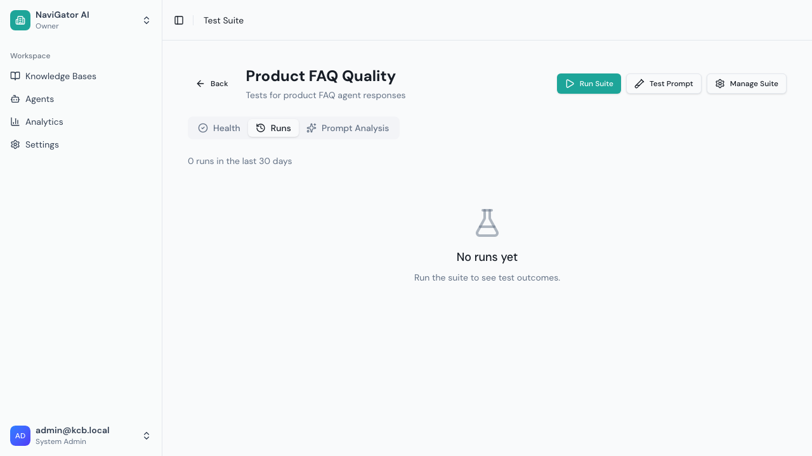

Lists all test runs with:
- Run date and trigger type (manual/schedule)
- Pass rate and case counts
- Status (completed, failed, cancelled)
- Click a run to see per-case results with actual responses and check details

### Prompt Analysis Tab

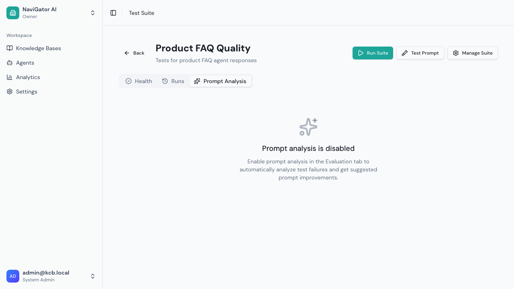

Shows AI-generated analysis of test failures (when enabled). Displays:
- Analysis summary
- Failure clusters (grouped patterns)
- Suggested prompt improvements
- Comparison with current prompt

---

## Adding Test Cases

Open a suite's **Manage Suite** dialog and go to the **Cases** tab, then click **Add Case**:

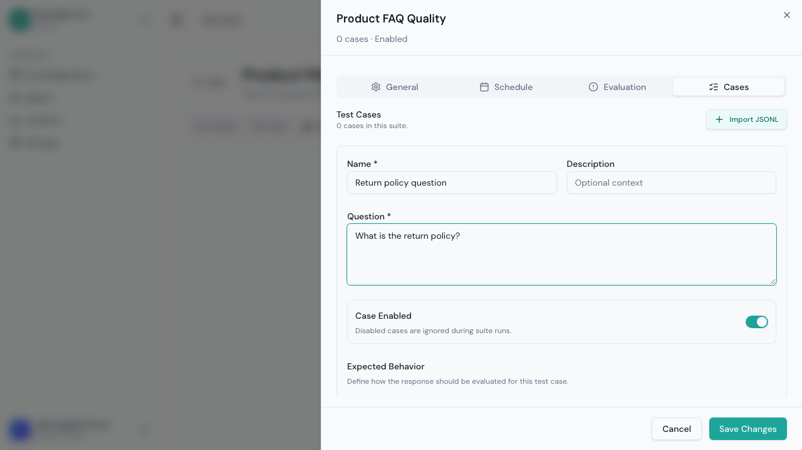

Each test case has:
- **Name** — Short identifier (e.g., "Returns policy deadline")
- **Description** — Optional context
- **Question** — The exact question sent to the agent
- **Enabled** — Toggle individual cases on/off
- **Check Mode** — "All checks must pass" or "Any check can pass"

### Adding Checks

Click **Add** next to a check type to add it to the test case:

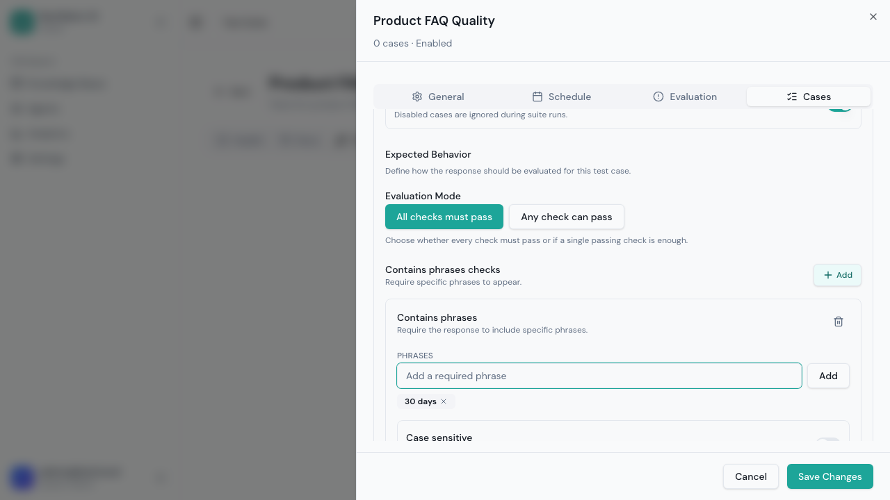

#### Contains Phrases

Verify the response includes specific text:
- Enter required phrases one at a time (press Enter after each)
- Toggle **Case Sensitive** if exact casing matters
- ✅ Pass if the response contains ALL listed phrases

**Best for:** Ensuring specific facts, terms, or data points appear in the response.

**Example:**
| Setting | Value |
|---------|-------|
| Phrases | "30 days", "full refund" |
| Case Sensitive | No |

#### Semantic Similarity

Compare the response's meaning to an expected answer:
- Enter the expected answer text
- Set a similarity threshold (0 to 1)
- ✅ Pass if cosine similarity exceeds the threshold

**Best for:** Checking that the response covers the right topic without requiring exact wording.

| Threshold | Meaning |
|-----------|---------|
| 0.6–0.7 | Loosely related — good for initial testing |
| 0.7–0.8 | Reasonably similar — standard threshold |
| 0.8–0.9 | Very similar — strict matching |
| 0.9+ | Near-identical — rarely appropriate |

**Requires:** An embedding model configured on the agent's knowledge base.

#### LLM Judge

Use an AI model to evaluate the response:
- Enter the expected answer (what the response should convey)
- Optionally add evaluation criteria (specific requirements)
- ✅ Pass if the LLM judge determines the response meets the criteria

**Best for:** Nuanced evaluation — tone, completeness, format, reasoning quality.

**Example:**
| Setting | Value |
|---------|-------|
| Expected Answer | "The response should explain the 30-day return window and mention the full refund policy." |
| Criteria | "Must be concise, professional tone, and cite a specific source." |

**Requires:** An LLM model configured as the suite's "LLM Judge Model."

### Which Check Type to Use?

| Scenario | Recommended Check | Why |
|----------|------------------|-----|
| Must mention specific facts | Contains Phrases | Exact, deterministic |
| Answer meaning matters, not wording | Semantic Similarity | Flexible matching |
| Quality, tone, or format matters | LLM Judge | Human-like evaluation |
| High-stakes accuracy | Contains Phrases + LLM Judge (All) | Belt-and-suspenders |

### Importing Test Cases

Click **Import JSONL** to bulk-import test cases. Format:

```json
{"name": "Return policy", "question": "What is the return policy?", "expectedBehavior": {"mode": "all", "checks": [{"type": "contains_phrases", "phrases": ["30 days"]}]}}
{"name": "Shipping times", "question": "How long does shipping take?", "expectedBehavior": {"mode": "all", "checks": [{"type": "contains_phrases", "phrases": ["3-5 business days"]}]}}
```

One JSON object per line. Each must have `name`, `question`, and `expectedBehavior`.

---

## Running Test Suites

### Manual Run

1. Click **Run Suite** from the suite detail page (or **Run** from the list)
2. Each enabled test case is executed sequentially:
   - Sends the question to the agent via the RAG pipeline
   - Captures the full response
   - Evaluates each check
   - Records pass/fail with details
3. Results appear in the **Runs** tab

### Run Results

After a run completes, click it to see:
- **Overall pass rate** — percentage of cases that passed
- **Per-case results** — each case shows:
  - ✅ Pass / ❌ Fail / ⚠️ Error status
  - The agent's actual response text
  - Individual check results with details (e.g., missing phrases, similarity score, judge reasoning)
  - Response duration (ms)

### What "Error" Means

A test case shows "Error" (not "Fail") when:
- The agent didn't respond within the timeout (60 seconds)
- The evaluation couldn't complete (e.g., embedding model unavailable)
- An unexpected exception occurred

Errors count as failures in the pass rate calculation.

---

## Prompt Analysis

When enabled, Grounded uses AI to analyze test failures and suggest prompt improvements.

### Setup

1. In **Manage Suite** → **Evaluation** tab:
   - Enable **Prompt Analysis**
   - Select an **Analysis Model** (the AI model that will analyze failures)
2. Run the test suite (or wait for a scheduled run)

### How It Works

After a run with failures, the analysis:

1. **Groups failures into clusters** — finds common patterns (e.g., "missing_citations", "verbose_responses")
2. **Identifies root causes** — determines what in the prompt is causing failures
3. **Generates a suggested prompt** — a complete rewritten system prompt
4. **Explains the changes** — rationale for each modification

Results appear in the **Prompt Analysis** tab.

### Reviewing Analysis

The analysis shows:
- **Summary** — 1-2 sentence overview of prompt strengths/weaknesses
- **Failure Clusters** — each cluster shows:
  - Category (e.g., `missing_citations`)
  - Description of the issue
  - Affected test cases
  - Suggested fix
- **Suggested Prompt** — full revised prompt with diff highlighting
- **Rationale** — why the changes were made

---

## A/B Testing Prompts

Compare your current prompt against a candidate prompt to measure impact.

### Starting an A/B Test

Click **Test Prompt** from the suite detail page:

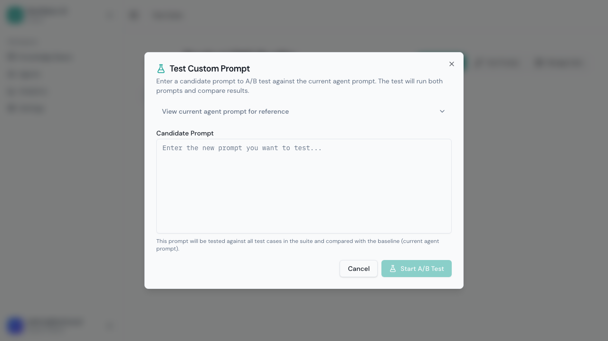

1. Click **View current agent prompt** for reference
2. Enter a **Candidate Prompt** (paste your proposed improvement or a prompt analysis suggestion)
3. Click **Start A/B Test**

### What Happens

The system runs two complete test suite executions:

1. **Baseline run** — uses the agent's current system prompt
2. **Candidate run** — uses your candidate prompt

Both runs execute all enabled test cases under identical conditions.

### Viewing Results

After both runs complete, the experiment shows:
- Side-by-side pass rates (baseline vs candidate)
- Delta: how much better/worse the candidate performed
- Per-case comparison where results differ
- Both prompts for reference

### Applying the Winner

If the candidate prompt performs better:
1. Copy the candidate prompt
2. Go to the agent's **Configure** dialog
3. Paste it as the new system prompt
4. Save

> **Tip:** Run A/B tests with enough test cases (10+) to get meaningful results. A single test case passing or failing can swing the pass rate dramatically in small suites.

---

## Scheduled Runs

For automated quality monitoring:

1. Set the schedule type in the **Schedule** tab (hourly, daily, or weekly)
2. For daily: choose the time of day
3. For weekly: choose the day and time
4. Runs happen automatically at the scheduled time
5. If regression is detected, alert emails are sent

---

## Regression Alerts

When a run's pass rate drops below the previous run by more than the alert threshold:

- An email is sent to tenant owners and admins
- The email includes:
  - Previous vs. current pass rate
  - Percentage drop
  - Newly failing test cases (passed before, failing now)
  - Link to the run details

### Example

If your last run was 90% pass rate and the new run is 75%, that's a 15% drop — exceeding the default 10% threshold. An alert email is sent.

---

## Tips

| Goal | Recommendation |
|------|---------------|
| **Start small** | Begin with 5–10 test cases covering your most important questions |
| **Mix check types** | Contains Phrases for facts, LLM Judge for quality |
| **Start with low thresholds** | Set similarity threshold at 0.65–0.70 and raise as your agent improves |
| **Review failures** | Failed tests often reveal gaps in knowledge base content, not just prompt issues |
| **Schedule weekly** | Catch regressions from content changes or model updates |
| **Use A/B testing** | Don't guess — measure prompt changes against your test suite |
| **Keep tests independent** | Each test case should stand alone (no conversation history) |
| **Tag by category** | Use descriptive names like "billing-refund-policy" for easy filtering |
