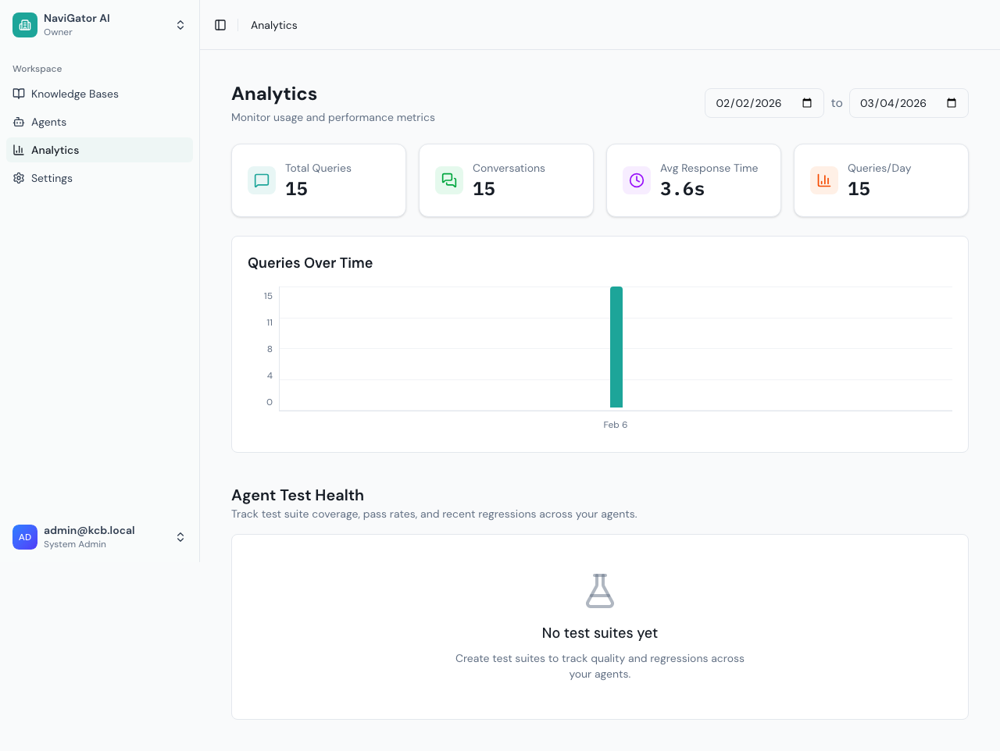

# Analytics

The Analytics page gives you visibility into how your agents are performing and how your knowledge is being used. It combines chat usage metrics with test suite health tracking.

## Accessing Analytics

Click **Analytics** in the sidebar:

---

## Chat Usage Metrics

The top of the page shows four key stat cards:

### Total Queries
The total number of chat messages sent to your agents in the selected date range. This counts every user question, whether from the admin chat, widget, API, or hosted chat page.

**What to watch for:** A sudden drop might mean a widget is down or an integration broke. A spike might mean a new deployment is getting traction.

### Conversations
The number of unique chat sessions. One conversation can contain many queries (back-and-forth messages).

**Total Queries ÷ Conversations** gives you the average messages per conversation. Higher numbers mean users are engaging more deeply.

### Average Response Time
How long it takes from when a user sends a message to when the agent starts responding, measured in seconds.

| Response Time | Assessment | Action |
|--------------|------------|--------|
| < 2s | Excellent | None needed |
| 2-5s | Normal for Advanced RAG | Consider Simple RAG if speed matters |
| 5-10s | Slow | Check model latency, reduce Top K |
| > 10s | Problem | Check model provider health, reduce complexity |

### Queries/Day
Average daily query volume across the selected date range. Useful for capacity planning and trend analysis.

---

## Queries Over Time Chart

Below the stat cards, a line chart shows **daily query volume** over the selected date range:

- **X-axis:** Date
- **Y-axis:** Number of queries
- Hover over data points to see exact counts

**Use this to identify:**
- **Traffic patterns** — Weekday vs. weekend usage
- **Growth trends** — Is adoption increasing over time?
- **Anomalies** — Unexpected spikes or drops that need investigation

---

## Agent Test Health

The bottom section of the Analytics page tracks the health of your test suites across agents.

### Test Suite Summary Cards

| Metric | What It Shows |
|--------|--------------|
| **Test Suites** | Total number of test suites configured |
| **Test Cases** | Total test cases across all suites |
| **Overall Pass Rate** | Percentage of test cases passing (color-coded: green ≥80%, yellow ≥60%, red <60%) |
| **Regressions** | Number of recent regressions detected |

### Test Pass Rate Over Time

A line chart showing how your overall test pass rate changes over time. This helps you spot:
- **Prompt regressions** — Pass rate drops after a prompt change
- **Model regressions** — Pass rate drops after switching AI models
- **Content improvements** — Pass rate increases after adding better knowledge

### Test Health by Agent

A table showing each agent's test health:

| Column | Description |
|--------|-------------|
| **Agent** | Agent name |
| **Suites** | Number of test suites for this agent |
| **Cases** | Total test cases |
| **Pass Rate** | Current pass rate percentage |
| **Change** | Pass rate change vs. previous period (↑ or ↓) |
| **Last Run** | When the most recent test run completed |
| **Status** | Last run result (passed, failed, etc.) |

Click an agent row to drill into its test details.

### Recent Regressions

A table showing test runs where the pass rate dropped compared to the previous run:

| Column | Description |
|--------|-------------|
| **Suite** | Test suite name |
| **Agent** | Agent the suite is testing |
| **Previous** | Previous pass rate |
| **Current** | New (lower) pass rate |
| **Failed At** | When the regression was detected |

Click a regression to see the full test run details — which specific test cases failed and why.

---

## Date Range Filtering

Use the date picker at the top-right to control the time window:

| Range | Best For |
|-------|---------|
| **Last 7 days** | Recent performance check |
| **Last 30 days** | Monthly review, trend analysis |
| **Custom range** | Investigating a specific incident or period |

All metrics and charts update when you change the date range.

---

## Acting on Analytics Data

### Low Query Volume
- Check that widgets and integrations are properly deployed
- Verify agents are enabled
- Check if the hosted chat page links are accessible

### High Error Rate (via alerts)
- Check AI model provider status (Admin → AI Models → Status tab)
- Review recent prompt changes that might cause issues
- Check knowledge base ingestion — are sources failing?

### Slow Response Times
- Switch agents from Advanced to Simple RAG
- Reduce **Top K** and **Candidate K** retrieval settings
- Check if the AI model provider is experiencing latency
- Consider using a faster/smaller LLM model

### Declining Test Pass Rates
- Review recent changes: prompts, models, knowledge base content
- Click into failing test cases to see expected vs. actual responses
- Roll back recent changes if regression is severe

### Low Conversations-per-Query Ratio
- Users might not be finding the widget
- The welcome message might not be engaging
- The agent might not be answering well enough to encourage follow-ups

---

## Tips

- **Check analytics weekly** — Spot trends before they become problems
- **Set up test suites first** — Analytics is more useful when you have automated tests tracking quality
- **Compare before and after changes** — Use custom date ranges to compare performance across prompt or model changes
- **Pair with alerts** — Configure alert thresholds in Settings so you get notified when metrics cross boundaries
- **Track per-agent** — If one agent has problems, it won't be visible in overall metrics unless you look at the agent test health table
