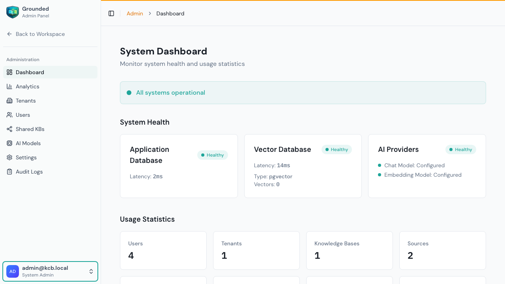

# Admin Dashboard

The Admin Dashboard provides a system-wide overview of your Grounded instance. It's only accessible to **system administrators**.

## Accessing the Admin Panel

1. Click your name at the bottom of the sidebar
2. Select **Admin Panel**
3. The sidebar switches to the admin navigation

## System Health

The dashboard shows the health status of all infrastructure components:

### Application Database
- **Status** — Healthy / Unhealthy
- **Latency** — Response time in milliseconds

### Vector Database
- **Status** — Healthy / Unhealthy
- **Latency** — Response time
- **Type** — pgvector
- **Vector count** — Total stored vectors

### AI Providers
- **Chat Model** — Whether a chat model is configured and working
- **Embedding Model** — Whether an embedding model is configured and working

A green **"All systems operational"** banner appears when everything is healthy.

## Usage Statistics

Quick counts of system-wide resources:
- **Users** — Total registered users
- **Tenants** — Total organizations
- **Knowledge Bases** — Total KBs across all tenants
- **Sources** — Total content sources
- **Agents** — Total configured agents

## Quick Actions

The dashboard provides quick links to common admin tasks:
- **AI Models** — Configure LLM and embedding providers
- **System Settings** — Manage authentication and quotas
- **User Management** — Manage users and system admins

## Interpreting Health Status

| Component | Healthy | Unhealthy Action |
|-----------|---------|-----------------|
| **Application DB** | Latency < 50ms, status "connected" | Check PostgreSQL is running, connection pool not exhausted |
| **Vector DB** | Latency < 100ms, vectors counted | Check pgvector container, verify port 5433 is accessible |
| **Chat Model** | At least one chat model configured | Go to AI Models → add a provider and chat model |
| **Embedding Model** | At least one embedding model configured | Go to AI Models → add an embedding model |

> **Tip:** If a component shows "Unhealthy," the specific error is shown below the status. Common causes:
> - Database containers not running → run `bun run docker:dev`
> - API keys expired → update provider credentials in AI Models
> - Network issues → check firewall and DNS resolution

## Usage Statistics Explained

| Metric | What It Counts | Concern Threshold |
|--------|---------------|-------------------|
| **Users** | All registered accounts (active + disabled) | Rapid growth without corresponding tenants may indicate spam |
| **Tenants** | All organizations (active + deleted) | — |
| **Knowledge Bases** | All KBs across all tenants | Check quota settings if approaching system limits |
| **Sources** | All content sources (all types) | Many failed sources may indicate scraping issues |
| **Agents** | All configured agents | — |

## When to Check the Dashboard

| Situation | What to Look For |
|-----------|-----------------|
| **After deployment** | All components green, vector count > 0 if existing data |
| **After model changes** | Chat/embedding model status still healthy |
| **User complaints** | Which component is unhealthy? Check latency values |
| **Periodic review** | Usage growth trends, any red indicators |
| **After infrastructure changes** | Database connectivity, vector DB accessible |
