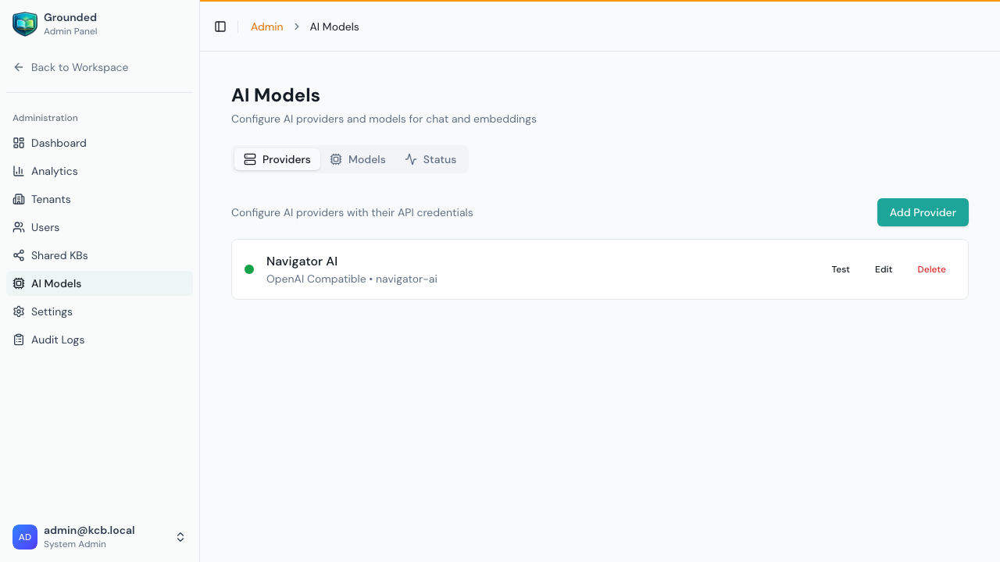
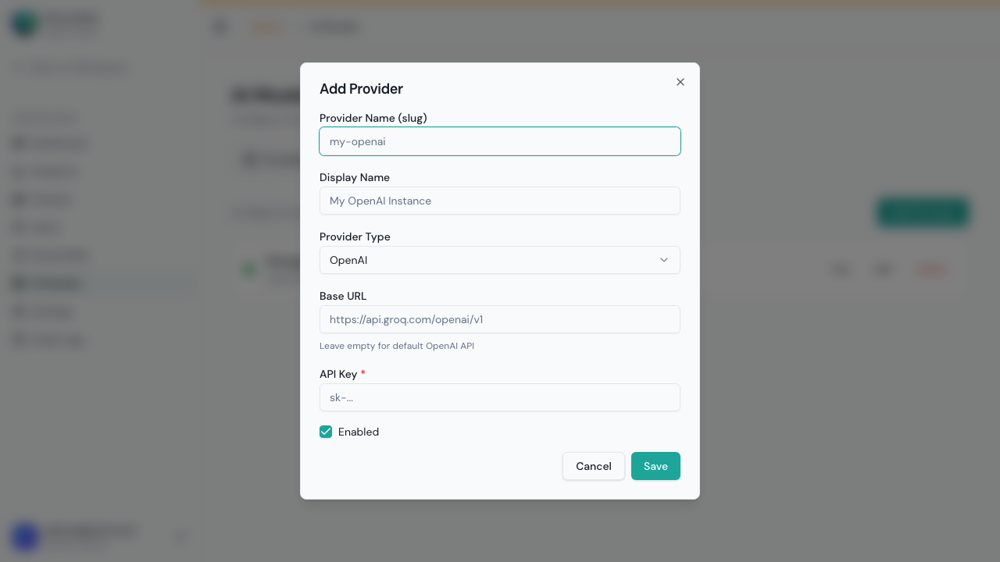
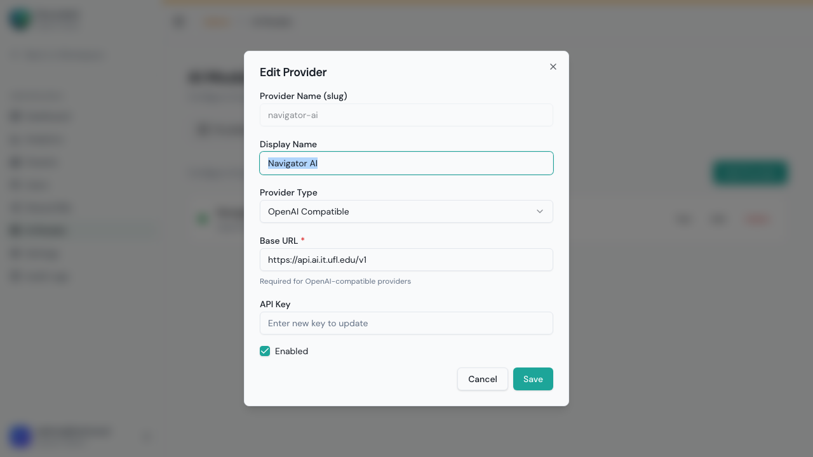
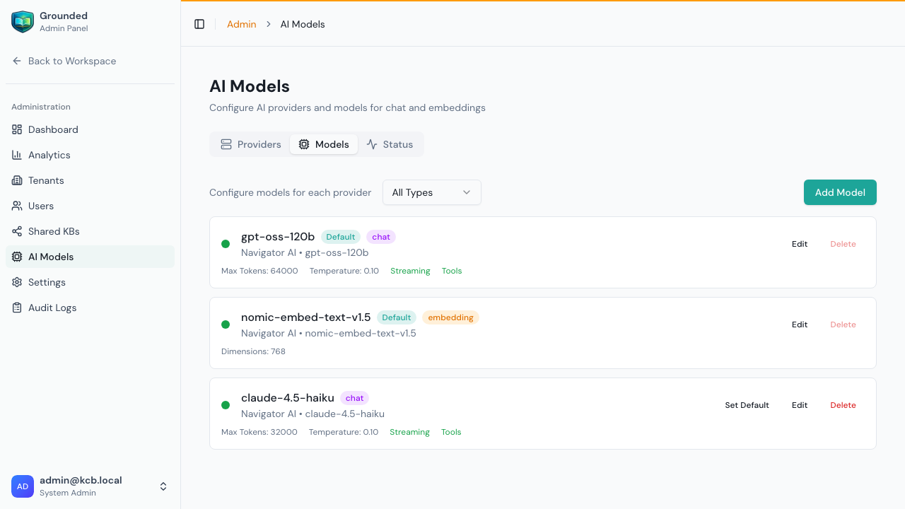
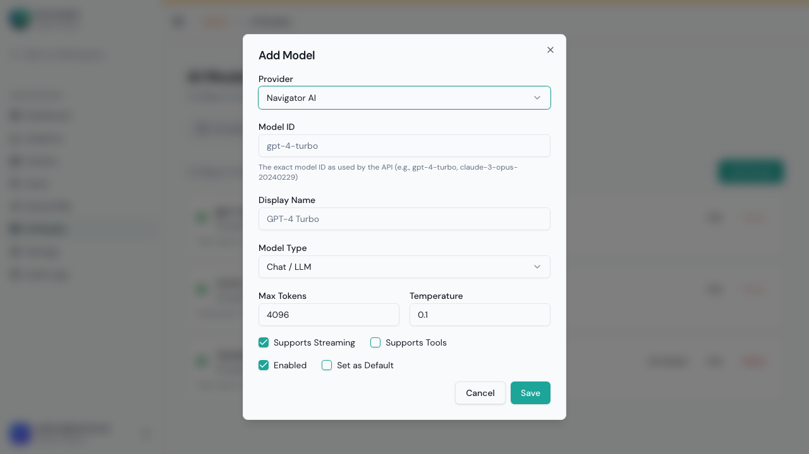
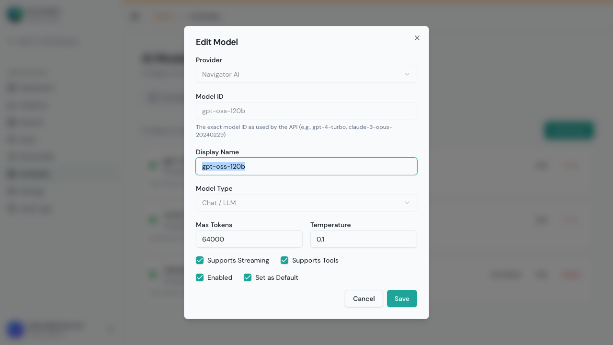
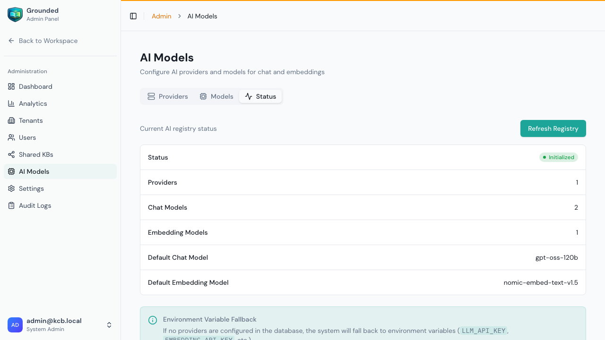

# AI Models Management

AI Models is where you configure the LLM and embedding providers that power Grounded's chat and search capabilities. This is a **system admin** function.

> **Important:** Without at least one chat model and one embedding model configured, agents cannot answer questions and knowledge bases cannot be indexed.

## Accessing AI Models

From the Admin Panel, click **AI Models** in the sidebar.

The page has three tabs: **Providers**, **Models**, and **Status**.

---

## Providers Tab

Providers are the AI services that supply models. You need at least one provider configured.

Each provider card shows:
- **Name** and type (e.g., "OpenAI Compatible")
- **Internal name** (used for API references)
- **Status indicator** (green = enabled)
- Action buttons: **Test**, **Edit**, **Delete**

### Adding a Provider

1. Click **Add Provider**

2. Fill in all fields:

| Field | Description | Example |
|-------|-------------|---------|
| **Name** | Internal identifier (no spaces) | `my-openai` |
| **Display Name** | Human-readable name | `OpenAI Production` |
| **Type** | Provider type (see below) | `OpenAI` |
| **Base URL** | API endpoint (required for OpenAI-compatible) | `https://api.openai.com/v1` |
| **API Key** | Your provider's API key | `sk-...` |
| **Enabled** | Whether this provider is active | ✅ Checked |

3. Click **Save**

### Provider Types Explained

| Type | Description | When to Use |
|------|-------------|-------------|
| **OpenAI** | OpenAI's official API | GPT-4o, GPT-4o-mini, text-embedding-3-small |
| **Anthropic** | Anthropic's official API | Claude 3.5 Sonnet, Claude 3.5 Haiku |
| **Google** | Google AI API | Gemini Pro, Gemini Flash |
| **OpenAI Compatible** | Any API following OpenAI's format | Groq, Together AI, Ollama, vLLM, LiteLLM, any local model server |

**OpenAI Compatible** is the most flexible option — many hosting providers (Groq, Together, Fireworks, etc.) and self-hosted solutions (Ollama, vLLM) expose an OpenAI-compatible API.

### Testing a Provider

Click **Test** next to any provider to verify the API connection:
- ✅ Green = Connection successful
- ❌ Red = Connection failed (check API key, base URL, and network access)

**Always test after adding or editing a provider.**

### Editing a Provider

Click **Edit** to open the edit dialog:

You can change:
- Display name
- Provider type
- Base URL
- API key (enter a new key to replace the existing one — the current key is never shown)
- Enabled status

> **Note:** The internal name cannot be changed after creation.

### Deleting a Provider

Click **Delete** to remove a provider.

⚠️ **Warning:** Deleting a provider also removes all models configured under it. Any agents using those models will lose their model assignment and will need to be reconfigured.

---

## Models Tab

Models are specific AI models within a provider. You need at least one **chat** model and one **embedding** model.

Models are listed with:
- **Model name** and ID
- **Type** — Chat (LLM) or Embedding
- **Provider** it belongs to
- **Default** badge if set as default
- Action buttons: **Edit**, **Delete**, **Set Default**

### Adding a Model

1. Click **Add Model**

2. Fill in all fields:

| Field | Description | Example |
|-------|-------------|---------|
| **Provider** | Which provider this model belongs to | `OpenAI Production` |
| **Model ID** | The exact model identifier from the provider | `gpt-4o` |
| **Display Name** | Human-readable name shown in dropdowns | `GPT-4o (Fast)` |
| **Model Type** | `Chat` for LLM responses or `Embedding` for search vectors | `Chat` |
| **Max Tokens** | Maximum response length (chat models only) | `4096` |
| **Temperature** | Creativity level: 0 = deterministic, 1 = creative | `0.1` |
| **Supports Streaming** | Can stream responses token-by-token | ✅ (most chat models) |
| **Supports Tools** | Supports function/tool calling | Check if using agentic features |
| **Enabled** | Whether this model is available for use | ✅ |
| **Set as Default** | Use as default when no model specified | One per type |

3. Click **Save**

### Editing a Model

Click **Edit** next to any model:

You can change:
- Display name
- Max tokens and temperature
- Streaming and tools support
- Enabled status
- Default status

> **Note:** Provider, Model ID, and Model Type cannot be changed after creation. Delete and recreate if you need to change these.

### Setting a Default Model

Each model type (Chat and Embedding) should have exactly one default:

- **Default Chat Model** — Used when creating new agents without specifying a model
- **Default Embedding Model** — Used when creating new knowledge bases

Click **Set Default** on any model to make it the default for its type.

### Deleting a Model

Click **Delete** to remove a model.

⚠️ **Warning:** Agents using this model will need to be reconfigured. Knowledge bases using a deleted embedding model will continue to work with existing content, but new content cannot be indexed until a new embedding model is assigned.

---

## Status Tab

The Status tab provides a real-time health check of all configured models:

For each model, you can see:
- ✅ **Available** — Model is reachable and responding
- ❌ **Error** — Model is unreachable (check provider configuration)
- Provider connection status

**Check the Status tab:**
- After adding or editing providers
- When users report chat issues
- After network or infrastructure changes

---

## Recommended Setup

### Minimum Configuration

| What | Why | Recommendation |
|------|-----|----------------|
| 1 Chat Model | Agents need an LLM to generate responses | GPT-4o-mini or Claude 3.5 Haiku for cost-effectiveness |
| 1 Embedding Model | Knowledge bases need embeddings for search | `text-embedding-3-small` (1536 dims) |

### Production Configuration

| What | Model | Purpose |
|------|-------|---------|
| Primary Chat | `gpt-4o` or `claude-3-5-sonnet` | High-quality responses |
| Fast Chat | `gpt-4o-mini` or `claude-3-5-haiku` | Quick responses, lower cost |
| LLM Judge | `gpt-4o` or `claude-3-5-sonnet` | Evaluating test suite results |
| Embedding | `text-embedding-3-small` | Knowledge base indexing |

### Using Self-Hosted Models

For self-hosted models via Ollama, vLLM, or similar:

1. Add a provider with type **OpenAI Compatible**
2. Set the **Base URL** to your model server (e.g., `http://localhost:11434/v1` for Ollama)
3. Set **API Key** to any non-empty string (some servers require a dummy key)
4. Add models using the exact model names from your server

---

## Tips

- **Test providers after setup** — Always verify the connection works before creating models
- **Set defaults** — Ensure one chat model and one embedding model are marked as default
- **Start with one provider** — Get one provider working before adding more
- **Consider costs** — Larger models cost more per token. Use smaller models for development/testing.
- **Embedding model consistency** — Once a KB is indexed with an embedding model, changing it requires re-indexing ALL content. Choose carefully.
- **Multiple providers** — Configure multiple providers for redundancy or to give different agents different model options
- **Monitor the Status tab** — Check regularly to catch provider outages early
