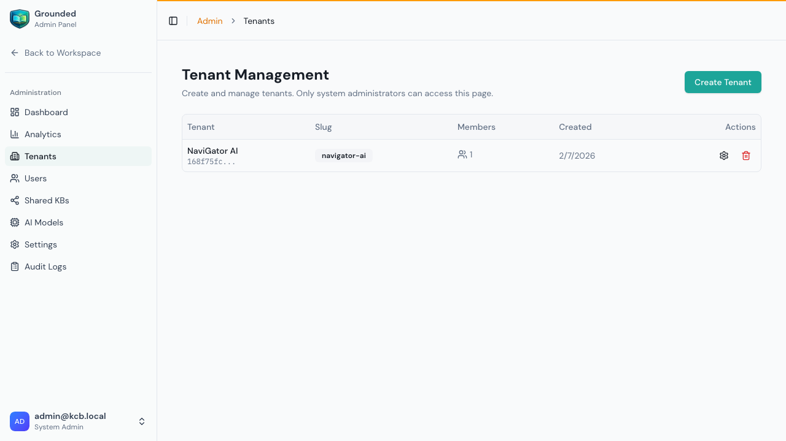
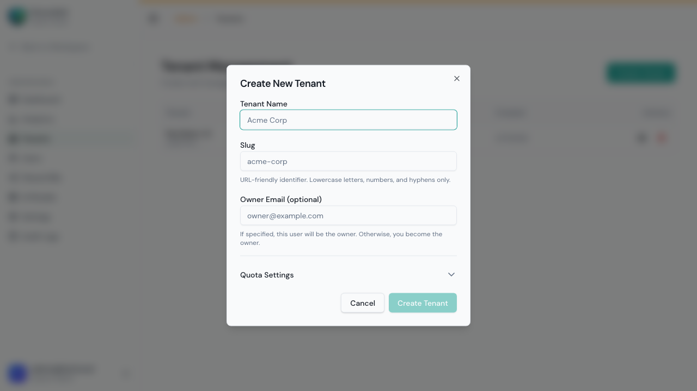
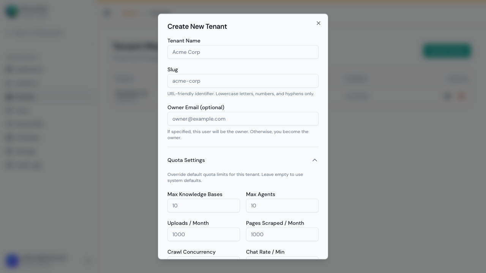
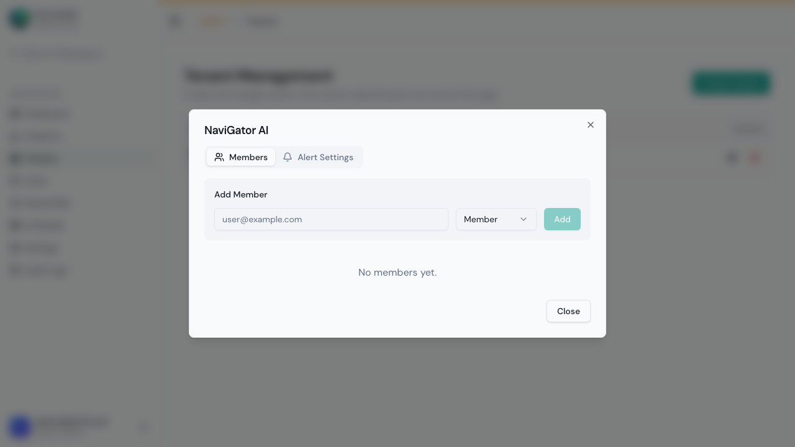
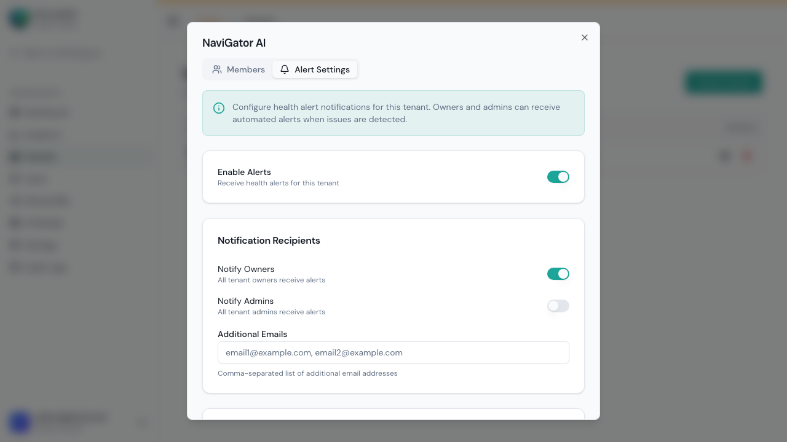
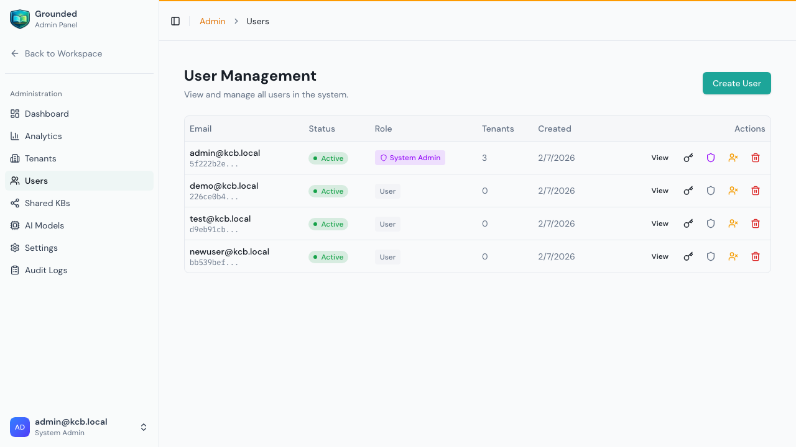

# Tenant & User Management

System administrators manage the multi-tenant environment — creating organizations, managing users, setting per-tenant resource limits, and controlling access.

## Tenant Management

From the Admin Panel, click **Tenants** in the sidebar:



Each tenant card shows:
- **Name** and **slug** (URL-friendly identifier)
- **Member count** — How many users belong to this tenant
- **Created date**
- Action buttons: **Manage tenant** (gear), **Delete tenant** (trash)

---

### Creating a Tenant

1. Click **Create Tenant**



2. Fill in the basic info:

| Field | Required | Description | Example |
|-------|:--------:|-------------|---------|
| **Tenant Name** | ✅ | Organization display name | `Acme Corp` |
| **Slug** | ✅ | URL-friendly identifier (lowercase, hyphens only) | `acme-corp` |
| **Owner Email** | No | Existing user to assign as owner (default: you) | `john@acme.com` |

3. Optionally expand **Quota Settings** to set custom resource limits:



### Quota Overrides at Creation

When creating a tenant, you can override any of the system-wide default quotas. If you don't set a value, the system default (from Admin → Settings → Quotas) is used.

| Quota | System Default | What It Controls | When to Override |
|-------|:-:|-------------|-----------------|
| **Max KBs** | 10 | Knowledge bases the tenant can create | Enterprise clients need more |
| **Max Agents** | 10 | AI agents the tenant can configure | Teams with many use cases |
| **Max Uploaded Docs/Month** | 1,000 | Monthly file upload limit | Heavy document workflows |
| **Max Scraped Pages/Month** | 1,000 | Monthly web scraping limit | Large sites being scraped |
| **Max Crawl Concurrency** | 5 | Concurrent page fetches | Speed up large crawls |
| **Chat Rate Limit/Min** | 60 | Chat requests per minute | High-traffic widgets |

4. Click **Create Tenant**

> **Tip:** Start with system defaults and increase quotas only when tenants hit limits. You can always change them later.

---

### Managing a Tenant

Click **Manage tenant** (gear icon) on any tenant card:



The management panel has two tabs:

#### Members Tab
- View all current members and their roles
- **Add members** — Enter an email and select a role
- **Change roles** — Use the dropdown next to any member
- **Remove members** — Remove access to this tenant

#### Alert Settings Tab



Override the per-tenant alert configuration:

| Setting | Description | Default |
|---------|-------------|---------|
| **Enabled** | Master toggle for alerts for this tenant | On |
| **Notify Owners** | Send alerts to all tenant owners | On |
| **Notify Admins** | Also send alerts to tenant admins | Off |
| **Additional Emails** | Extra recipients (comma-separated) | None |
| **Error Rate Threshold** | Chat error % that triggers an alert | System default |
| **Quota Warning Threshold** | Usage % that triggers a warning | System default |
| **Inactivity Days** | Days of no activity before alerting | System default |

> **Note:** When a value is blank/empty, the system-wide default (from Admin → Settings → Alerts) is used. Enter a value to override for this specific tenant.

---

### Settings Overrides: How They Work

Grounded uses a layered settings model where per-tenant settings override system defaults:

```
System Defaults (Admin → Settings)
    ↓
Per-Tenant Overrides (Admin → Tenants → Manage)
    ↓
Effective Value (what the tenant actually gets)
```

**Example:**

| Setting | System Default | Tenant A Override | Tenant A Effective |
|---------|:-:|:-:|:-:|
| Max KBs | 10 | 50 | **50** |
| Max Agents | 10 | *(not set)* | **10** |
| Chat Rate/Min | 60 | 200 | **200** |
| Error Rate Threshold | 10% | 5% | **5%** |

**Key rules:**
- Per-tenant values **always win** over system defaults
- If no override is set, the system default applies
- Changing a system default affects all tenants that **don't** have an override
- Quotas are set at creation time and can be modified via the manage panel
- Alert thresholds can be overridden at any time

---

### Deleting a Tenant

Click **Delete tenant** (trash icon):

- This is a **soft delete** — all tenant data is preserved for 30 days
- After 30 days, data is permanently and irreversibly removed
- All members lose access immediately
- All agents, KBs, sources, and chat history are included in the deletion
- During the 30-day window, the tenant can be restored by a system admin

> ⚠️ **Warning:** Deleting a tenant removes all its content. Confirm with the tenant owner before proceeding.

---

## User Management

From the Admin Panel, click **Users** in the sidebar:



### User List

Shows all users across all tenants:

| Column | Description |
|--------|-------------|
| **Email** | User's primary email address |
| **Status** | Active or disabled |
| **Tenants** | Which organizations they belong to |
| **System Admin** | Whether they have system admin access |
| **Created** | When the account was created |

### Creating a User

1. Click **Create User**
2. Enter:
   - **Email** — The user's email address (must be unique)
   - **Password** — Initial password (user should change on first login)
3. Click **Create**

The new user can now log in but doesn't belong to any tenant yet. Add them to a tenant via the tenant management panel or let them be invited by a tenant admin.

### Disabling/Enabling Users

| Action | Effect |
|--------|--------|
| **Disable** | User cannot log in. Preserves all data and memberships. |
| **Enable** | Restores login access. All previous memberships are intact. |

**Use disable instead of delete** — it's reversible and preserves the user's history for auditing.

### Promoting to System Admin

| Action | Effect |
|--------|--------|
| **Make Admin** | Grants full system administration access |
| **Remove Admin** | Revokes system admin access, keeps tenant memberships |

> ⚠️ **Caution:** System admins have unrestricted access to all tenants, all settings, all data. Grant sparingly.

### Assigning Users to Tenants

1. From the tenant management panel, go to the **Members** tab
2. Enter the user's email and select a role
3. Click **Add**

Or from the user's detail view:
1. Click on a user
2. Use the tenant membership section to add/remove tenant access

---

## Roles Reference

### Tenant Roles (within a single tenant)

| Role | Knowledge Bases | Agents | Sources | Chat | Settings | Members |
|------|:-:|:-:|:-:|:-:|:-:|:-:|
| **Owner** | Create/Edit/Delete | Create/Edit/Delete | Create/Run/Delete | ✅ | Full Access | Manage All |
| **Admin** | Create/Edit/Delete | Create/Edit/Delete | Create/Run/Delete | ✅ | Full Access | Manage Below |
| **Member** | View | View | View | ✅ | View Only | — |
| **Viewer** | View | View | View | ❌ | — | — |

### System Admin (platform-wide)
- Access to all admin pages (Dashboard, Settings, Models, Tenants, Users, Shared KBs, Audit Logs)
- Can access **any** tenant's data
- Can create/manage all tenants and users
- Can set per-tenant quota overrides
- Bypasses tenant role restrictions
- **System admin is separate from tenant roles** — a user can be both a system admin and a member of specific tenants

---

## Common Admin Workflows

### Onboarding a New Team

1. **Create the tenant** — Name, slug, and assign an owner
2. **Set quotas** — Override defaults if this team needs more resources
3. **Create user accounts** — For each team member
4. **Add members** — Assign to the tenant with appropriate roles
5. **Share KBs** — If this team needs shared knowledge bases, share them directly
6. **Communicate** — Send the team their login credentials and getting-started guide

### Upgrading a Tenant's Resources

1. Go to **Tenants** → click **Manage tenant**
2. From the Members tab or via API, update the quota overrides
3. Changes take effect immediately — no restart needed

### Handling a User Who Left

1. Go to **Users** → find the user
2. Click **Disable** (don't delete — preserves audit trail)
3. Optionally remove from specific tenants via tenant management
4. If they were an owner, promote another member to owner first

---

## Tips

- **One owner per tenant** — Each tenant should have at least one owner for accountability
- **Use Member role for most users** — Member is sufficient for users who just need chat access
- **System admin ≠ tenant admin** — System admins manage the platform; tenant admins manage their organization
- **Don't share accounts** — Create individual user accounts for auditing and security
- **Disable rather than delete** — Disabling preserves the user's history and can be reversed
- **Set quotas at creation** — It's easier to set appropriate limits upfront than to retroactively restrict a tenant
- **Document overrides** — When you set custom quotas for a tenant, note why (in the tenant description or external docs)
