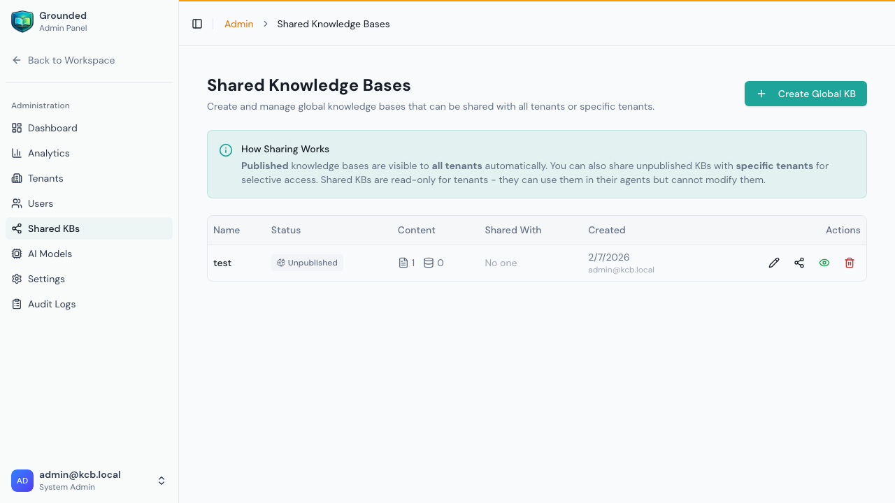
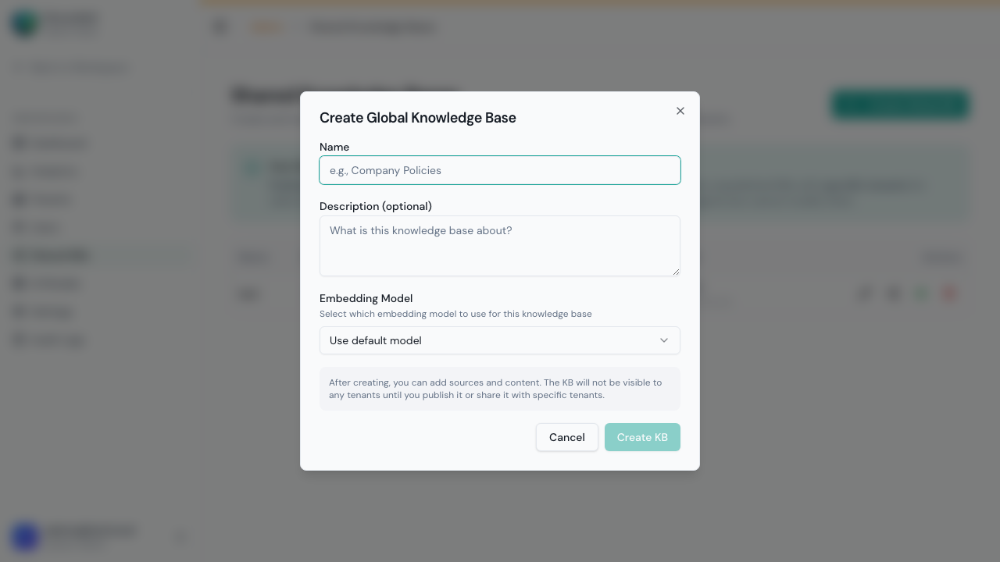
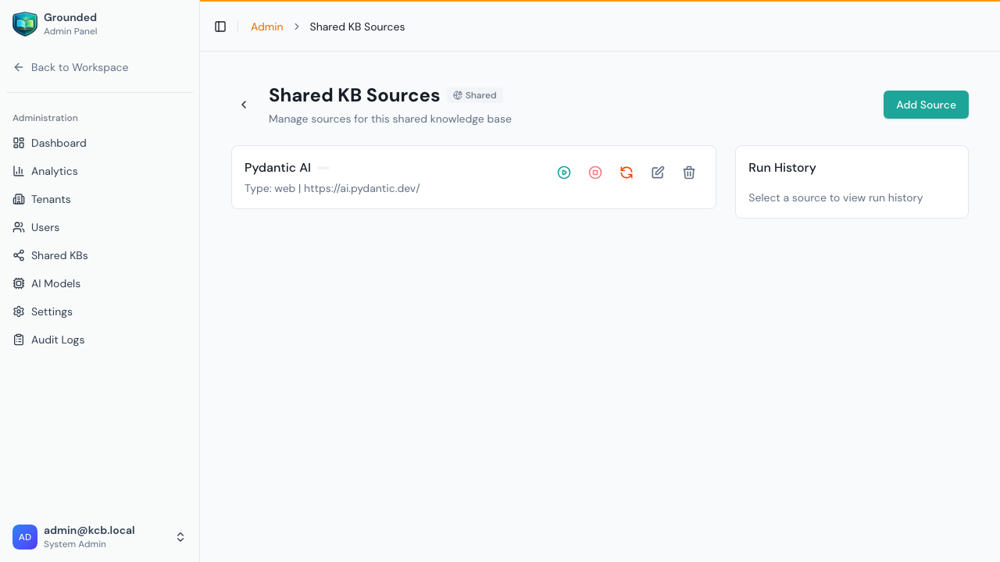
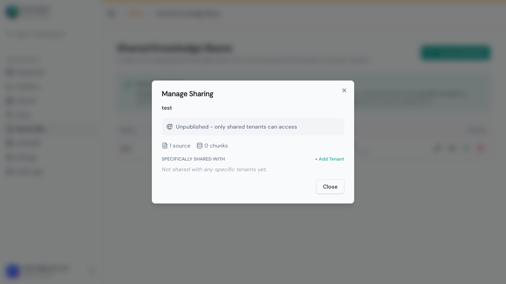
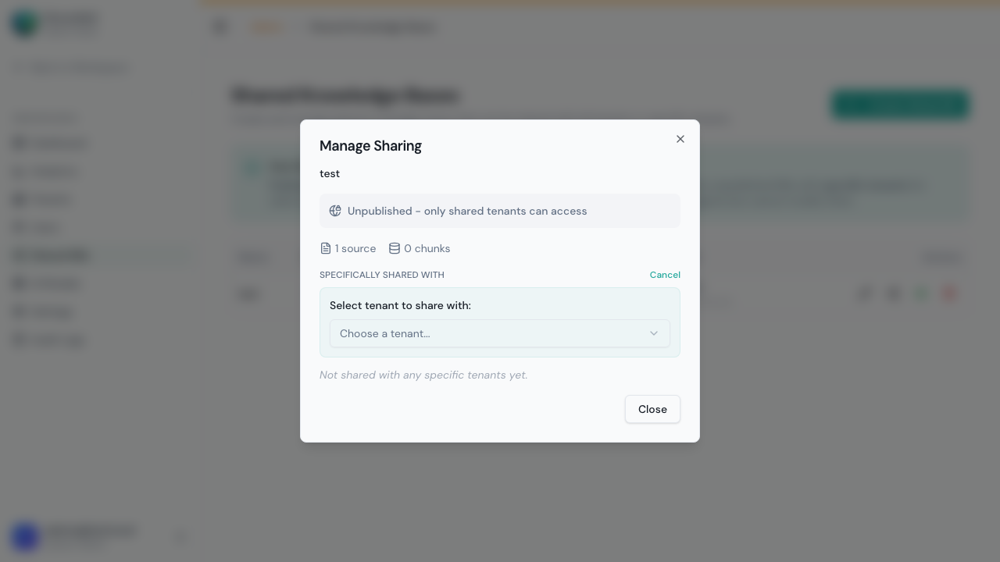
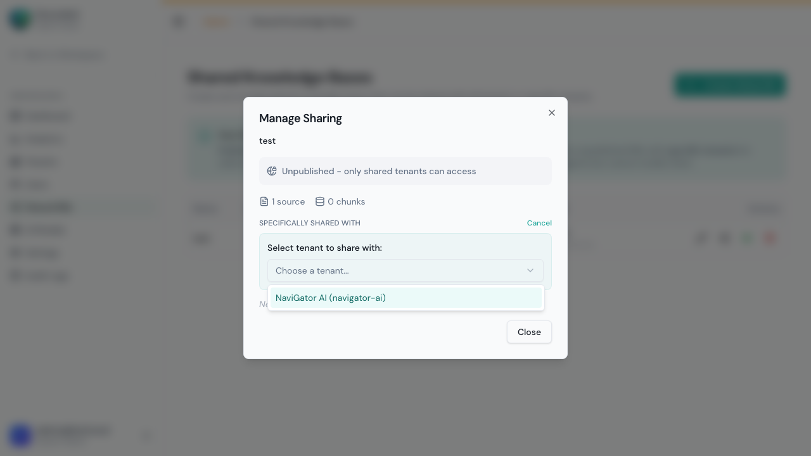

# Shared Knowledge Bases

Shared (Global) Knowledge Bases are created by system administrators and made available to tenants across the platform. This enables company-wide knowledge sharing — every agent across any tenant can reference the same authoritative content.

## Accessing Shared KBs

From the Admin Panel, click **Shared KBs** in the sidebar:

Each shared KB card shows:
- **Name** and description
- **Published status** — Whether it's visible to all tenants
- **Share count** — How many tenants are subscribed
- **Source count** and **chunk count** — Content volume
- **Creator** — Who created the KB
- Action buttons: **Edit**, **Manage sharing**, **Publish/Unpublish**, **Delete**

---

## Creating a Shared KB

1. Click **Create Global KB**

2. Fill in:

| Field | Required | Description |
|-------|:--------:|-------------|
| **Name** | ✅ | A descriptive name visible to all tenants (e.g., "Company Policies") |
| **Description** | No | What content this KB contains |
| **Embedding Model** | ✅ | Which model to use for vectorizing content (defaults to system default) |

3. Click **Create KB**

> **Important:** Choose the embedding model carefully. Once content is indexed, changing the model requires re-indexing everything. All tenants subscribing to this KB will use the same embeddings.

---

## Adding Content to a Shared KB

Click on a shared KB name to open its sources view:

From here you can manage sources identically to regular KBs:
- **Add Source** — Add web sources or upload files
- **Run Now** — Trigger ingestion
- **Force Re-index** — Re-process all content (ignores cache)
- **Edit Source** / **Delete Source** — Manage existing sources

### Adding a Web Source
1. Click **Add Source**
2. Configure like any source (see [Sources & Ingestion](./03-sources-and-ingestion.md)):
   - Choose scrape mode (Single Page, List of URLs, Sitemap, Crawl Domain)
   - Set the URL(s)
   - Choose fetch mode (Auto, HTML, Headless, Firecrawl)
   - Configure advanced settings (patterns, depth, schedule)
3. Click **Create**
4. Click **Run Now** to start ingestion

### Uploading Files
1. Click **Add Source** → select **File Upload** type
2. Upload your files (PDF, DOCX, TXT, MD, HTML — max 15 MB each)
3. Content is extracted and indexed automatically

### Running Ingestion
Click **Run Now** to process a source through the pipeline:
**Discovering → Scraping → Processing → Indexing → Embedding → Completed**

> **Best Practice:** Always add and index content **before** publishing the KB, so tenants get immediate value when they subscribe.

---

## Two Ways to Share: Global Publishing vs. Per-Tenant Sharing

Grounded provides two distinct sharing mechanisms:

### Option 1: Publish to All Tenants (Global)

Makes the KB visible to **every tenant** on the platform. Tenants opt-in by subscribing.

1. From the Shared KBs list, click **Publish to all tenants**
2. The KB becomes visible in every tenant's Knowledge Bases page with a "Shared" badge
3. Tenants choose to subscribe (opt-in model)
4. Subscribed tenants can attach the KB to their agents

**When to use:** Company-wide content that applies to all teams — policies, compliance docs, product documentation, universal FAQs.

### Option 2: Share with Specific Tenants (Targeted)

Shares the KB with **selected tenants only** — other tenants never see it.

1. Click **Manage sharing** on any shared KB

2. Click **+ Add Tenant**

3. Select the tenant from the dropdown

4. The KB immediately appears in that tenant's Knowledge Bases page

**When to use:** Content that's only relevant to certain teams — department-specific procedures, client-specific materials, regional documentation.

### Combining Both Methods

You can use both simultaneously:
- **Publish** for broad availability (all tenants can opt-in)
- **Share directly** to ensure specific tenants have access regardless of publishing status

| Scenario | Method | Result |
|----------|--------|--------|
| KB is **published** | All tenants see it, opt-in to subscribe | Global availability |
| KB is **shared with Tenant A** | Only Tenant A sees it | Targeted access |
| KB is **published + shared with Tenant A** | All tenants see it + Tenant A has guaranteed access | Belt and suspenders |
| KB is **unpublished but shared with Tenants A, B** | Only A and B see it | Selective distribution |

---

## Unpublishing a Shared KB

Click **Unpublish** to hide the KB from new subscriptions:

| What happens | Detail |
|-------------|--------|
| New tenants can't subscribe | KB disappears from their available list |
| Existing subscribers keep access | Content remains searchable in their agents |
| Directly shared tenants keep access | Per-tenant shares are unaffected |
| You can re-publish later | All existing subscriptions are preserved |

**Use for:** Temporarily removing a KB during major content updates, deprecating old content while allowing current users to transition.

---

## Removing Shares

### Removing a specific tenant's access
1. Click **Manage sharing**
2. Find the tenant in the list
3. Click **Remove** next to the tenant
4. The KB disappears from their Knowledge Bases page
5. Agents in that tenant lose access to the shared content

### Deleting a Shared KB entirely
Click **Delete** to soft-delete the shared KB:
- All subscriptions are removed
- Content is retained for 30 days before permanent deletion
- All agents across all tenants lose access to this content

---

## How Tenants Use Shared KBs

From the workspace (as a regular tenant user):

1. Go to **Knowledge Bases**
2. Published shared KBs appear with a **"Shared"** or **"Global"** badge
3. Click **Subscribe** to add it to your tenant
4. The shared KB appears in your KB list like any other KB
5. When configuring an agent (Model & RAG tab), check the shared KB to include it

### Tenant Permissions for Shared KBs

| Action | Tenant User | System Admin |
|--------|:-:|:-:|
| View content (if subscribed) | ✅ | ✅ |
| Attach to agents | ✅ | ✅ |
| Subscribe to published KB | ✅ | ✅ |
| Unsubscribe | ✅ | ✅ |
| Add/edit/delete sources | ❌ | ✅ |
| Run ingestion | ❌ | ✅ |
| Publish/unpublish | ❌ | ✅ |
| Manage sharing (per-tenant) | ❌ | ✅ |
| Delete the KB | ❌ | ✅ |

---

## Common Use Cases

| Use Case | Content | Sharing Method |
|----------|---------|----------------|
| **Company policies** | HR policies, code of conduct, benefits | Publish globally |
| **Product documentation** | Official product docs | Publish globally |
| **Compliance** | Regulatory docs, SOC2 procedures | Publish globally |
| **Department procedures** | Engineering runbooks, sales playbooks | Share with specific tenants |
| **Client materials** | Client-specific onboarding, SLAs | Share with client's tenant only |
| **Training materials** | How-to guides, new hire docs | Publish globally |
| **Regional content** | Region-specific compliance, local policies | Share with regional tenants |

---

## Tips

- **Index before publishing** — Add sources and run ingestion before sharing so tenants get immediate value
- **One KB per topic** — "Company Policies" and "Product Docs" should be separate KBs, not one massive catch-all
- **Use per-tenant sharing for sensitive content** — Don't publish compliance docs that only certain teams should see
- **Communicate changes** — Let tenant admins know when you add, update, or plan to deprecate shared KB content
- **Re-run sources regularly** — Shared KBs often contain frequently-updated content (docs, policies). Set up scheduled runs.
- **Monitor subscription counts** — If few tenants subscribe to a published KB, it may not be useful enough to maintain
- **Test with one tenant first** — Use per-tenant sharing to test new content with a pilot tenant before publishing globally
