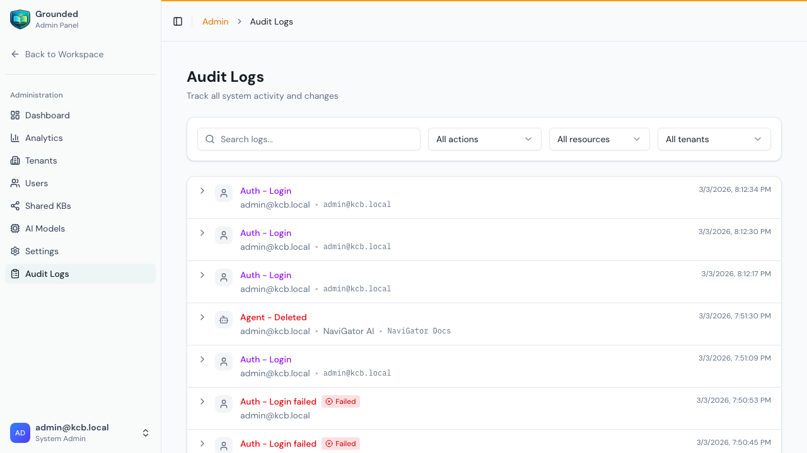

# Audit Logs

Audit logs provide a complete record of all significant actions performed in your Grounded instance. This is a **system admin** function.

## Accessing Audit Logs

From the Admin Panel, click **Audit Logs** in the sidebar:

## What's Logged

Every important action is automatically recorded:

### Authentication Events
| Action | Description |
|--------|-------------|
| `auth.login` | User logged in successfully |
| `auth.logout` | User logged out |
| `auth.login_failed` | Failed login attempt |
| `auth.password_changed` | User changed their password |

### Tenant Events
| Action | Description |
|--------|-------------|
| `tenant.created` | New tenant created |
| `tenant.updated` | Tenant details changed |
| `tenant.deleted` | Tenant soft-deleted |

### User Events
| Action | Description |
|--------|-------------|
| `user.created` | New user account created |
| `user.updated` | User profile updated |
| `user.disabled` | User account disabled |
| `user.enabled` | User account re-enabled |
| `user.role_changed` | User's tenant role changed |

### Agent Events
| Action | Description |
|--------|-------------|
| `agent.created` | New agent created |
| `agent.updated` | Agent configuration changed |
| `agent.deleted` | Agent soft-deleted |
| `agent.enabled` | Agent enabled |
| `agent.disabled` | Agent disabled |

### Knowledge Base Events
| Action | Description |
|--------|-------------|
| `kb.created` | New knowledge base created |
| `kb.updated` | KB settings changed |
| `kb.deleted` | KB soft-deleted |
| `kb.published` | Shared KB published |
| `kb.unpublished` | Shared KB unpublished |

### Source Events
| Action | Description |
|--------|-------------|
| `source.created` | New source added |
| `source.updated` | Source configuration changed |
| `source.deleted` | Source soft-deleted |
| `source.run_triggered` | Ingestion run started |

### Token/Key Events
| Action | Description |
|--------|-------------|
| `api_key.created` | Tenant API key created |
| `api_key.revoked` | Tenant API key revoked |
| `widget_token.created` | Widget token generated |
| `widget_token.revoked` | Widget token revoked |
| `chat_endpoint.created` | Chat endpoint token created |
| `chat_endpoint.revoked` | Chat endpoint token revoked |

### Settings Events
| Action | Description |
|--------|-------------|
| `settings.updated` | System settings changed |

### AI Model Events
| Action | Description |
|--------|-------------|
| `model.created` | New model configuration added |
| `model.updated` | Model settings changed |
| `model.deleted` | Model removed |
| `provider.created` | New AI provider added |
| `provider.updated` | Provider settings changed |
| `provider.deleted` | Provider removed |

## Log Entry Details

Each audit log entry contains:
- **Timestamp** — When the action occurred
- **Actor** — Who performed the action (user email)
- **Tenant** — Which tenant context (if applicable)
- **Action** — What was done
- **Resource** — What was affected (type + ID)
- **IP Address** — Origin IP of the request
- **Success/Failure** — Whether the action succeeded
- **Metadata** — Additional details including:
  - What changed (old value → new value)
  - Resource name
  - Error message (if failed)

## Filtering & Searching

Filter audit logs by:
- **Tenant** — Show only events from a specific tenant
- **Actor** — Show only events by a specific user
- **Action type** — Filter by event category
- **Resource type** — Filter by what was affected
- **Date range** — Narrow to a specific time period
- **Text search** — Search across metadata and resource names

## Use Cases

### Security Investigation
- Filter by `auth.login_failed` to find brute force attempts
- Check `settings.updated` after unexpected behavior changes
- Review `api_key.created` and `widget_token.created` for unauthorized access setup

### Change Tracking
- Filter by `agent.updated` to see prompt changes over time
- Review `kb.deleted` or `source.deleted` for accidental deletions
- Check `model.updated` after AI behavior changes

### Compliance
- Export audit logs for regulatory compliance
- Demonstrate access controls are in place
- Show who did what and when

## Tips

- **Check regularly** — Review audit logs weekly for unusual activity
- **Investigate failures** — Failed login attempts may indicate security issues
- **Track sensitive changes** — Pay attention to settings, model, and role changes
- **Use date filters** — Narrow down to the relevant time period when investigating
- **Correlate with issues** — When chat quality changes, check what was modified around that time
