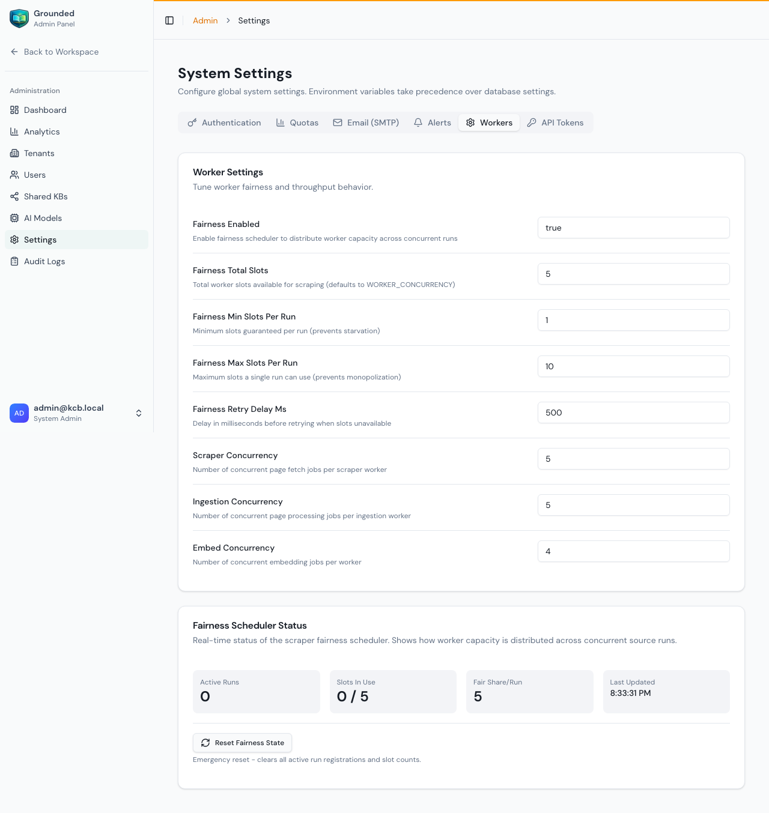

# Workers & Fairness Scheduler

Workers are the background processes that handle web scraping, content processing, and embedding generation. The fairness scheduler ensures that when multiple ingestion runs happen simultaneously, no single run monopolizes worker capacity.

## Overview

Grounded uses two types of workers:

| Worker | What It Does | Queue(s) |
|--------|-------------|----------|
| **Scraper Worker** | Downloads web pages using HTTP or headless browser (Playwright) | `page_fetch` |
| **Ingestion Worker** | Processes content: text extraction, chunking, embedding, indexing, deletion, re-indexing | `source_run`, `page_process`, `page_index`, `embed_chunks`, `enrich_page`, `deletion`, `kb_reindex` |

### How Jobs Flow

When you click **Run Now** on a source, here's what happens:

```
1. API creates a source run record (status: pending)
2. API queues a "source_run" job to the ingestion queue
3. Ingestion worker picks up the job:
   a. Discovers pages to process (for web: finds URLs; for upload: prepares files)
   b. Queues "page_fetch" jobs → scraper worker downloads pages
   c. Queues "page_process" jobs → ingestion worker extracts content
   d. Queues "page_index" jobs → ingestion worker chunks content
   e. Queues "embed_chunks" jobs → ingestion worker generates embeddings
4. Source run status transitions: pending → running → succeeded/partial/failed
```

**For file uploads**, the scraping step is skipped — text is extracted directly from the file, then chunked and embedded.

---

## Configuring Workers

Workers are configured in **Admin → Settings → Workers**:



### Concurrency Settings

These control how many jobs each worker processes simultaneously:

| Setting | What It Controls | Default | Effect of Increasing |
|---------|-----------------|---------|---------------------|
| **Scraper concurrency** | Concurrent page fetch jobs per scraper worker | 5 | Faster scraping, more CPU/memory, more network traffic |
| **Ingestion concurrency** | Concurrent content processing jobs per ingestion worker | 5 | Faster chunking/indexing, more memory |
| **Embed concurrency** | Concurrent embedding API calls per ingestion worker | 4 | Faster embedding, may hit API rate limits |

> ⚠️ **Concurrency changes require a worker restart.** Other settings (fairness, etc.) take effect within 60 seconds.

### How Workers Get Settings

Workers fetch their configuration from the API at startup and refresh every 60 seconds:

```
Worker starts → Fetches settings from API → Applies fairness config
    ↓                                            ↑
Every 60 seconds → Re-fetches settings → Updates fairness config
```

This means you can change fairness settings in the Admin UI and they apply automatically. But concurrency changes require restarting the workers.

---

## Fairness Scheduler

### The Problem

Without fairness scheduling, if three tenants start ingestion runs at the same time:
- A run crawling 10,000 pages grabs all worker slots
- Two small runs (10 pages each) wait until the big run finishes
- Small tenants experience long delays

### The Solution

The fairness scheduler **dynamically distributes worker capacity** across concurrent runs using a fair-share algorithm:

```
Total Slots: 10
Active Runs: 3

Fair share per run = floor(10 / 3) = 3 slots each
(bounded by min and max per-run limits)
```

Each run gets a guaranteed minimum and is capped at a maximum, ensuring no run starves and no run monopolizes.

### How It Works (Step by Step)

1. **Registration** — When a source run enters the scraping stage, it registers with the fairness scheduler (a Redis set tracks active runs)

2. **Slot Acquisition** — Before each page fetch, the scraper worker tries to acquire a fairness slot:
   - An atomic Lua script in Redis checks: How many runs are active? What's the fair share? How many slots does this run currently hold?
   - If the run has fewer slots than its fair share → **slot granted**, job proceeds
   - If the run is at its limit → **slot denied**, job is delayed and retried

3. **Slot Release** — After processing a page, the slot is released back to the pool

4. **Unregistration** — When a run's scraping stage completes (or is canceled), it unregisters and all its slots are freed

### Fairness Settings

| Setting | What It Does | Default | Guidelines |
|---------|-------------|---------|------------|
| **Fairness enabled** | Turn fair scheduling on/off | On | Disable only for single-tenant deployments |
| **Total slots** | Total worker capacity to distribute | 5 | Match to your scraper concurrency |
| **Min slots per run** | Guaranteed minimum capacity per run | 1 | Prevents starvation — every run gets at least this many |
| **Max slots per run** | Maximum capacity any single run can use | 10 | Prevents monopolization — no run exceeds this |
| **Retry delay (ms)** | Delay before retrying when no slot available | 500 | Increase for busy systems (reduces Redis load) |

### Worked Examples

**Example 1: Two concurrent runs, default settings (10 total, min 1, max 10)**
```
Run A: Crawling 5,000 pages
Run B: Crawling 20 pages

Fair share = floor(10 / 2) = 5 slots each
→ Run A uses 5 slots (processes 5 pages concurrently)
→ Run B uses 5 slots (processes 5 pages concurrently)
→ Run B finishes quickly, Run A then gets all 10 slots
```

**Example 2: Five concurrent runs, 10 total, min 1, max 5**
```
Runs A-E all running simultaneously

Fair share = floor(10 / 5) = 2 slots each
→ Each run processes 2 pages concurrently
→ When one finishes, others get more slots (up to max 5)
```

**Example 3: One very large run, one tiny run, min 2, max 8**
```
Run A: 50,000 pages
Run B: 3 pages

Fair share = floor(10 / 2) = 5 each
→ Run A: 5 slots (capped at 8 max)
→ Run B: 5 slots (even though it only needs 3)
→ Run B finishes in seconds, Run A gets up to 8 slots
```

### What Happens When a Slot Is Denied

When a scraper job can't get a fairness slot:
1. The job is **not** counted as a failure
2. It's moved to a **delayed** state (not lost)
3. After `retryDelayMs` (default 500ms), it's retried automatically
4. The job's retry counter is **not** incremented (fairness delays are separate from error retries)

This means fairness never causes data loss — it only slows down runs that are using more than their fair share.

### Graceful Degradation

If Redis becomes unavailable:
- The fairness scheduler **allows all jobs through** (falls back to no fairness)
- This prevents Redis issues from blocking all ingestion
- A warning is logged so admins can investigate

---

## Monitoring Workers

### Signs Workers Are Healthy
- Source runs complete within expected timeframes
- Run status transitions normally: pending → running → succeeded
- No stuck runs (running for hours without progress)

### Signs Something Is Wrong

| Symptom | Likely Cause | Fix |
|---------|-------------|-----|
| Runs stuck at "pending" | Workers not running | Restart workers |
| Runs stuck at "running" with no progress | Worker crashed mid-job | Restart workers, run will resume |
| Scraping is very slow | Fairness slots too low | Increase total slots |
| Embedding errors | AI provider rate limits | Reduce embed concurrency |
| All runs slow with many concurrent | Fair share too low | Increase total slots or max per run |

### Worker Health Check

Workers report their status via the internal API:
```
GET /api/v1/internal/workers/settings
```

Check the admin dashboard for worker-related metrics and alerts.

---

## Tips

- **Match total slots to scraper concurrency** — If you have 10 scraper worker concurrency, set total fairness slots to 10
- **Start with defaults** — The default settings work well for most deployments
- **Increase gradually** — Higher concurrency means more memory and CPU usage
- **Watch for rate limits** — If using cloud AI providers, high embed concurrency can hit API limits
- **Restart workers after concurrency changes** — Fairness changes are automatic, but concurrency is not
- **Don't disable fairness in multi-tenant** — Without it, one large crawl blocks everyone else
- **Monitor during large crawls** — When crawling thousands of pages, watch memory and CPU
